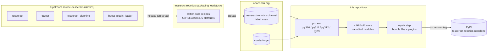
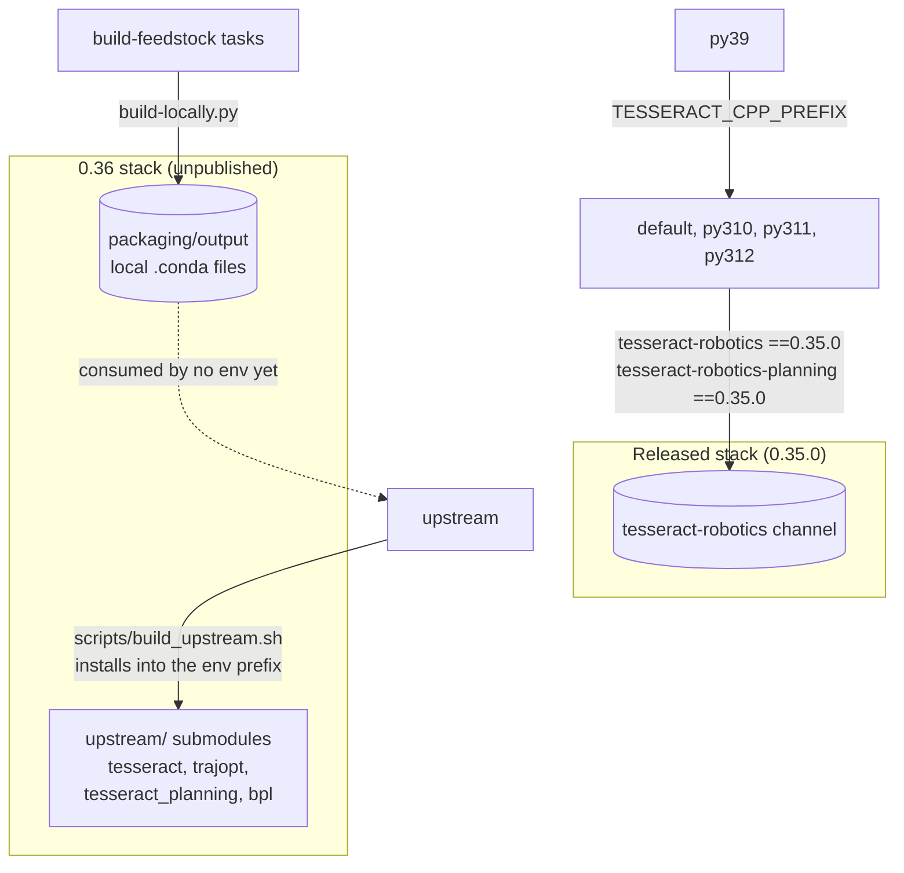
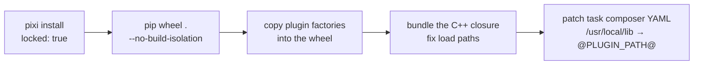
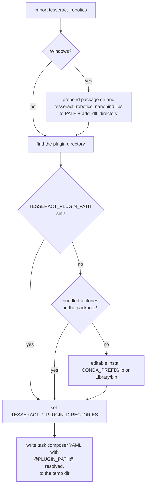

# How the binaries are built

This repository compiles only the nanobind modules. The tesseract C++ stack
(tesseract, trajopt, tesseract_planning and their plugins) is built as conda
packages by the [tesseract-robotics-packaging](https://github.com/tesseract-robotics-packaging)
feedstocks and published to the `tesseract-robotics` channel on anaconda.org.
pixi installs those packages, scikit-build-core compiles the bindings against
them, and a per-platform repair step copies the C++ libraries and plugin
factories into the wheel. Each platform's workflow then publishes its wheels to
PyPI when a version tag is pushed.

Released wheels are built against tesseract 0.35.0. The 0.36 stack that
`upstream-main` (#161) binds is not published yet: it is built from source on a
developer machine (see [Building against upstream main](upstream-main.md)), so
CI cannot build that branch until the packages exist on the channel.

## Layers and who owns them

| Layer | What it produces | Where it lives | Built by |
|---|---|---|---|
| Upstream C++ | source at a release tag | `tesseract-robotics/{tesseract,trajopt,tesseract_planning,boost_plugin_loader}` | nothing here; the feedstocks fetch the tag archive |
| C++ packages | `tesseract-robotics`, `trajopt`, `tesseract-robotics-planning`, `boost-plugin-loader`, `descartes-light`, `opw-kinematics`, `libruckig`, … | `tesseract-robotics` channel, label `main` | feedstock CI in `tesseract-robotics-packaging` |
| Third-party C++ | boost, eigen, ompl, pcl/vtk, bullet, fcl, osqp, taskflow, … | `conda-forge` | conda-forge |
| Bindings | `_tesseract_*` nanobind extension modules | this repository | scikit-build-core + CMake, inside a pixi env |
| Wheels | self-contained wheels with the C++ closure bundled | PyPI, `tesseract-robotics-nanobind` | `.github/workflows/wheels-{linux,macos,windows}.yml` |

The SWIG bindings follow the same pattern one level up:
[tesseract-robotics-python-feedstock](https://github.com/tesseract-robotics-packaging/tesseract-robotics-python-feedstock)
builds `tesseract_python` as a conda package against the same channel. This
repository ships wheels to PyPI instead and has no feedstock of its own yet.

## C++ packages: the feedstocks

Each upstream library has a conda-forge-style feedstock in the
`tesseract-robotics-packaging` GitHub organisation:

| Feedstock | Package | On the channel | Notes |
|---|---|---|---|
| `boost-plugin-loader-feedstock` | `boost-plugin-loader` | 0.4.3 | tesseract `master` needs 0.4.5 |
| `tesseract-robotics-feedstock` | `tesseract-robotics` | 0.35.0 | |
| `trajopt-feedstock` | `trajopt` | 0.35.0 | |
| `tesseract-robotics-planning-feedstock` | `tesseract-robotics-planning` | 0.35.0 | |
| `descartes-light-feedstock` | `descartes-light` | 0.4.10 | |
| `opw-kinematics-feedstock`, `ruckig-feedstock`, `ros-industrial-cmake-boilerplate-feedstock` | supporting packages | | |
| `tesseract-robotics-python-feedstock` | `tesseract-robotics-python` (SWIG) | 0.35.0 | not used by this repository |

How a feedstock builds:

- The recipe is `recipe/recipe.yaml`, built with rattler-build
  (`conda_build_tool: rattler-build` in `conda-forge.yml`). The CI files are
  generated by conda-smithy.
- The source is the upstream release tarball
  (`archive/refs/tags/<version>.tar.gz`), and `recipe/build.sh` / `build.bat`
  runs a plain CMake + Ninja build with shared libraries and no tests or
  examples.
- GitHub Actions builds linux-64, linux-aarch64, osx-64, osx-arm64 and win-64
  on every push and pull request. Every build that is not a pull request
  uploads, with the organisation's `BINSTAR_TOKEN` (`.scripts/build_steps.sh`).
- `recipe/conda_build_config.yaml` sets `channel_sources: tesseract-robotics,conda-forge`
  (so each feedstock links the stack packages published before it) and
  `channel_targets: tesseract-robotics main` (so uploads land on the `main`
  label).
- Each package carries `run_exports` pinned to `x.x`, so anything built
  against `tesseract-robotics 0.35.0` requires `0.35.*` at run time.

The `packaging/*-feedstock` directories in this repository are submodules
pointing at forks of these feedstocks. They exist for the 0.36 outer loop
below; the released wheels never touch them.

## pixi environments: where each one gets its C++

| Environment | Python | C++ stack comes from | Used for |
|---|---|---|---|
| `default` | 3.14 (unpinned, `>=3.10`) | `tesseract-robotics` channel: `tesseract-robotics ==0.35.0`, `tesseract-robotics-planning ==0.35.0`; trajopt, descartes-light, opw-kinematics and every third-party library arrive transitively | local development |
| `py310`, `py311`, `py312` | pinned | same as `default` | CI wheel builds |
| `py39` | 3.9 | none of its own: the pcl → vtk closure has no cp39 builds, so the build reads the `py312` env through `TESSERACT_CPP_PREFIX` | CI wheels for Python 3.9 (macOS, Windows) |
| `upstream` | 3.12 | the `upstream/` submodules, compiled by `pixi run -e upstream build-upstream-cpp` and installed into the env prefix; third-party libraries from conda-forge | 0.36 inner loop |

The pins are in `pyproject.toml` under `[tool.pixi.dependencies]`. Only the two
top-level tesseract packages are pinned: pinning trajopt or eigen as well
deadlocks the solve, because `tesseract-robotics 0.35.0` was rebuilt against
eigen 5.0.1 and its `run_exports` drive the rest.

`TESSERACT_CPP_PREFIX` takes precedence over `CONDA_PREFIX` in `CMakeLists.txt`
(the RPATH, `CMAKE_PREFIX_PATH`, link directories and the data that gets
installed into the wheel), in `scripts/build_macos_wheel.sh`, and in the Windows
workflow.

## Building a wheel

Every platform follows the same five steps:

1. `prefix-dev/setup-pixi` installs the platform's env from `pixi.lock` with
   `locked: true`, so CI fails if the lock drifts from `pyproject.toml`.
2. `pip wheel . --no-build-isolation` runs scikit-build-core, which configures
   `CMakeLists.txt` against the env and compiles each `_tesseract_*` module as
   `STABLE_ABI NB_STATIC`. The CMake install step also copies data into the
   wheel: `share/tesseract/support` (robot models) and the task composer
   configuration from `share/tesseract_planning/task_composer/config`.
3. The plugin factories are loaded with `dlopen`, so no linker-based tool finds
   them. Each script copies the nine factory libraries explicitly (contact
   managers, kinematics including KDL/OPW/UR, task composer).
4. A repair step bundles the remaining dependency closure and fixes load paths
   (table below).
5. The task composer YAML hard-codes `/usr/local/lib` as the plugin directory.
   The build replaces it with the placeholder `@PLUGIN_PATH@`, which the
   package resolves at import time.

| | Linux | macOS | Windows |
|---|---|---|---|
| Workflow | `wheels-linux.yml` | `wheels-macos.yml` | `wheels-windows.yml` |
| Runner | `ubuntu-22.04` (x86_64), `ubuntu-22.04-arm` (aarch64) | `macos-14` (arm64) | `windows-2022` (x64) |
| Python builds | 3.10, 3.11, 3.12 (x86_64); 3.12 (aarch64) | 3.9, 3.10, 3.11, 3.12 | 3.9, 3.10, 3.11, 3.12 |
| Entry point | `pixi run build-wheel` → `scripts/build_linux_wheel.sh` | `pixi run build-wheel` → `scripts/build_macos_wheel.sh` | inline workflow steps with MSVC v143 |
| Repair | `ldd` closure copied next to the package, `patchelf --set-rpath '$ORIGIN'` | `delocate-wheel`, then a walk over the plugins rewriting `@rpath/` to `@loader_path/` | `delvewheel repair --analyze-existing` |
| Bundled libraries | `tesseract_robotics/` | `tesseract_robotics/.dylibs/` | `tesseract_robotics/` (plugins), `tesseract_robotics_nanobind.libs/` (dependencies) |
| Never bundled | `libstdc++`, `libgcc_s`, system libraries, `libpython` | | |
| Platform gotchas | [Linux wheels](linux-wheels.md) | [macOS wheels](macos-wheels.md) | [Windows wheels](windows-wheels.md) |

### Wheel tags

`wheel.py-api = "cp312"` makes the Python 3.12 build an abi3 wheel
(`cp312-abi3-<platform>`), which installs on 3.12 and every later CPython. The
3.9, 3.10 and 3.11 builds produce version-specific wheels. The Linux script
renames the wheel from `linux_*` to `manylinux_2_35_*`. libstdc++ is
deliberately left to the host, so the real floor is the host's gcc runtime;
[Linux wheels](linux-wheels.md) explains why.

### Tests before publishing

- **ABI canary.** Each build job installs the wheel it just built into the
  pixi env and runs `tests/tesseract_kinematics` (skipped for 3.9).
- **`test-wheel` job.** A plain virtualenv on a fresh runner, outside pixi,
  installs the wheel and runs the full test suite. The abi3 wheel is tested on
  3.12, 3.13 and 3.14 (3.14 is non-blocking), and the 3.9 wheel on 3.9. Linux
  also checks that no library is "not found" and that only one libstdc++ is
  mapped.

### Publishing

The wheel workflows run on pull requests, on pushes to `main`, and on tags
matching `X.Y.Z` or `X.Y.Z.W`. On a tag, each workflow's `publish` job (after
`build` and `test-wheel`) checks that every wheel's version equals the tag and
uploads with PyPI trusted publishing (`id-token: write`, no stored token). The
three platforms publish independently, so one platform's wheels can reach PyPI
while another's job is still failing. The version is the tag:
`SETUPTOOLS_SCM_PRETEND_VERSION_FOR_TESSERACT_ROBOTICS_NANOBIND` is set from the
tag name.

## At import time

`src/tesseract_robotics/__init__.py` makes an installed wheel self-contained:

- **Plugins.** The first match wins: `TESSERACT_PLUGIN_PATH`, then the bundled
  factories (`tesseract_robotics/` on Linux and Windows, `.dylibs/` on macOS),
  then `$CONDA_PREFIX/lib` (`Library/bin` on Windows) for an editable install.
  The result is exported as `TESSERACT_CONTACT_MANAGERS_PLUGIN_DIRECTORIES`,
  `TESSERACT_KINEMATICS_PLUGIN_DIRECTORIES` and
  `TESSERACT_TASK_COMPOSER_PLUGIN_DIRECTORIES`. Variables that are already set
  are left alone.
- **Data.** A wheel reads robot models and task composer configs from
  `tesseract_robotics/data/`; an editable install reads them from the pixi
  env's `share/`.
- **Windows.** `boost::dll` loads plugins with plain `LoadLibrary`, which
  ignores `os.add_dll_directory`, so the package directory and the `.libs`
  directory are also prepended to `PATH`.

An editable install (`pixi run install`) bakes the env's `lib/` into the
modules' RPATH. It runs only inside the pixi env it was built in; use a wheel
to move the bindings to another environment.

## The 0.36 track

`upstream-main` binds tesseract, trajopt and tesseract_planning `master` ahead
of 0.36. Nothing on the channel can build it yet:

| Package | Channel | `upstream-main` needs |
|---|---|---|
| boost-plugin-loader | 0.4.3 | 0.4.5 |
| tesseract-robotics | 0.35.0 | `master` @ `f4cc080` |
| trajopt | 0.35.0 | `master` @ `de9e941` |
| tesseract-robotics-planning | 0.35.0 | `master` @ `4efed5f` |

Two local loops exist, described in [Building against upstream main](upstream-main.md):

- **Inner loop**: the `upstream` env compiles the `upstream/` submodules from
  source. This is what the branch's tests run against.
- **Outer loop**: `pixi run build-feedstock` runs each forked feedstock's
  `build-locally.py` in dependency order and writes `0.36.0.dev<date>` packages
  to `packaging/output`.

!!! warning "Status of the 0.36 packages"
    - **Confirmed:** the dev recipes pin the same SHAs as the `upstream/`
      submodules, and replace `console_bridge` with `spdlog`.
    - **Confirmed:** the dev recipe edits are uncommitted changes in the
      `packaging/*-feedstock` submodules. A fresh clone builds the 0.35.0
      recipes.
    - **Confirmed:** packages exist for osx-arm64 only, in `packaging/output`.
      No pixi env consumes them, so the bindings have never been built or
      tested against them.
    - **Under verification:** the tesseract and tesseract_planning feedstocks
      do not strip `-fvisibility-inlines-hidden` on macOS, as upstream's own
      conda recipes do. Without the strip each dylib keeps its own cereal
      registry and serialization fails with "unregistered polymorphic type"
      (seen in the inner loop before its build script stripped the flag).

Landing the 0.36 stack on the channel for every platform needs a `dev` track in
the packaging feedstocks, uploaded to a separate label. A
`tesseract-robotics-nanobind` feedstock built like the python feedstock would
let this repository's CI test against the published dev packages.

## Known gaps

!!! note "Under verification"
    These come from reading the scripts; no wheel has been inspected to
    confirm them.

    - **`manylinux` tag.** The Linux script renames the file but does not run
      auditwheel or rewrite `Tag:` in `.dist-info/WHEEL`.
    - **`RECORD`.** On Linux and macOS, plugins and patched YAMLs are added
      after `pip wheel` / `delocate`, and the wheel is re-zipped without
      regenerating `RECORD`. Windows runs `delvewheel` last, which rewrites it.
    - **OPW plugin name.** `abb_irb2400_plugins.yaml` asks for
      `tesseract_kinematics_opw_factories`, but the library is
      `libtesseract_kinematics_opw_factory`. The Windows workflow ships aliases
      under the plural name; Linux and macOS don't.
    - **Silent copies.** A plugin factory missing from the env is skipped
      (Linux, macOS) or only logged (Windows), and several `patchelf` /
      `install_name_tool` calls end in `|| true`.
