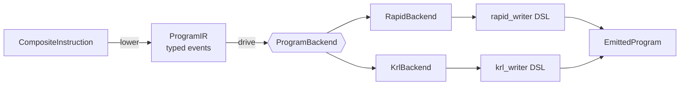

# Program emitters

`tesseract_robotics.emitters` turns a planned or hand-authored
`CompositeInstruction` into controller-native robot programs.

## Architecture



One walk produces the brand-neutral `ProgramIR`; `drive()` dispatches its
events to a `ProgramBackend`, and each backend renders through its brand's
hand-authoring DSL (`rapid_writer`, `krl_writer`, …). The DSL is the same layer
you would write by hand to author a program directly — the backend just drives
it from the IR.

- **`core/`** — the brand-independent spine: the single lowering walk
  (`lower`), the typed event IR (`JointMove`, `CartesianMove`, `Dwell`,
  `WaitDigital`, `SetDigital`, `SetAnalog`, `ToolChange`, `Note`),
  `EmitIdentity` (content-addressed reproducibility), the `ProgramBackend`
  protocol with `drive()`, `EmittedProgram`, and the shared **DSL skeleton**
  (`core.dsl`: `Writer`, `Command`, `Block`).
- **`rapid/`, `krl/`** — per-brand backends. Each owns a pure target formatter,
  a validated `Profile`, a hand-authoring **DSL** (`rapid_writer`, `krl_writer`)
  that specializes `core.dsl`, and a backend that drives that DSL from the IR.
  ABB RAPID is itself a backend over this core — its golden tests prove the
  extraction is behaviour-preserving.

### The DSL skeleton (`core.dsl`)

Every brand's hand-authoring DSL is the same shape, captured once:

- `Writer` — an indented code buffer, one singleton per subclass; a brand sets
  the tab width and leading-newline policy (RAPID: 4 spaces + leading newline;
  KRL: 2 spaces, none).
- `Command` — the base every statement/scope class inherits; a brand binds its
  `Writer` so `MoveL(...)` / `Ptp(...)` write themselves on construction.
- `Block` — a `<opening> … <closing>` indented `with`-scope (RAPID `Module` /
  `Proc`, KRL `Def`).

One walk, many backends: `lower()` runs once and the resulting `ProgramIR` can
drive any number of brand backends.

## Example — KUKA KRL

```python
import numpy as np
from tesseract_robotics.emitters.krl import KrlProfile, emit_krl
from tesseract_robotics.planning import CartesianTarget, JointTarget, MotionProgram, Pose

joint_names = [f"joint_{i}" for i in range(1, 7)]
program = MotionProgram("manipulator", tcp_frame="tool0", profile="weld")
program.move_to(JointTarget(np.deg2rad([0, -20, 30, 0, 50, 0]), profile="approach"))
program.linear_to(
    CartesianTarget(Pose.from_xyz_rpy([0.6, -0.1, 0.8], [np.pi, 0, 0]), profile="weld")
)
program.set_joint_names(joint_names)
composite = program.to_composite_instruction(joint_names=joint_names, tcp_frame="tool0")

profiles = {"approach": KrlProfile.build(), "weld": KrlProfile.build(cp_speed_mms=100.0)}
result = emit_krl(composite, profiles, program_name="WELD_01")
result.write_to("out")          # writes out/WELD_01.src
print(result.text)
```

```krl
DEF WELD_01()
; generated by tesseract_robotics.emitters <version>
; ir-digest: sha256:…
; profiles-digest: sha256:…
; DO NOT EDIT — regenerate from the planning pipeline
  BAS(#VEL_PTP, 100)
  PTP {A1 0.00000,A2 -20.00000,A3 30.00000,A4 0.00000,A5 50.00000,A6 0.00000}
  $VEL.CP = 0.10000
  LIN {X 600.000,Y -100.000,Z 800.000,A 0.000,B 0.000,C 180.000}
END
```

## Determinism

The same program and profiles produce byte-identical output. Every file carries
`ir-digest` / `profiles-digest` SHA-256 headers and there are no timestamps in
the body, so goldens diff meaningfully and artifacts are reproducible by
construction.

## Conventions

- The IR is strictly SI (metres, radians, seconds); unit conversion happens only
  inside brand backends, through the named functions in `core.units`.
- KUKA `ABC` angles are the intrinsic ZYX decomposition (`A` about Z, `B` about
  Y, `C` about X), computed directly from the rotation matrix.
- Quaternions follow the project-wide scalar-last `[qx, qy, qz, qw]` convention
  at the Python surface; backends reorder as their dialect requires.

## Supported brands

| brand | entry point | output |
|---|---|---|
| ABB | `emitters.rapid.emit_rapid` | RAPID `.mod` |
| KUKA KRC4 | `emitters.krl.emit_krl` | KRL `.src` |

Fanuc LS, Yaskawa Motoman JBI, and Universal Robots URScript follow in
subsequent backends over the same core.
