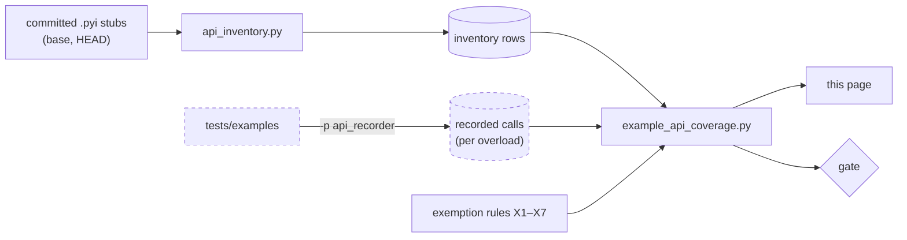

# Example API coverage

Generated by `pixi run example-coverage` from the inventory `21930d81..d863f52d`; do not edit by hand.

**1 / 292 non-exempt entries covered** by a shipped example: 289 uncovered, 2 ambiguous. 165 entries are exempt by rule.

An entry is one overload of the public stub API added since 0.35.0.9. It is covered only by a call whose immediate caller is a file under `src/tesseract_robotics/examples/`, matched to exactly that overload; a new or changed overload also needs a call that binds every parameter. A call that fits more than one overload makes its candidates ambiguous, never covered. Dashed nodes run at test time.

## Uncovered (289)

| entry | change | added by | note |
|---|---|---|---|
| `collision.ContactManagersPluginFactory.__init__(PathLike, ResourceLocator)` | changed_signature | #165 |  |
| `collision.ContactManagersPluginFactory.addContinuousContactManagerPlugin(str, PluginInfo)` | new_name | #170 |  |
| `collision.ContactManagersPluginFactory.addDiscreteContactManagerPlugin(str, PluginInfo)` | new_name | #170 |  |
| `collision.ContactManagersPluginFactory.clearSearchLibraries()` | new_name | #170 |  |
| `collision.ContactManagersPluginFactory.clearSearchPaths()` | new_name | #170 |  |
| `collision.ContactManagersPluginFactory.createContinuousContactManager(str, PluginInfo)` | new_overload | #170 |  |
| `collision.ContactManagersPluginFactory.createDiscreteContactManager(str, PluginInfo)` | new_overload | #170 |  |
| `collision.ContactManagersPluginFactory.getConfig()` | new_name | #170 |  |
| `collision.ContactManagersPluginFactory.getContinuousContactManagerPlugins()` | new_name | #170 |  |
| `collision.ContactManagersPluginFactory.getDiscreteContactManagerPlugins()` | new_name | #170 |  |
| `collision.ContactManagersPluginFactory.removeContinuousContactManagerPlugin(str)` | new_name | #170 |  |
| `collision.ContactManagersPluginFactory.removeDiscreteContactManagerPlugin(str)` | new_name | #170 |  |
| `collision.ContactManagersPluginFactory.saveConfig(str | PathLike)` | new_name | #170 |  |
| `collision.ContactManagersPluginFactory.setDefaultContinuousContactManagerPlugin(str)` | new_name | #170 |  |
| `collision.ContactManagersPluginFactory.setDefaultDiscreteContactManagerPlugin(str)` | new_name | #170 |  |
| `collision.ContactRequest.is_valid` | new_name | #171 |  |
| `collision.ContactResult.cc_transform` | new_name | #172 |  |
| `collision.ContactResult.nearest_points_local` | new_name | #172 |  |
| `collision.ContactResult.subshape_id` | new_name | #172 |  |
| `collision.ContactResultMap.__iter__()` | new_name | #173 |  |
| `collision.ContactResultMap.addContactResult(tuple[str, str], ContactResult)` | new_name | #173 |  |
| `collision.ContactResultMap.addContactResult(tuple[str, str], ContactResultVector)` | new_name | #173 |  |
| `collision.ContactResultMap.addInterpolatedCollisionResults(ContactResultMap, int, int, Sequence[str], float, bool, Callable[[tuple[str, str], ContactResultVector], None] | None)` | new_name | #173 |  |
| `collision.ContactResultMap.at(tuple[str, str])` | new_name | #173 |  |
| `collision.ContactResultMap.filter(Callable[[tuple[str, str], ContactResultVector], None])` | new_name | #173 |  |
| `collision.ContactResultMap.getContainer()` | new_name | #173 |  |
| `collision.ContactResultMap.setContactResult(tuple[str, str], ContactResult)` | new_name | #173 |  |
| `collision.ContactResultMap.setContactResult(tuple[str, str], ContactResultVector)` | new_name | #173 |  |
| `collision.ContactResultValidator` | new_name | #171 |  |
| `collision.ContactResultValidator.__call__(ContactResult)` | new_name | #171 |  |
| `collision.ContactResultValidator.__init__()` | new_name | #171 |  |
| `collision.ContinuousContactManager.setCollisionObjectsTransform(Mapping[str, Isometry3d], Mapping[str, Isometry3d])` | new_overload | #174 |  |
| `collision.ContinuousContactManager.setCollisionObjectsTransform(Sequence[str], Sequence[Isometry3d], Sequence[Isometry3d])` | new_overload | #174 |  |
| `collision.ContinuousContactManager.setCollisionObjectsTransform(str, Isometry3d, Isometry3d)` | new_overload | #174 |  |
| `collision.ConvexDecomposition` | new_name | #179 |  |
| `collision.ConvexDecomposition.compute(Sequence[Annotated[NDArray[float64], dict(shape=3, order=C)]], Annotated[NDArray[int32], dict(shape=(None,), order=C)], bool)` | new_name | #179 |  |
| `collision.ConvexDecompositionVHACD` | new_name | #179 |  |
| `collision.ConvexDecompositionVHACD.__init__()` | new_name | #179 |  |
| `collision.ConvexDecompositionVHACD.__init__(VHACDParameters)` | new_name | #179 |  |
| `collision.FillMode` | new_name | #179 |  |
| `collision.VHACDParameters` | new_name | #179 |  |
| `collision.VHACDParameters.__init__()` | new_name | #179 |  |
| `collision.VHACDParameters.async_ACD` | new_name | #179 |  |
| `collision.VHACDParameters.fill_mode` | new_name | #179 |  |
| `collision.VHACDParameters.find_best_plane` | new_name | #179 |  |
| `collision.VHACDParameters.max_convex_hulls` | new_name | #179 |  |
| `collision.VHACDParameters.max_num_vertices_per_ch` | new_name | #179 |  |
| `collision.VHACDParameters.max_recursion_depth` | new_name | #179 |  |
| `collision.VHACDParameters.min_edge_length` | new_name | #179 |  |
| `collision.VHACDParameters.minimum_volume_percent_error_allowed` | new_name | #179 |  |
| `collision.VHACDParameters.resolution` | new_name | #179 |  |
| `collision.VHACDParameters.shrinkwrap` | new_name | #179 |  |
| `collision.createConvexHull(Sequence[Annotated[NDArray[float64], dict(shape=3, order=C)]], float, float)` | new_name | #175 |  |
| `common.AllowedCollisionMatrix.__init__(Mapping[tuple[str, str], str])` | new_overload | #180 |  |
| `common.AllowedCollisionMatrix.__str__()` | new_name | #180 |  |
| `common.AllowedCollisionMatrix.removeAllowedCollision(str)` | new_overload | #180 |  |
| `common.BytesResource.__init__(str, Sequence[int], ResourceLocator | None)` | new_overload | #166 |  |
| `common.BytesResource.__init__(str, bytes, ResourceLocator | None)` | new_overload | #166 |  |
| `common.CalibrationInfo` | new_name | #217 |  |
| `common.CalibrationInfo.__init__()` | new_name | #217 |  |
| `common.CalibrationInfo.clear()` | new_name | #217 |  |
| `common.CalibrationInfo.empty()` | new_name | #217 |  |
| `common.CalibrationInfo.insert(CalibrationInfo)` | new_name | #217 |  |
| `common.CalibrationInfo.joints` | new_name | #217 |  |
| `common.CollisionMarginData.__init__(CollisionMarginPairData)` | new_overload | #178 |  |
| `common.CollisionMarginData.__init__(float, CollisionMarginPairData)` | new_overload | #178 |  |
| `common.CollisionMarginData.apply(CollisionMarginPairData, CollisionMarginPairOverrideType)` | new_name | #178 |  |
| `common.CollisionMarginData.getMaxCollisionMargin(str)` | new_overload | #178 |  |
| `common.CollisionMarginData.incrementMargins(float)` | new_name | #178 |  |
| `common.CollisionMarginData.scaleMargins(float)` | new_name | #178 |  |
| `common.CollisionMarginPairData.__init__(Mapping[tuple[str, str], float])` | new_overload | #178 |  |
| `common.CollisionMarginPairData.apply(CollisionMarginPairData, CollisionMarginPairOverrideType)` | new_name | #178 |  |
| `common.CollisionMarginPairData.getMaxCollisionMargin()` | new_name | #178 |  |
| `common.CollisionMarginPairData.getMaxCollisionMargin(str)` | new_name | #178 |  |
| `common.CollisionMarginPairData.incrementMargins(float)` | new_name | #178 |  |
| `common.CollisionMarginPairData.scaleMargins(float)` | new_name | #178 |  |
| `common.ContactManagersPluginInfo` | new_name | #164 |  |
| `common.ContactManagersPluginInfo.__init__()` | new_name | #164 |  |
| `common.ContactManagersPluginInfo.clear()` | new_name | #164 |  |
| `common.ContactManagersPluginInfo.continuous_plugin_infos` | new_name | #164 |  |
| `common.ContactManagersPluginInfo.discrete_plugin_infos` | new_name | #164 |  |
| `common.ContactManagersPluginInfo.empty()` | new_name | #164 |  |
| `common.ContactManagersPluginInfo.insert(ContactManagersPluginInfo)` | new_name | #164 |  |
| `common.ContactManagersPluginInfo.search_libraries` | new_name | #164 |  |
| `common.ContactManagersPluginInfo.search_paths` | new_name | #164 |  |
| `common.GeneralResourceLocator.__init__(kw:Sequence[str | PathLike], kw:Sequence[str])` | new_overload | #166 |  |
| `common.GeneralResourceLocator.__init__(kw:Sequence[str])` | new_overload | #166 |  |
| `common.GeneralResourceLocator.addPath(str | PathLike)` | new_name | #166 |  |
| `common.GeneralResourceLocator.loadEnvironmentVariable(str)` | new_name | #166 |  |
| `common.JointTrajectory` | new_name | #167 |  |
| `common.JointTrajectory.__getitem__(int)` | new_name | #167 |  |
| `common.JointTrajectory.__init__(Sequence[JointState], str)` | new_name | #167 |  |
| `common.JointTrajectory.__init__(str)` | new_name | #167 |  |
| `common.JointTrajectory.__iter__()` | new_name | #167 |  |
| `common.JointTrajectory.__len__()` | new_name | #167 |  |
| `common.JointTrajectory.__setitem__(int, JointState)` | new_name | #167 |  |
| `common.JointTrajectory.clear()` | new_name | #167 |  |
| `common.JointTrajectory.description` | new_name | #167 |  |
| `common.JointTrajectory.empty()` | new_name | #167 |  |
| `common.JointTrajectory.push_back(JointState)` | new_name | #167 |  |
| `common.JointTrajectory.states` | new_name | #167 |  |
| `common.JointTrajectory.uuid` | new_name | #167 |  |
| `common.KinematicLimits.jerk_limits` | new_name | #182 |  |
| `common.KinematicLimits.resize(int)` | new_name | #182 |  |
| `common.ManipulatorInfo.__init__(str, str, str, str | Isometry3d)` | new_overload | #181 |  |
| `common.ManipulatorInfo.empty()` | new_name | #181 |  |
| `common.ManipulatorInfo.getCombined(ManipulatorInfo)` | new_name | #181 |  |
| `common.ProfilesPluginInfo` | new_name | #164 |  |
| `common.ProfilesPluginInfo.__init__()` | new_name | #164 |  |
| `common.ProfilesPluginInfo.clear()` | new_name | #164 |  |
| `common.ProfilesPluginInfo.empty()` | new_name | #164 |  |
| `common.ProfilesPluginInfo.insert(ProfilesPluginInfo)` | new_name | #164 |  |
| `common.ProfilesPluginInfo.plugin_infos` | new_name | #164 |  |
| `common.ProfilesPluginInfo.search_libraries` | new_name | #164 |  |
| `common.ProfilesPluginInfo.search_paths` | new_name | #164 |  |
| `common.TaskComposerPluginInfo` | new_name | #164 |  |
| `common.TaskComposerPluginInfo.__init__()` | new_name | #164 |  |
| `common.TaskComposerPluginInfo.clear()` | new_name | #164 |  |
| `common.TaskComposerPluginInfo.empty()` | new_name | #164 |  |
| `common.TaskComposerPluginInfo.executor_plugin_infos` | new_name | #164 |  |
| `common.TaskComposerPluginInfo.insert(TaskComposerPluginInfo)` | new_name | #164 |  |
| `common.TaskComposerPluginInfo.search_libraries` | new_name | #164 |  |
| `common.TaskComposerPluginInfo.search_paths` | new_name | #164 |  |
| `common.TaskComposerPluginInfo.task_plugin_infos` | new_name | #164 |  |
| `common.applyTolerances(Annotated[NDArray[float64], dict(shape=(None,), order=C)], Annotated[NDArray[float64], dict(shape=(None,), writable=False)], Annotated[NDArray[float64], dict(shape=(None,), writable=False)])` | new_name | #184 |  |
| `common.calcJacobianTransformErrorDiff(Isometry3d, Isometry3d, Isometry3d)` | new_name | #184 |  |
| `common.calcJacobianTransformErrorDiff(Isometry3d, Isometry3d, Isometry3d, Annotated[NDArray[float64], dict(shape=(None,), writable=False)], Annotated[NDArray[float64], dict(shape=(None,), writable=False)])` | new_name | #184 |  |
| `common.calcJacobianTransformErrorDiff(Isometry3d, Isometry3d, Isometry3d, Isometry3d)` | new_name | #184 |  |
| `common.calcJacobianTransformErrorDiff(Isometry3d, Isometry3d, Isometry3d, Isometry3d, Annotated[NDArray[float64], dict(shape=(None,), writable=False)], Annotated[NDArray[float64], dict(shape=(None,), writable=False)])` | new_name | #184 |  |
| `common.calcRotationalError(Annotated[NDArray[float64], dict(shape=(3, 3), writable=False)])` | new_name | #184 |  |
| `common.calcTransformError(Isometry3d, Isometry3d)` | new_name | #184 |  |
| `common.enforceLimits(Annotated[NDArray[float64], dict(shape=(None,), writable=False)], Annotated[NDArray[float64], dict(shape=(None, 2), writable=False)])` | new_name | #182 |  |
| `common.getAllowedCollisions(Sequence[str], Mapping[tuple[str, str], str], bool)` | new_name | #180 |  |
| `common.isWithinLimits(Annotated[NDArray[float64], dict(shape=(None,), writable=False)], Annotated[NDArray[float64], dict(shape=(None, 2), writable=False)])` | new_name | #182 |  |
| `common.jacobianChangeBase(Annotated[NDArray[float64], dict(shape=(6, None))], Isometry3d)` | new_name | #184 |  |
| `common.jacobianChangeRefPoint(Annotated[NDArray[float64], dict(shape=(6, None))], Annotated[NDArray[float64], dict(shape=3, writable=False)])` | new_name | #184 |  |
| `common.makeOrderedLinkPair(str, str)` | new_name | #180 |  |
| `common.twistChangeBase(Annotated[NDArray[float64], dict(shape=6, order=C)], Isometry3d)` | new_name | #184 |  |
| `common.twistChangeRefPoint(Annotated[NDArray[float64], dict(shape=6, order=C)], Annotated[NDArray[float64], dict(shape=3, writable=False)])` | new_name | #184 |  |
| `environment.AddContactManagersPluginInfoCommand` | new_name | #164 |  |
| `environment.AddContactManagersPluginInfoCommand.__init__(ContactManagersPluginInfo)` | new_name | #164 |  |
| `environment.AddContactManagersPluginInfoCommand.getContactManagersPluginInfo()` | new_name | #164 |  |
| `environment.AddTrajectoryLinkCommand` | new_name | #167 |  |
| `environment.AddTrajectoryLinkCommand.Method` | new_name | #167 |  |
| `environment.AddTrajectoryLinkCommand.__init__(str, str, JointTrajectory, bool, Method)` | new_name | #167 |  |
| `environment.AddTrajectoryLinkCommand.getLinkName()` | new_name | #167 |  |
| `environment.AddTrajectoryLinkCommand.getMethod()` | new_name | #167 |  |
| `environment.AddTrajectoryLinkCommand.getParentLinkName()` | new_name | #167 |  |
| `environment.AddTrajectoryLinkCommand.getTrajectory()` | new_name | #167 |  |
| `environment.AddTrajectoryLinkCommand.replaceAllowed()` | new_name | #167 |  |
| `environment.CommandAppliedEvent.commands` | new_name | #186 |  |
| `environment.CommandType` | new_name | #186 |  |
| `environment.Environment.addFindTCPOffsetCallback(Callable[[ManipulatorInfo], Isometry3d])` | new_name | #183 |  |
| `environment.Environment.applyCommand(AddContactManagersPluginInfoCommand)` | new_overload | #164 |  |
| `environment.Environment.applyCommand(AddTrajectoryLinkCommand)` | new_overload | #167 |  |
| `environment.Environment.applyCommand(SetActiveContinuousContactManagerCommand)` | new_overload | #186 |  |
| `environment.Environment.applyCommand(SetActiveDiscreteContactManagerCommand)` | new_overload | #186 |  |
| `environment.Environment.applyCommands(Sequence[Command])` | new_name | #186 |  |
| `environment.Environment.getActiveLinkNames(Sequence[str])` | new_overload | #187 |  |
| `environment.Environment.getCommandHistory()` | new_name | #186 |  |
| `environment.Environment.getContactManagersPluginInfo()` | new_name | #188 |  |
| `environment.Environment.getContinuousContactManager(str)` | new_overload | #187 |  |
| `environment.Environment.getCurrentFloatingJointValues()` | new_name | #188 |  |
| `environment.Environment.getCurrentFloatingJointValues(Sequence[str])` | new_name | #188 |  |
| `environment.Environment.getCurrentJointValues(Sequence[str])` | new_overload | #187 |  |
| `environment.Environment.getCurrentStateTimestamp()` | new_name | #188 |  |
| `environment.Environment.getDiscreteContactManager(str)` | new_overload | #187 |  |
| `environment.Environment.getInitRevision()` | new_name | #188 |  |
| `environment.Environment.getJointGroup(str, Sequence[str])` | new_overload | #187 |  |
| `environment.Environment.getJointLimits(str)` | new_name | #188 |  |
| `environment.Environment.getLinkCollisionEnabled(str)` | new_name | #188 |  |
| `environment.Environment.getLinkTransforms()` | new_name | #188 |  |
| `environment.Environment.getLinkTransforms(Sequence[str], Annotated[NDArray[float64], dict(shape=(None,), writable=False)])` | new_name | #188 |  |
| `environment.Environment.getLinkTransforms(Sequence[str], Annotated[NDArray[float64], dict(shape=(None,), writable=False)], Mapping[str, Isometry3d])` | new_name | #188 |  |
| `environment.Environment.getLinkVisibility(str)` | new_name | #188 |  |
| `environment.Environment.getState(Mapping[str, Isometry3d])` | new_overload | #187 |  |
| `environment.Environment.getState(Mapping[str, float], Mapping[str, Isometry3d])` | new_overload | #187 |  |
| `environment.Environment.getState(Sequence[str], Annotated[NDArray[float64], dict(shape=(None,), writable=False)], Mapping[str, Isometry3d])` | new_overload | #187 |  |
| `environment.Environment.getStaticLinkNames(Sequence[str])` | new_overload | #187 |  |
| `environment.Environment.getTimestamp()` | new_name | #188 |  |
| `environment.Environment.init(Sequence[Command])` | new_overload | #186 |  |
| `environment.Environment.setState(Mapping[str, Isometry3d])` | changed_signature | #187 |  |
| `environment.Environment.setState(Mapping[str, float], Mapping[str, Isometry3d])` | changed_signature | #187 | called, but not with every parameter bound (`online_planning_sqp_example.py:202`) |
| `environment.Environment.setState(Sequence[str], Annotated[NDArray[float64], dict(shape=(None,), writable=False)], Mapping[str, Isometry3d])` | new_overload | #187 | called, but not with every parameter bound (`abb_irb2400_viewer.py:101`, `lowlevel/tesseract_planning_lowlevel_c_api_example.py:96`, `lowlevel/tesseract_planning_lowlevel_trajopt_ifopt_example.py:97` (+1)) |
| `environment.EnvironmentContactAllowedValidator` | new_name | #189 |  |
| `environment.EnvironmentContactAllowedValidator.__init__(SceneGraph)` | new_name | #189 |  |
| `environment.SetActiveContinuousContactManagerCommand` | new_name | #186 |  |
| `environment.SetActiveContinuousContactManagerCommand.__init__(str)` | new_name | #186 |  |
| `environment.SetActiveContinuousContactManagerCommand.getName()` | new_name | #186 |  |
| `environment.SetActiveDiscreteContactManagerCommand` | new_name | #186 |  |
| `environment.SetActiveDiscreteContactManagerCommand.__init__(str)` | new_name | #186 |  |
| `environment.SetActiveDiscreteContactManagerCommand.getName()` | new_name | #186 |  |
| `environment.checkTrajectorySegment(ContinuousContactManager, Mapping[str, Isometry3d], Mapping[str, Isometry3d], ContactRequest)` | new_name | #190 |  |
| `environment.checkTrajectoryState(ContinuousContactManager, Mapping[str, Isometry3d], ContactRequest)` | new_name | #190 |  |
| `environment.checkTrajectoryState(DiscreteContactManager, Mapping[str, Isometry3d], ContactRequest)` | new_name | #190 |  |
| `geometry.ConvexMesh.CreationMethod` | new_name | #208 |  |
| `geometry.ConvexMesh.__init__(Sequence[Annotated[NDArray[float64], dict(shape=3, order=C)]], Annotated[NDArray[int32], dict(shape=(None,), order=C)], Resource | None, Annotated[NDArray[float64], dict(shape=3, order=C)], Sequence[Annotated[NDArray[float64], dict(shape=3, order=C)]] | None, Sequence[Annotated[NDArray[float64], dict(shape=4, order=C)]] | None, MeshMaterial | None, Sequence[MeshTexture] | None)` | new_overload | #208 | called, but not with every parameter bound (`geometry_showcase_example.py:374`) |
| `geometry.ConvexMesh.__init__(Sequence[Annotated[NDArray[float64], dict(shape=3, order=C)]], Annotated[NDArray[int32], dict(shape=(None,), order=C)], int, Resource | None, Annotated[NDArray[float64], dict(shape=3, order=C)], Sequence[Annotated[NDArray[float64], dict(shape=3, order=C)]] | None, Sequence[Annotated[NDArray[float64], dict(shape=4, order=C)]] | None, MeshMaterial | None, Sequence[MeshTexture] | None)` | new_overload | #208 |  |
| `geometry.ConvexMesh.getCreationMethod()` | new_name | #208 |  |
| `geometry.ConvexMesh.setCreationMethod(CreationMethod)` | new_name | #208 |  |
| `geometry.Geometry.getUUID()` | new_name | #206 |  |
| `geometry.Geometry.setUUID(str)` | new_name | #206 |  |
| `geometry.Mesh.__init__(Sequence[Annotated[NDArray[float64], dict(shape=3, order=C)]], Annotated[NDArray[int32], dict(shape=(None,), order=C)], Resource | None, Annotated[NDArray[float64], dict(shape=3, order=C)], Sequence[Annotated[NDArray[float64], dict(shape=3, order=C)]] | None, Sequence[Annotated[NDArray[float64], dict(shape=4, order=C)]] | None, MeshMaterial | None, Sequence[MeshTexture] | None)` | new_overload | #207 | called, but not with every parameter bound (`geometry_showcase_example.py:359`) |
| `geometry.Mesh.__init__(Sequence[Annotated[NDArray[float64], dict(shape=3, order=C)]], Annotated[NDArray[int32], dict(shape=(None,), order=C)], int, Resource | None, Annotated[NDArray[float64], dict(shape=3, order=C)], Sequence[Annotated[NDArray[float64], dict(shape=3, order=C)]] | None, Sequence[Annotated[NDArray[float64], dict(shape=4, order=C)]] | None, MeshMaterial | None, Sequence[MeshTexture] | None)` | new_overload | #207 |  |
| `geometry.MeshTexture.__init__(Resource, Sequence[Annotated[NDArray[float64], dict(shape=2, order=C)]])` | new_name | #207 |  |
| `geometry.PolygonMesh.__init__(Sequence[Annotated[NDArray[float64], dict(shape=3, order=C)]], Annotated[NDArray[int32], dict(shape=(None,), order=C)], Resource | None, Annotated[NDArray[float64], dict(shape=3, order=C)], Sequence[Annotated[NDArray[float64], dict(shape=3, order=C)]] | None, Sequence[Annotated[NDArray[float64], dict(shape=4, order=C)]] | None, MeshMaterial | None, Sequence[MeshTexture] | None, GeometryType)` | new_name | #207 |  |
| `geometry.PolygonMesh.__init__(Sequence[Annotated[NDArray[float64], dict(shape=3, order=C)]], Annotated[NDArray[int32], dict(shape=(None,), order=C)], int, Resource | None, Annotated[NDArray[float64], dict(shape=3, order=C)], Sequence[Annotated[NDArray[float64], dict(shape=3, order=C)]] | None, Sequence[Annotated[NDArray[float64], dict(shape=4, order=C)]] | None, MeshMaterial | None, Sequence[MeshTexture] | None, GeometryType)` | new_name | #207 |  |
| `geometry.SDFMesh.__init__(Sequence[Annotated[NDArray[float64], dict(shape=3, order=C)]], Annotated[NDArray[int32], dict(shape=(None,), order=C)], Resource | None, Annotated[NDArray[float64], dict(shape=3, order=C)], Sequence[Annotated[NDArray[float64], dict(shape=3, order=C)]] | None, Sequence[Annotated[NDArray[float64], dict(shape=4, order=C)]] | None, MeshMaterial | None, Sequence[MeshTexture] | None)` | new_overload | #207 | called, but not with every parameter bound (`geometry_showcase_example.py:391`) |
| `geometry.SDFMesh.__init__(Sequence[Annotated[NDArray[float64], dict(shape=3, order=C)]], Annotated[NDArray[int32], dict(shape=(None,), order=C)], int, Resource | None, Annotated[NDArray[float64], dict(shape=3, order=C)], Sequence[Annotated[NDArray[float64], dict(shape=3, order=C)]] | None, Sequence[Annotated[NDArray[float64], dict(shape=4, order=C)]] | None, MeshMaterial | None, Sequence[MeshTexture] | None)` | new_overload | #207 |  |
| `geometry.createConvexMeshFromBytes(str, bytes, Annotated[NDArray[float64], dict(shape=3, order=C)], bool, bool, bool, bool, bool)` | new_name | #210 |  |
| `geometry.createConvexMeshFromPath(str, Annotated[NDArray[float64], dict(shape=3, order=C)], bool, bool, bool, bool, bool)` | new_overload | #226 | called, but not with every parameter bound (`geometry_showcase_example.py:443`) |
| `geometry.createConvexMeshFromResource(Resource, Annotated[NDArray[float64], dict(shape=3, order=C)], bool, bool, bool, bool, bool)` | new_overload | #226 |  |
| `geometry.createMeshFromBytes(str, bytes, Annotated[NDArray[float64], dict(shape=3, order=C)], bool, bool, bool, bool, bool)` | new_name | #210 |  |
| `geometry.createMeshFromPath(str, Annotated[NDArray[float64], dict(shape=3, order=C)], bool, bool, bool, bool, bool)` | new_overload | #226 | called, but not with every parameter bound (`geometry_showcase_example.py:422`, `lowlevel/car_seat_c_api_example.py:260`, `lowlevel/car_seat_c_api_example.py:274` (+1)) |
| `geometry.createMeshFromResource(Resource, Annotated[NDArray[float64], dict(shape=3, order=C)], bool, bool, bool, bool, bool)` | new_overload | #226 | called, but not with every parameter bound (`car_seat_example.py:227`, `car_seat_example.py:236`) |
| `geometry.createSDFMeshFromBytes(str, bytes, Annotated[NDArray[float64], dict(shape=3, order=C)], bool, bool, bool, bool, bool)` | new_name | #210 |  |
| `geometry.createSDFMeshFromPath(str, Annotated[NDArray[float64], dict(shape=3, order=C)], bool, bool, bool, bool, bool)` | new_overload | #226 |  |
| `geometry.createSDFMeshFromResource(Resource, Annotated[NDArray[float64], dict(shape=3, order=C)], bool, bool, bool, bool, bool)` | new_overload | #226 |  |
| `kinematics.JointGroup.calcJacobian(Annotated[NDArray[float64], dict(shape=(None,), writable=False)], str, Annotated[NDArray[float64], dict(shape=3, order=C)])` | new_overload | #212 |  |
| `kinematics.JointGroup.calcJacobian(Annotated[NDArray[float64], dict(shape=(None,), writable=False)], str, str)` | new_overload | #212 |  |
| `kinematics.JointGroup.calcJacobian(Annotated[NDArray[float64], dict(shape=(None,), writable=False)], str, str, Annotated[NDArray[float64], dict(shape=3, order=C)])` | new_overload | #212 |  |
| `kinematics.KinematicGroup.__init__(str, Sequence[str], InverseKinematics, SceneGraph, SceneState)` | new_name | #212 |  |
| `kinematics.KinematicsPluginFactory.__init__(PathLike, ResourceLocator)` | changed_signature | #165 |  |
| `kinematics.KinematicsPluginFactory.addFwdKinPlugin(str, str, PluginInfo)` | new_name | #211 |  |
| `kinematics.KinematicsPluginFactory.addInvKinPlugin(str, str, PluginInfo)` | new_name | #211 |  |
| `kinematics.KinematicsPluginFactory.createFwdKin(str, PluginInfo, SceneGraph, SceneState)` | new_overload | #211 |  |
| `kinematics.KinematicsPluginFactory.createInvKin(str, PluginInfo, SceneGraph, SceneState)` | new_overload | #211 |  |
| `kinematics.KinematicsPluginFactory.getConfig()` | new_name | #211 |  |
| `kinematics.KinematicsPluginFactory.getFwdKinPlugins()` | new_name | #211 |  |
| `kinematics.KinematicsPluginFactory.getInvKinPlugins()` | new_name | #211 |  |
| `kinematics.KinematicsPluginFactory.removeFwdKinPlugin(str, str)` | new_name | #211 |  |
| `kinematics.KinematicsPluginFactory.removeInvKinPlugin(str, str)` | new_name | #211 |  |
| `kinematics.KinematicsPluginFactory.saveConfig(str | PathLike)` | new_name | #211 |  |
| `kinematics.KinematicsPluginFactory.setDefaultFwdKinPlugin(str, str)` | new_name | #211 |  |
| `kinematics.KinematicsPluginFactory.setDefaultInvKinPlugin(str, str)` | new_name | #211 |  |
| `kinematics.Manipulability` | new_name | #213 |  |
| `kinematics.Manipulability.__init__()` | new_name | #213 |  |
| `kinematics.Manipulability.__repr__()` | new_name | #213 |  |
| `kinematics.Manipulability.f` | new_name | #213 |  |
| `kinematics.Manipulability.f_angular` | new_name | #213 |  |
| `kinematics.Manipulability.f_linear` | new_name | #213 |  |
| `kinematics.Manipulability.m` | new_name | #213 |  |
| `kinematics.Manipulability.m_angular` | new_name | #213 |  |
| `kinematics.Manipulability.m_linear` | new_name | #213 |  |
| `kinematics.ManipulabilityEllipsoid` | new_name | #213 |  |
| `kinematics.ManipulabilityEllipsoid.__init__()` | new_name | #213 |  |
| `kinematics.ManipulabilityEllipsoid.__repr__()` | new_name | #213 |  |
| `kinematics.ManipulabilityEllipsoid.condition` | new_name | #213 |  |
| `kinematics.ManipulabilityEllipsoid.eigen_values` | new_name | #213 |  |
| `kinematics.ManipulabilityEllipsoid.measure` | new_name | #213 |  |
| `kinematics.ManipulabilityEllipsoid.volume` | new_name | #213 |  |
| `kinematics.calcManipulability(Annotated[NDArray[float64], dict(shape=(6, None), writable=False)])` | new_name | #213 |  |
| `kinematics.checkKinematics(KinematicGroup, float)` | new_name | #213 |  |
| `kinematics.harmonizeTowardMedian(Annotated[NDArray[float64], dict(shape=(None,), order=C)], Sequence[int], Annotated[NDArray[float64], dict(shape=(None, 2), writable=False)])` | new_name | #213 |  |
| `kinematics.harmonizeTowardZero(Annotated[NDArray[float64], dict(shape=(None,), order=C)], Sequence[int])` | new_name | #213 |  |
| `kinematics.isNearSingularity(Annotated[NDArray[float64], dict(shape=(None, None), writable=False)], float)` | new_name | #213 |  |
| `kinematics.isValid(Sequence[float])` | new_name | #213 |  |
| `kinematics.numericalJacobian(Isometry3d, ForwardKinematics, Annotated[NDArray[float64], dict(shape=(None,), writable=False)], str, Annotated[NDArray[float64], dict(shape=3, writable=False)])` | new_name | #213 |  |
| `kinematics.numericalJacobian(Isometry3d, JointGroup, Annotated[NDArray[float64], dict(shape=(None,), writable=False)], str, Annotated[NDArray[float64], dict(shape=3, writable=False)])` | new_name | #213 |  |
| `kinematics.numericalJacobian(JointGroup, Annotated[NDArray[float64], dict(shape=(None,), writable=False)], str, Isometry3d, str, Isometry3d)` | new_name | #213 |  |
| `scene_graph.JointCalibration.__str__()` | new_name | #215 |  |
| `scene_graph.JointDynamics.__str__()` | new_name | #215 |  |
| `scene_graph.JointLimits.__str__()` | new_name | #215 |  |
| `scene_graph.JointMimic.__str__()` | new_name | #215 |  |
| `scene_graph.JointSafety.__str__()` | new_name | #215 |  |
| `scene_graph.JointType.__str__()` | new_name | #215 |  |
| `scene_graph.Link.collision_enabled` | new_name | #216 |  |
| `scene_graph.Link.visible` | new_name | #216 |  |
| `scene_graph.SceneGraph.getAdjacencyMap(Sequence[str])` | new_name | #216 |  |
| `scene_graph.SceneGraph.setAllowedCollisionMatrix(AllowedCollisionMatrix)` | new_name | #216 |  |
| `scene_graph.ShortestPath.__str__()` | new_name | #215 |  |
| `srdf.SRDFModel.contact_managers_plugin_info` | new_name | #217 |  |
| `state_solver.MutableStateSolver.insertSceneGraph(SceneGraph, Joint, str)` | new_name | #219 |  |
| `state_solver.StateSolver.getJacobian(Annotated[NDArray[float64], dict(shape=(None,), writable=False)], str, Mapping[str, Isometry3d])` | new_overload | #219 |  |
| `state_solver.StateSolver.getJacobian(Mapping[str, float], str, Mapping[str, Isometry3d])` | new_overload | #219 |  |
| `state_solver.StateSolver.getJacobian(Sequence[str], Annotated[NDArray[float64], dict(shape=(None,), writable=False)], str, Mapping[str, Isometry3d])` | new_overload | #219 |  |
| `state_solver.StateSolver.getLinkTransforms()` | new_name | #219 |  |
| `state_solver.StateSolver.getLinkTransforms(Sequence[str], Annotated[NDArray[float64], dict(shape=(None,), writable=False)], Mapping[str, Isometry3d])` | new_name | #219 |  |
| `state_solver.StateSolver.getState(Annotated[NDArray[float64], dict(shape=(None,), writable=False)], Mapping[str, Isometry3d])` | changed_signature | #219 |  |
| `state_solver.StateSolver.getState(Mapping[str, Isometry3d])` | changed_signature | #219 |  |
| `state_solver.StateSolver.getState(Mapping[str, float], Mapping[str, Isometry3d])` | changed_signature | #219 |  |
| `state_solver.StateSolver.getState(Sequence[str], Annotated[NDArray[float64], dict(shape=(None,), writable=False)], Mapping[str, Isometry3d])` | new_overload | #219 |  |
| `state_solver.StateSolver.setState(Annotated[NDArray[float64], dict(shape=(None,), writable=False)], Mapping[str, Isometry3d])` | new_overload | #219 |  |
| `state_solver.StateSolver.setState(Mapping[str, Isometry3d])` | changed_signature | #219 |  |
| `state_solver.StateSolver.setState(Mapping[str, float], Mapping[str, Isometry3d])` | new_overload | #219 |  |
| `state_solver.StateSolver.setState(Sequence[str], Annotated[NDArray[float64], dict(shape=(None,), writable=False)], Mapping[str, Isometry3d])` | new_overload | #219 |  |
| `task_composer.TaskComposerPluginFactory.getAvailableTaskComposerNodePlugins()` | new_name | #185 |  |
| `task_composer.TaskComposerPluginFactory.getTaskComposerNodePlugins()` | new_name | #185 |  |
| `urdf.writeMeshToFile(PolygonMesh, str)` | new_name | #220 |  |

## Ambiguous (2)

| entry | change | added by | call sites |
|---|---|---|---|
| `environment.Environment.init(PathLike, ResourceLocator)` | new_overload | #165 | `shapes_viewer.py:112`, `tesseract_material_mesh_viewer.py:56` |
| `kinematics.KinematicGroup.calcInvKin(Sequence[KinGroupIKInput], Annotated[NDArray[float64], dict(shape=(None,), writable=False)])` | new_overload | #212 | `lowlevel/tesseract_kinematics_c_api_example.py:226` |

## Covered (1)

| entry | change | example |
|---|---|---|
| `environment.Environment.init(PathLike, PathLike, ResourceLocator)` | new_overload | `abb_irb2400_viewer.py:83`, `lowlevel/descartes_raster_c_api_example.py:184`, `lowlevel/scene_graph_c_api_example.py:108` (+5) |

## Exempt (165)

**X1** (100): Value equality (#169) is pinned by the `test_value_equality.py` tests; one example shows it once.

`collision.CollisionCheckConfig.__eq__(CollisionCheckConfig)`, `collision.CollisionCheckConfig.__ne__(CollisionCheckConfig)`, `collision.ContactManagerConfig.__eq__(ContactManagerConfig)`, `collision.ContactManagerConfig.__ne__(ContactManagerConfig)`, `collision.ContactRequest.__eq__(ContactRequest)`, `collision.ContactRequest.__ne__(ContactRequest)`, `collision.ContactResult.__eq__(ContactResult)`, `collision.ContactResult.__ne__(ContactResult)`, `collision.ContactResultMap.__eq__(ContactResultMap)`, `collision.ContactResultMap.__ne__(ContactResultMap)`, `common.AllowedCollisionMatrix.__eq__(AllowedCollisionMatrix)`, `common.AllowedCollisionMatrix.__ne__(AllowedCollisionMatrix)`, `common.BytesResource.__eq__(BytesResource)`, `common.BytesResource.__ne__(BytesResource)`, `common.CalibrationInfo.__eq__(CalibrationInfo)`, `common.CalibrationInfo.__ne__(CalibrationInfo)`, `common.CollisionMarginData.__eq__(CollisionMarginData)`, `common.CollisionMarginData.__ne__(CollisionMarginData)`, `common.CollisionMarginPairData.__eq__(CollisionMarginPairData)`, `common.CollisionMarginPairData.__ne__(CollisionMarginPairData)`, `common.ContactManagersPluginInfo.__eq__(ContactManagersPluginInfo)`, `common.ContactManagersPluginInfo.__ne__(ContactManagersPluginInfo)`, `common.GeneralResourceLocator.__eq__(GeneralResourceLocator)`, `common.GeneralResourceLocator.__ne__(GeneralResourceLocator)`, `common.JointState.__eq__(JointState)`, `common.JointState.__ne__(JointState)`, `common.JointTrajectory.__eq__(JointTrajectory)`, `common.JointTrajectory.__ne__(JointTrajectory)`, `common.KinematicLimits.__eq__(KinematicLimits)`, `common.KinematicLimits.__ne__(KinematicLimits)`, `common.KinematicsPluginInfo.__eq__(KinematicsPluginInfo)`, `common.KinematicsPluginInfo.__ne__(KinematicsPluginInfo)`, `common.ManipulatorInfo.__eq__(ManipulatorInfo)`, `common.ManipulatorInfo.__ne__(ManipulatorInfo)`, `common.PluginInfo.__eq__(PluginInfo)`, `common.PluginInfo.__ne__(PluginInfo)`, `common.PluginInfoContainer.__eq__(PluginInfoContainer)`, `common.PluginInfoContainer.__ne__(PluginInfoContainer)`, `common.ProfilesPluginInfo.__eq__(ProfilesPluginInfo)`, `common.ProfilesPluginInfo.__ne__(ProfilesPluginInfo)`, `common.SimpleLocatedResource.__eq__(SimpleLocatedResource)`, `common.SimpleLocatedResource.__ne__(SimpleLocatedResource)`, `common.TaskComposerPluginInfo.__eq__(TaskComposerPluginInfo)`, `common.TaskComposerPluginInfo.__ne__(TaskComposerPluginInfo)`, `environment.AddContactManagersPluginInfoCommand.__eq__(AddContactManagersPluginInfoCommand)`, `environment.AddContactManagersPluginInfoCommand.__ne__(AddContactManagersPluginInfoCommand)`, `environment.AddKinematicsInformationCommand.__eq__(AddKinematicsInformationCommand)`, `environment.AddKinematicsInformationCommand.__ne__(AddKinematicsInformationCommand)`, `environment.AddLinkCommand.__eq__(AddLinkCommand)`, `environment.AddLinkCommand.__ne__(AddLinkCommand)`, `environment.AddSceneGraphCommand.__eq__(AddSceneGraphCommand)`, `environment.AddSceneGraphCommand.__ne__(AddSceneGraphCommand)`, `environment.AddTrajectoryLinkCommand.__eq__(AddTrajectoryLinkCommand)`, `environment.AddTrajectoryLinkCommand.__ne__(AddTrajectoryLinkCommand)`, `environment.ChangeCollisionMarginsCommand.__eq__(ChangeCollisionMarginsCommand)`, `environment.ChangeCollisionMarginsCommand.__ne__(ChangeCollisionMarginsCommand)`, `environment.ChangeJointAccelerationLimitsCommand.__eq__(ChangeJointAccelerationLimitsCommand)`, `environment.ChangeJointAccelerationLimitsCommand.__ne__(ChangeJointAccelerationLimitsCommand)`, `environment.ChangeJointOriginCommand.__eq__(ChangeJointOriginCommand)`, `environment.ChangeJointOriginCommand.__ne__(ChangeJointOriginCommand)`, `environment.ChangeJointPositionLimitsCommand.__eq__(ChangeJointPositionLimitsCommand)`, `environment.ChangeJointPositionLimitsCommand.__ne__(ChangeJointPositionLimitsCommand)`, `environment.ChangeJointVelocityLimitsCommand.__eq__(ChangeJointVelocityLimitsCommand)`, `environment.ChangeJointVelocityLimitsCommand.__ne__(ChangeJointVelocityLimitsCommand)`, `environment.ChangeLinkCollisionEnabledCommand.__eq__(ChangeLinkCollisionEnabledCommand)`, `environment.ChangeLinkCollisionEnabledCommand.__ne__(ChangeLinkCollisionEnabledCommand)`, `environment.ChangeLinkOriginCommand.__eq__(ChangeLinkOriginCommand)`, `environment.ChangeLinkOriginCommand.__ne__(ChangeLinkOriginCommand)`, `environment.ChangeLinkVisibilityCommand.__eq__(ChangeLinkVisibilityCommand)`, `environment.ChangeLinkVisibilityCommand.__ne__(ChangeLinkVisibilityCommand)`, `environment.Command.__eq__(Command)`, `environment.Command.__ne__(Command)`, `environment.Environment.__eq__(Environment)`, `environment.Environment.__ne__(Environment)`, `environment.ModifyAllowedCollisionsCommand.__eq__(ModifyAllowedCollisionsCommand)`, `environment.ModifyAllowedCollisionsCommand.__ne__(ModifyAllowedCollisionsCommand)`, `environment.MoveJointCommand.__eq__(MoveJointCommand)`, `environment.MoveJointCommand.__ne__(MoveJointCommand)`, `environment.MoveLinkCommand.__eq__(MoveLinkCommand)`, `environment.MoveLinkCommand.__ne__(MoveLinkCommand)`, `environment.RemoveAllowedCollisionLinkCommand.__eq__(RemoveAllowedCollisionLinkCommand)`, `environment.RemoveAllowedCollisionLinkCommand.__ne__(RemoveAllowedCollisionLinkCommand)`, `environment.RemoveJointCommand.__eq__(RemoveJointCommand)`, `environment.RemoveJointCommand.__ne__(RemoveJointCommand)`, `environment.RemoveLinkCommand.__eq__(RemoveLinkCommand)`, `environment.RemoveLinkCommand.__ne__(RemoveLinkCommand)`, `environment.ReplaceJointCommand.__eq__(ReplaceJointCommand)`, `environment.ReplaceJointCommand.__ne__(ReplaceJointCommand)`, `environment.SetActiveContinuousContactManagerCommand.__eq__(SetActiveContinuousContactManagerCommand)`, `environment.SetActiveContinuousContactManagerCommand.__ne__(SetActiveContinuousContactManagerCommand)`, `environment.SetActiveDiscreteContactManagerCommand.__eq__(SetActiveDiscreteContactManagerCommand)`, `environment.SetActiveDiscreteContactManagerCommand.__ne__(SetActiveDiscreteContactManagerCommand)`, `geometry.ConvexMesh.__eq__(ConvexMesh)`, `geometry.ConvexMesh.__ne__(ConvexMesh)`, `geometry.Mesh.__eq__(Mesh)`, `geometry.Mesh.__ne__(Mesh)`, `geometry.PolygonMesh.__eq__(PolygonMesh)`, `geometry.PolygonMesh.__ne__(PolygonMesh)`, `geometry.SDFMesh.__eq__(SDFMesh)`, `geometry.SDFMesh.__ne__(SDFMesh)`

**X2** (33): Enum members are covered when their enum class is used; the values are listed in `docs/api`.

`collision.FillMode.FLOOD_FILL`, `collision.FillMode.RAYCAST_FILL`, `collision.FillMode.SURFACE_ONLY`, `environment.AddTrajectoryLinkCommand.Method.GLOBAL_CONVEX_HULL`, `environment.AddTrajectoryLinkCommand.Method.GLOBAL_PER_LINK_CONVEX_HULL`, `environment.AddTrajectoryLinkCommand.Method.PER_STATE_CONVEX_HULL`, `environment.AddTrajectoryLinkCommand.Method.PER_STATE_OBJECTS`, `environment.CommandType.ADD_CONTACT_MANAGERS_PLUGIN_INFO`, `environment.CommandType.ADD_KINEMATICS_INFORMATION`, `environment.CommandType.ADD_LINK`, `environment.CommandType.ADD_SCENE_GRAPH`, `environment.CommandType.ADD_TRAJECTORY_LINK`, `environment.CommandType.CHANGE_COLLISION_MARGINS`, `environment.CommandType.CHANGE_JOINT_ACCELERATION_LIMITS`, `environment.CommandType.CHANGE_JOINT_ORIGIN`, `environment.CommandType.CHANGE_JOINT_POSITION_LIMITS`, `environment.CommandType.CHANGE_JOINT_VELOCITY_LIMITS`, `environment.CommandType.CHANGE_LINK_COLLISION_ENABLED`, `environment.CommandType.CHANGE_LINK_ORIGIN`, `environment.CommandType.CHANGE_LINK_VISIBILITY`, `environment.CommandType.MODIFY_ALLOWED_COLLISIONS`, `environment.CommandType.MOVE_JOINT`, `environment.CommandType.MOVE_LINK`, `environment.CommandType.REMOVE_ALLOWED_COLLISION_LINK`, `environment.CommandType.REMOVE_JOINT`, `environment.CommandType.REMOVE_LINK`, `environment.CommandType.REPLACE_JOINT`, `environment.CommandType.SET_ACTIVE_CONTINUOUS_CONTACT_MANAGER`, `environment.CommandType.SET_ACTIVE_DISCRETE_CONTACT_MANAGER`, `environment.CommandType.UNINITIALIZED`, `geometry.ConvexMesh.CreationMethod.CONVERTED`, `geometry.ConvexMesh.CreationMethod.DEFAULT`, `geometry.ConvexMesh.CreationMethod.MESH`

**X3** (11): Exception classes: each issue's tests pin the raise paths red-first; examples show the success path.

`collision.ConvexHullError`, `collision.EmptyContactResultsError`, `collision.MalformedFacesError`, `collision.NonTriangleFaceError`, `collision.UnorderedLinkPairError`, `common.LimitsSizeMismatchError`, `common.ToleranceSizeMismatchError`, `environment.EventTypeError`, `geometry.MeshFaceCountError`, `kinematics.KinematicsPluginRemovalError`, `task_composer.TaskComposerPluginError`

**X4** (10): `std::vector` capacity and accessor plumbing, duplicated by `[i]`, `[0]`, `[-1]` and `len`.

`collision.ContactResultMap.shrinkToFit()`, `common.AllowedCollisionMatrix.reserveAllowedCollisionMatrix(int)`, `common.JointTrajectory.at(int)`, `common.JointTrajectory.back()`, `common.JointTrajectory.capacity()`, `common.JointTrajectory.front()`, `common.JointTrajectory.max_size()`, `common.JointTrajectory.pop_back()`, `common.JointTrajectory.reserve(int)`, `common.JointTrajectory.shrink_to_fit()`

**X5** (5): `CONFIG_KEY` YAML key constants: data, documented in `docs/api`.

`common.CalibrationInfo.CONFIG_KEY`, `common.ContactManagersPluginInfo.CONFIG_KEY`, `common.KinematicsPluginInfo.CONFIG_KEY`, `common.ProfilesPluginInfo.CONFIG_KEY`, `common.TaskComposerPluginInfo.CONFIG_KEY`

**X6** (1): A debug printer to stdout.

`collision.VHACDParameters.print()`

**X7** (5): Python-only compatibility aliases; examples use the native overloads.

`environment.Environment.getStateByMap(Mapping[str, float], Mapping[str, Isometry3d])`, `environment.Environment.getStateByNamesAndValues(Sequence[str], Annotated[NDArray[float64], dict(shape=(None,), writable=False)], Mapping[str, Isometry3d])`, `environment.Environment.setStateByNamesAndValues(Sequence[str], Annotated[NDArray[float64], dict(shape=(None,), writable=False)], Mapping[str, Isometry3d])`, `state_solver.StateSolver.setStateByMap(Mapping[str, float], Mapping[str, Isometry3d])`, `state_solver.StateSolver.setStateByNamesAndValues(Sequence[str], Annotated[NDArray[float64], dict(shape=(None,), writable=False)], Mapping[str, Isometry3d])`
