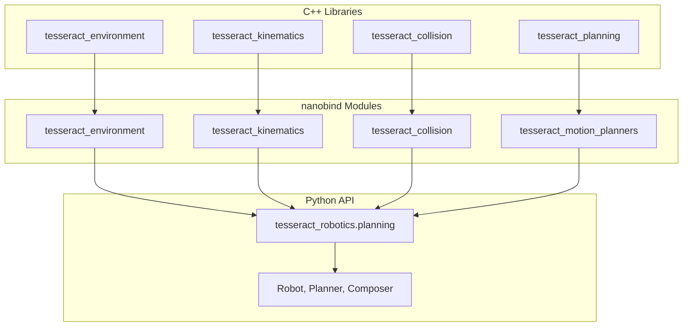

# Developer Guide

Documentation for developers contributing to or extending tesseract_robotics.

## Migration from SWIG

These bindings use [nanobind](https://github.com/wjakob/nanobind) instead of SWIG. Key differences are documented in [Migration Notes](migration.md).

## Building from Source

See [Installation](../getting-started/installation.md) for build instructions.

## Architecture

## Cross-Module Type Resolution

nanobind maintains separate type registries per module. When a function accepts a type from another module, special handling is needed. See [Migration Notes](migration.md#cross-module-type-resolution).

## Contributing

1. Fork the repository
2. Create a feature branch
3. Run tests: `pytest -n auto`
4. Submit a pull request
