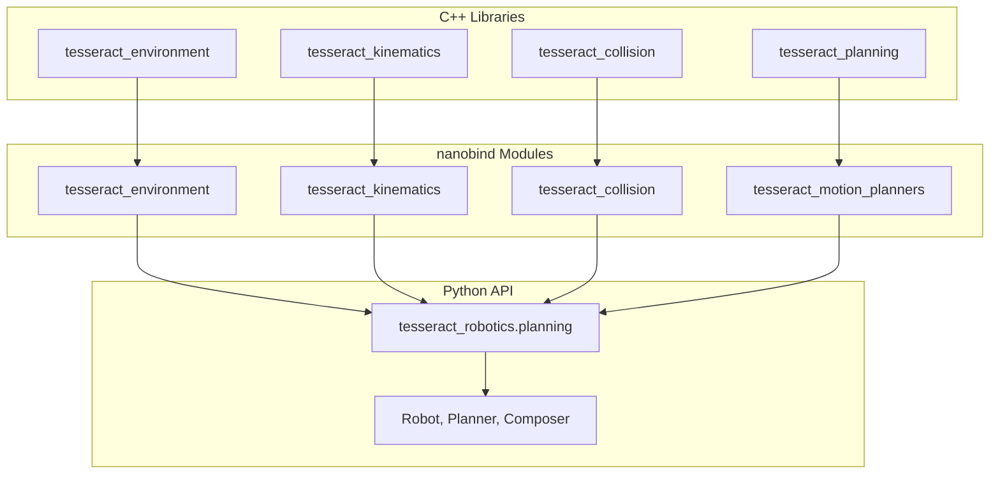

# Developer Guide

Documentation for developers contributing to or extending tesseract_robotics.

## Migration from SWIG

These bindings use [nanobind](https://github.com/wjakob/nanobind) instead of SWIG. Key differences are documented in [Migration Notes](migration.md).

## Building from Source

See [Installation](../getting-started/installation.md) for build instructions.

## Architecture



## Cross-Module Type Resolution

nanobind maintains separate type registries per module. When a function accepts a type from another module, special handling is needed. See [Migration Notes](migration.md#cross-module-type-resolution).

## Type Checking

```bash
pixi run typecheck
```

Uses pyright configured via `pyrightconfig.json`. Key design decisions:

- **Python code is type-checked** - The `planning/` module and other pure Python code
- **Auto-generated stubs are excluded** - nanobind generates `.pyi` stubs with C++ type artifacts that aren't worth cleaning up
- **Hand-written stub exception** - `ompl_base/_ompl_base.pyi` is manually maintained (safe to edit)

When adding new bindings, declare inheritance in nanobind to get correct stubs:

```cpp
// Good - generates: class Derived(Base)
nb::class_<Derived, Base>(m, "Derived")

// Bad - generates: class Derived (no inheritance)
nb::class_<Derived>(m, "Derived")
```

## Contributing

1. Fork the repository
2. Create a feature branch
3. Run tests: `pixi run test`
4. Run type check: `pixi run typecheck`
5. Submit a pull request
