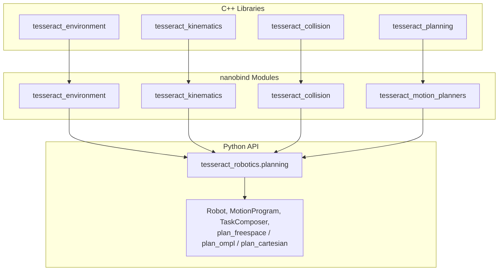

# Developer Guide

## Pixi Workspace

This project uses [pixi](https://pixi.sh) exclusively for package management. Pixi manages all C++ libraries, Python packages, build tools, and platform-specific dependencies through a single lockfile (`pixi.lock`). No pip, conda, poetry, or venv.

### Available Tasks

```bash
pixi task list
```

| Task | Description | What it does |
|------|-------------|--------------|
| `build` | Full build | C++ libs + nanobind bindings |
| `build-cpp` | C++ only | Fetches sources via vcstool, builds 28 packages with colcon |
| `install` | Install bindings | Editable pip install (depends on `build-cpp`) |
| `test` | Run tests | pytest with xdist parallel (depends on `install`) |
| `typecheck` | Type check | pyright on `src/tesseract_robotics/` |
| `lint` | Lint | ruff check |
| `fmt` | Format | ruff format |
| `docs` | Live docs | mkdocs serve with auto-reload |
| `docs-build` | Build docs | Static site to `site/` |

### Daily Workflow

```bash
# First time setup (fetches C++ deps, builds everything, ~15-30 min)
pixi run build

# Run tests
pixi run test

# Run a single test file
pixi run python -m pytest tests/trajopt_sqp/test_trajopt_sqp_bindings.py -v

# Run only tests affected by recent changes
pixi run python -m pytest --testmon

# Run an example
pixi run tesseract_freespace_ompl_example
# or
pixi run python -m tesseract_robotics.examples.freespace_ompl_example

# Interactive shell (all env vars set)
pixi shell
python -c "from tesseract_robotics.planning import Robot; print('ok')"
```

### Rebuild After C++ Changes

If you modify a C++ binding file (`src/*_bindings.cpp`):

```bash
# Reinstall bindings only (fast, ~30s)
pixi run install
```

If you modify upstream C++ sources or `dependencies.rosinstall`:

```bash
# Full C++ rebuild + reinstall
pixi run build
```

### Task Dependency Chain

Tasks use `depends-on` for ordered execution:

```
build
  └── install
        └── build-cpp
```

Running `pixi run build` executes `build-cpp` → `install` automatically. Running `pixi run test` also triggers the full chain since it depends on `install`.

### Environments

The workspace defines multiple Python environments for CI testing:

```bash
# Default environment (Python from pixi.lock)
pixi run test

# Specific Python version
pixi run -e py39 test
pixi run -e py312 test
```

Environments defined in `pyproject.toml`:

| Environment | Python | Usage |
|-------------|--------|-------|
| `default` | from lockfile | Local development |
| `py39` | 3.9.x | CI matrix |
| `py310` | 3.10.x | CI matrix |
| `py311` | 3.11.x | CI matrix |
| `py312` | 3.12.x | CI matrix |

### Dependency Management

All dependencies live in `pyproject.toml` under `[tool.pixi.dependencies]` (conda packages) and `[tool.pixi.pypi-dependencies]` (PyPI packages).

```bash
# Add a conda dependency
pixi add some-package

# Add a PyPI dependency
pixi add --pypi some-package

# Update lockfile after editing pyproject.toml manually
pixi install

# See what's installed
pixi list
```

Critical pins:

- `taskflow>=3.6,<3.8` — 3.8+ requires C++20, we use C++17
- `cereal>=1.3,<2` — serialization backend (0.34+)
- `llvm-openmp>=14,<20` — macOS OpenMP (not Homebrew's)

### CONDA_PREFIX and Worktrees

When working in a git worktree, the `CONDA_PREFIX` env var may point to the main repo's `.pixi/envs/default` instead of the worktree's. This causes build failures (e.g. missing `cereal`). Override when building manually:

```bash
CONDA_PREFIX=$(pwd)/.pixi/envs/default pip install -e . --no-build-isolation
```

Using `pixi run` handles this automatically.

---

## Architecture


```mermaid
graph TD
    subgraph "C++ Libraries"
        A[tesseract_environment]
        B[tesseract_kinematics]
        C[tesseract_collision]
        D[tesseract_planning]
    end

    subgraph "nanobind Modules"
        E[tesseract_environment]
        F[tesseract_kinematics]
        G[tesseract_collision]
        H[tesseract_motion_planners]
    end

    subgraph "Python API"
        I[tesseract_robotics.planning]
        J[Robot, MotionProgram, TaskComposer,<br/>plan_freespace / plan_ompl / plan_cartesian]
    end

    A --> E
    B --> F
    C --> G
    D --> H
    E --> I
    F --> I
    G --> I
    H --> I
    I --> J
```

### Project Layout

```
tesseract_nanobind/
├── pyproject.toml             # pixi workspace + package config
├── pixi.lock                  # locked deps (~200 packages)
├── CMakeLists.txt             # nanobind module build
├── dependencies.rosinstall    # C++ source versions (vcstool)
├── src/
│   ├── tesseract_robotics/    # Python package
│   │   ├── planning/          # High-level API (pure Python)
│   │   ├── viewer/            # 3D visualization
│   │   ├── trajopt_ifopt/     # Low-level optimization
│   │   ├── trajopt_sqp/       # SQP solver
│   │   └── <module>/          # nanobind module + __init__.py + .pyi
│   ├── tesseract_nb.h         # Shared precompiled header
│   └── <module>/              # C++ binding source (*_bindings.cpp)
├── tests/                     # pytest tests
├── examples/                  # Usage examples
├── scripts/
│   ├── build_tesseract_cpp.sh # C++ build (colcon + vcstool)
│   ├── generate_stubs.sh      # Regenerate .pyi stubs
│   └── build_wheel.sh         # Portable wheel with delocate
└── ws/                        # C++ workspace
    ├── src/                   # Fetched C++ sources
    └── install/               # Built C++ libraries
```

---

## Cross-Module Type Resolution

nanobind maintains separate type registries per module. When a function returns a type from another module, that module must be imported first:

```cpp
NB_MODULE(_my_module, m) {
    // Import module that defines the type BEFORE using it
    nb::module_::import_("tesseract_robotics.tesseract_collision._tesseract_collision");

    // Now can return DiscreteContactManager from functions
    .def("getContactManager", [...] { return self.getDiscreteContactManager(); })
}
```

See [Migration Notes](migration.md#cross-module-type-resolution) for details.

---

## Type Checking

```bash
pixi run typecheck
```

Uses pyright configured via `pyrightconfig.json`. Key design decisions:

- **Python code is type-checked** — the `planning/` module and other pure Python code
- **Auto-generated stubs are excluded** — nanobind generates `.pyi` stubs with C++ type artifacts
- **Hand-written stub exception** — `ompl_base/_ompl_base.pyi` is manually maintained

When adding new bindings, declare inheritance in nanobind to get correct stubs:

```cpp
// Good - generates: class Derived(Base)
nb::class_<Derived, Base>(m, "Derived")

// Bad - generates: class Derived (no inheritance)
nb::class_<Derived>(m, "Derived")
```

---

## Stub Generation

After modifying C++ bindings, regenerate `.pyi` stubs:

```bash
bash scripts/generate_stubs.sh
```

This introspects all 20 nanobind modules and writes stubs to `src/tesseract_robotics/<module>/`. Stubs are committed to the repo for IDE support and type checking.

---

## Pre-commit Hooks

```bash
pre-commit install
pre-commit install --hook-type pre-push
```

| Hook | Stage | What it does |
|------|-------|-------------|
| ruff check --fix | pre-commit | Auto-fix lint issues |
| ruff format | pre-commit | Format code |
| stage-formatted | pre-commit | Auto-stage ruff changes |
| pyright | pre-push | Type check |
| pytest --testmon | pre-push | Run affected tests |

Skip when needed: `git commit --no-verify` / `git push --no-verify`

---

## Contributing

1. Fork the repository
2. Create a feature branch (or use a [git worktree](https://git-scm.com/docs/git-worktree))
3. `pixi run build` (first time)
4. Make changes
5. `pixi run test`
6. `pixi run typecheck`
7. Submit a pull request
