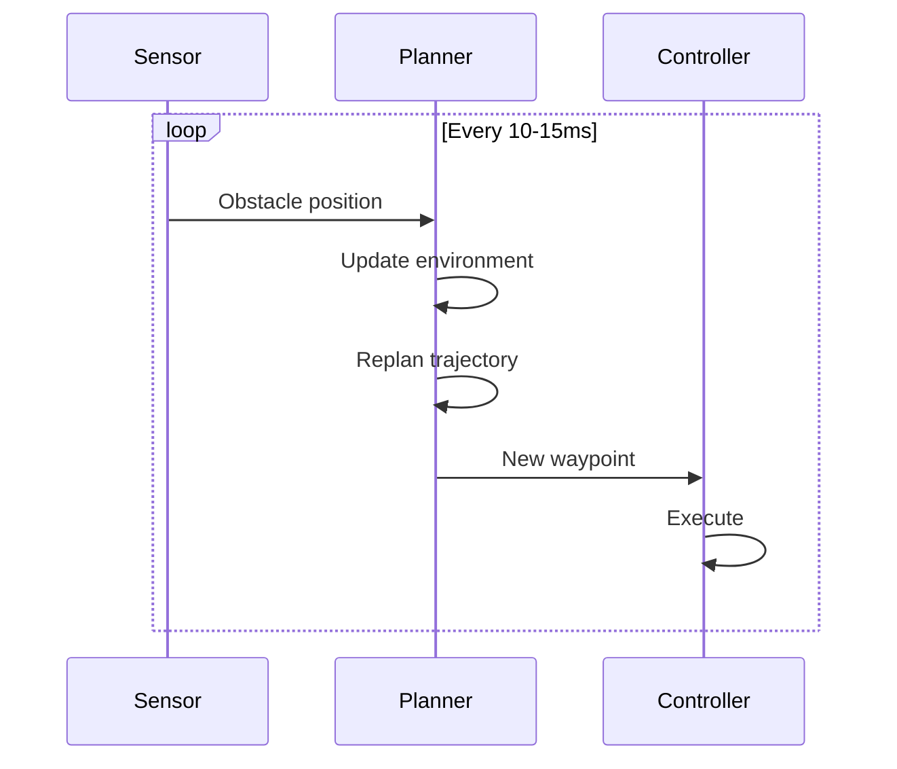

# Online Planning

Real-time trajectory replanning with moving obstacles.

## Overview

Online planning continuously replans as the environment changes:



## Performance Comparison

| Method | Rate | Use Case |
|--------|------|----------|
| Task Composer | 1-5 Hz | Moderate changes |
| Low-Level SQP (discrete) | 73 Hz | Fast replanning |
| Low-Level SQP (no collision) | 128 Hz | Safe environments |
| Low-Level SQP (LVS continuous) | 5-10 Hz | High precision |

## Low-Level SQP Example

Real-time replanning at 73 Hz with discrete collision:

```python title="online_planning_sqp_example.py"
import numpy as np
import time
from tesseract_robotics.planning import Robot
from tesseract_robotics.ifopt import Bounds
from tesseract_robotics.trajopt_ifopt import (
    JointPosition, CartPosConstraint, CartPosInfo, CartPosInfoType,
    TrajOptCollisionConfig, CollisionCache, SingleTimestepCollisionEvaluator,
    DiscreteCollisionConstraint, interpolate
)
from tesseract_robotics.trajopt_sqp import (
    TrustRegionSQPSolver, OSQPEigenSolver, IfoptQPProblem, SQPStatus
)

def setup_robot():
    """Load robot with human obstacle."""
    robot = Robot.from_tesseract_support(
        "abb_irb2400",
        extra_urdf="abb_irb2400_support/urdf/human_obstacle.urdf"
    )
    return robot

def build_problem(env, manip, joint_names, start_joints, target_pose,
                  n_steps=12, prev_trajectory=None):
    """Build QP problem for single planning iteration."""

    n_joints = len(joint_names)
    limits = manip.getLimits()
    lower = limits.joint_limits[:, 0]
    upper = limits.joint_limits[:, 1]

    # Create problem
    qp = IfoptQPProblem()

    # Add variables with warm-start
    variables = []
    for i in range(n_steps):
        if i == 0:
            init = start_joints
        elif prev_trajectory is not None and i < len(prev_trajectory):
            init = prev_trajectory[i]
        else:
            # Interpolate to goal
            t = i / (n_steps - 1)
            init = interpolate(start_joints, start_joints, t)  # Placeholder

        var = JointPosition(init, joint_names, f"joint_pos_{i}")

        # Fix start position
        if i == 0:
            bounds = [Bounds(start_joints[j], start_joints[j])
                      for j in range(n_joints)]
        else:
            bounds = [Bounds(lower[j], upper[j]) for j in range(n_joints)]

        var.SetBounds(bounds)
        variables.append(var)
        qp.addVariableSet(var)

    # Cartesian goal constraint
    cart_info = CartPosInfo(manip, "tool0", "base_link",
                           target_pose, CartPosInfoType.FULL)
    cart_constraint = CartPosConstraint(cart_info, variables[-1], "cart_goal")
    qp.addConstraintSet(cart_constraint)

    # Collision constraints (discrete, every other waypoint)
    config = TrajOptCollisionConfig()
    config.contact_margin_data.default_margin = 0.025
    config.collision_coeff_data.default_coeff = 20.0

    cache = CollisionCache(100)
    for i in range(0, n_steps, 2):  # Every other waypoint
        evaluator = SingleTimestepCollisionEvaluator(cache, manip, env, config)
        collision = DiscreteCollisionConstraint(
            evaluator, variables[i], f"collision_{i}"
        )
        qp.addConstraintSet(collision)

    return qp, variables

def move_obstacle(env, t):
    """Move human obstacle along sinusoidal path."""
    x = 0.8 + 0.3 * np.sin(2 * np.pi * t / 5.0)
    y = 0.2 * np.cos(2 * np.pi * t / 5.0)
    z = 0.0

    # Update obstacle position in environment
    # ... (implementation depends on obstacle setup)

def run(steps=12, verbose=False):
    """Main planning loop."""
    robot = setup_robot()
    env = robot.env
    manip = env.getKinematicGroup("manipulator")
    joint_names = list(manip.getJointNames())

    # Target pose
    target_pose = robot.fk(np.array([0.5, -0.3, 0.4, 0.0, 0.3, 0.0]))

    # Solver setup
    solver = TrustRegionSQPSolver(OSQPEigenSolver())
    solver.params.max_iterations = 10
    solver.params.initial_trust_box_size = 0.01

    # Initial state
    current_joints = np.zeros(len(joint_names))
    trajectory = None

    # Planning loop
    num_iterations = 100
    times = []

    for iteration in range(num_iterations):
        t_start = time.perf_counter()

        # Update obstacle
        move_obstacle(env, iteration * 0.01)

        # Build and solve problem
        qp, variables = build_problem(
            env, manip, joint_names,
            current_joints, target_pose,
            n_steps=steps,
            prev_trajectory=trajectory
        )

        solver.init(qp)
        status = solver.stepSQPSolver(qp)
        solver.setBoxSize(0.01)  # Reset trust region

        # Extract trajectory
        trajectory = np.array([var.GetValues() for var in variables])

        # "Execute" first step (move robot)
        if len(trajectory) > 1:
            current_joints = trajectory[1]

        t_end = time.perf_counter()
        times.append(t_end - t_start)

        if verbose:
            print(f"Iter {iteration}: {(t_end-t_start)*1000:.1f}ms, status={status}")

    # Report performance
    avg_time = np.mean(times) * 1000
    hz = 1000 / avg_time
    print(f"\nPerformance: {avg_time:.1f}ms avg ({hz:.0f} Hz)")

    return trajectory

if __name__ == "__main__":
    run()
```

??? example "Expected Output"
    ```
    Performance: 13.7ms avg (73 Hz)
    ```

## Key Concepts

### 1. Rebuild Problem Each Iteration

Due to shared_ptr lifecycle, rebuild the QP problem each iteration:

```python
for iteration in range(num_iterations):
    # Build fresh problem
    qp, variables = build_problem(...)

    # Re-initialize solver
    solver.init(qp)

    # Single step (not full solve)
    solver.stepSQPSolver(qp)
```

!!! warning "Don't Reuse Problems"
    Reusing the same `IfoptQPProblem` across iterations causes segfaults.
    Always create a new problem.

### 2. Warm-Start from Previous Solution

Use previous trajectory to initialize variables:

```python
for i in range(n_steps):
    if prev_trajectory is not None and i < len(prev_trajectory):
        init = prev_trajectory[i]  # Warm-start
    else:
        init = interpolate(start, goal, i / (n_steps-1))

    var = JointPosition(init, joint_names, f"joint_pos_{i}")
```

### 3. Fix Start Position

The first waypoint must match current robot state:

```python
if i == 0:
    # Fix to current position
    bounds = [Bounds(current[j], current[j]) for j in range(n_joints)]
else:
    # Allow optimization
    bounds = [Bounds(lower[j], upper[j]) for j in range(n_joints)]
```

### 4. Single Step vs Full Solve

For real-time, use `stepSQPSolver` instead of `solve`:

```python
# Full solve (slower, better convergence)
solver.solve(qp)

# Single step (faster, incremental)
solver.stepSQPSolver(qp)
solver.setBoxSize(0.01)  # Reset trust region after step
```

### 5. Sparse Collision Checking

Check collision every N waypoints for speed:

```python
# Every other waypoint (faster)
for i in range(0, n_steps, 2):
    collision = DiscreteCollisionConstraint(evaluator, variables[i], ...)

# Every waypoint (slower, safer)
for i in range(n_steps):
    collision = DiscreteCollisionConstraint(evaluator, variables[i], ...)
```

## Continuous Collision

For higher precision (5-10 Hz):

```python
from tesseract_robotics.trajopt_ifopt import (
    LVSDiscreteCollisionEvaluator, ContinuousCollisionConstraint
)

# LVS evaluator samples along trajectory segment
evaluator = LVSDiscreteCollisionEvaluator(
    cache, manip, env, config,
    dynamic_environment=True
)

# Add constraint between consecutive waypoints
for i in range(n_steps - 1):
    constraint = ContinuousCollisionConstraint(
        evaluator,
        variables[i], variables[i+1],
        fixed0=False, fixed1=False,
        name=f"cont_collision_{i}"
    )
    qp.addConstraintSet(constraint)
```

## Visualization

Animate trajectory in viewer:

```python
from tesseract_robotics_viewer import TesseractViewer

viewer = TesseractViewer()
viewer.update_environment(robot.env, [0, 0, 0])

# Convert trajectory to viewer format
joint_names = list(manip.getJointNames())
dt = 0.1  # Time between waypoints

trajectory_list = []
for i, wp in enumerate(trajectory):
    row = wp.tolist() + [i * dt]  # [joints..., time]
    trajectory_list.append(row)

viewer.update_trajectory_list(joint_names, trajectory_list)
viewer.start_serve_background()
```

## Task Composer Alternative

For slower updates (1-5 Hz), use Task Composer:

```python title="online_planning_example.py"
from tesseract_robotics.planning import Robot, Composer
import numpy as np

robot = Robot.from_tesseract_support("abb_irb2400")

for iteration in range(100):
    # Update obstacle position
    update_obstacle(robot.env, iteration)

    # Replan with Task Composer
    composer = Composer(robot)
    composer.add_freespace(goal_joints=goal)

    result = composer.plan()

    if result.success:
        # Execute first waypoint
        trajectory = result.get_trajectories()[0]
        execute(trajectory[0])
```

## Running the Examples

```bash
# Low-level SQP (73 Hz)
python examples/online_planning_sqp_example.py

# Task Composer based
python examples/online_planning_example.py
```

## Performance Tuning

### Faster Planning

```python
# Fewer waypoints
n_steps = 8  # Instead of 12

# Fewer collision checks
for i in range(0, n_steps, 3):  # Every third waypoint
    ...

# Smaller trust region (faster convergence)
solver.params.initial_trust_box_size = 0.01

# Fewer iterations per step
solver.params.max_iterations = 5
```

### Better Quality

```python
# More waypoints
n_steps = 20

# Continuous collision
use_continuous_collision = True

# More iterations
solver.params.max_iterations = 50

# Tighter convergence
solver.params.min_approx_improve = 1e-5
```

## Next Steps

- [Low-Level SQP Guide](../user-guide/low-level-sqp.md) - Full API reference
- [Collision Detection](../user-guide/collision.md) - Collision configuration
