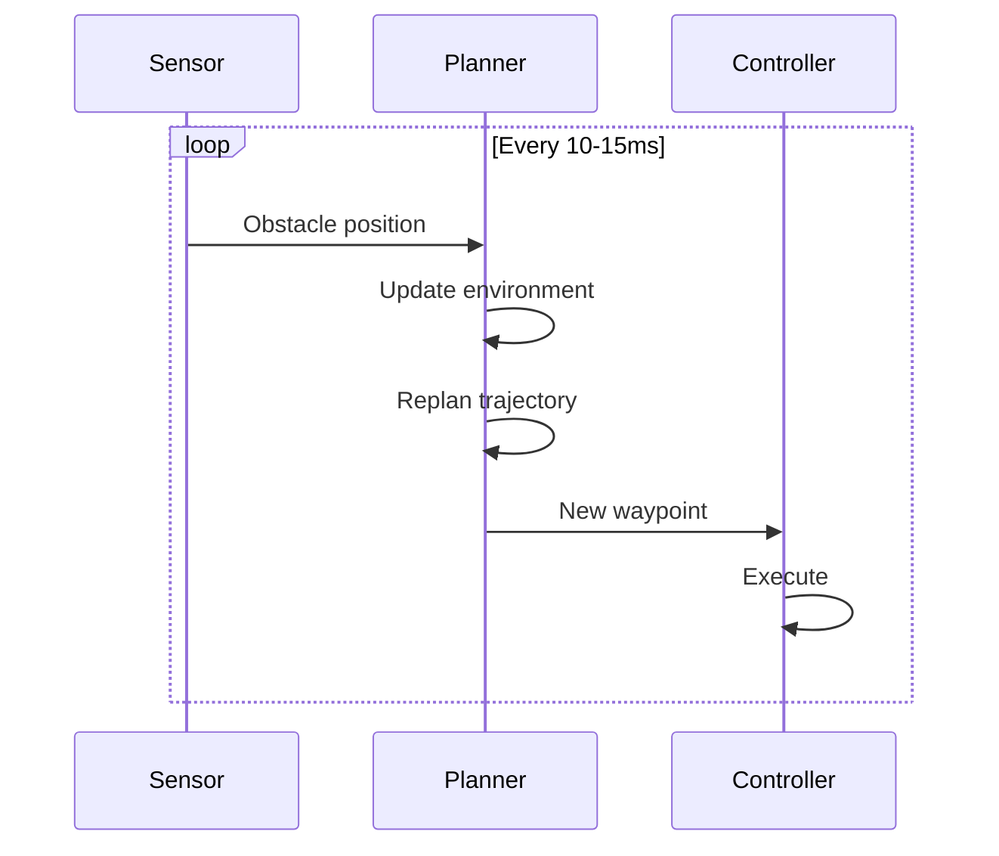

# Online Planning

Real-time trajectory replanning with moving obstacles.

## Overview

Online planning continuously replans as the environment changes:


```mermaid
sequenceDiagram
    participant Sensor
    participant Planner
    participant Controller

    loop Every 10-15ms
        Sensor->>Planner: Obstacle position
        Planner->>Planner: Update environment
        Planner->>Planner: Replan trajectory
        Planner->>Controller: New waypoint
        Controller->>Controller: Execute
    end
```

## Performance Comparison

| Method | Rate | Use Case |
|--------|------|----------|
| Task Composer | 1-5 Hz | Moderate scene changes |
| Low-Level SQP (discrete) | 73 Hz | Fast replanning |
| Low-Level SQP (no collision) | 128 Hz | Safe environments |
| Low-Level SQP (LVS continuous) | 5-10 Hz | High precision |

Numbers are from the reference
[`online_planning_sqp_example.py`](https://github.com/tesseract-robotics/tesseract_nanobind/blob/main/src/tesseract_robotics/examples/online_planning_sqp_example.py)
on an 8-DOF gantry workcell. Run it on your machine to get local numbers.

## Low-Level SQP Example

Real-time replanning at ~73 Hz using discrete collision. The snippets below
are the real shipped source, split into three regions: `setup`, `problem`,
`sqp_loop`. For the accompanying conceptual guide see the
[Low-Level SQP API](../user-guide/low-level-sqp.md) page.

### Setup

```python title="online_planning_sqp_example.py (setup)"
--8<-- "src/tesseract_robotics/examples/online_planning_sqp_example.py:setup"
```

### Problem construction

```python title="online_planning_sqp_example.py (problem)"
--8<-- "src/tesseract_robotics/examples/online_planning_sqp_example.py:problem"
```

### SQP loop

```python title="online_planning_sqp_example.py (sqp_loop)"
--8<-- "src/tesseract_robotics/examples/online_planning_sqp_example.py:sqp_loop"
```

Run the complete example:

```bash
tesseract_online_planning_sqp_example
```

??? example "Expected Output (indicative)"
    ```
    Performance: ~13ms avg (~73 Hz discrete / ~128 Hz no-collision)
    ```

## Key Concepts

### 1. Variable hierarchy (0.34+)

Use `createNodesVariables` to build `NodesVariables` → `Node` → `Var`:

```python
from tesseract_robotics.trajopt_ifopt import Bounds, createNodesVariables

bounds = Bounds(-3.14, 3.14)
nodes_variables = createNodesVariables(
    "trajectory", joint_names, initial_states, bounds,
)
vars_list = [node.getVar("joints") for node in nodes_variables.getNodes()]
```

### 2. Warm-start from the previous solution

Between ticks, push the previous trajectory back into the variables:

```python
nodes_variables.setVariables(trajectory.flatten())
solver.init(problem)
solver.stepSQPSolver()
```

### 3. Reset the trust region each tick

`stepSQPSolver` shrinks the trust region — if you don't reset it, successive
ticks get smaller and smaller steps:

```python
solver.stepSQPSolver()
solver.setBoxSize(0.01)  # Reset trust region
```

### 4. Single step vs full solve

- Use `solver.solve(problem)` on the first tick for global convergence.
- Use `solver.stepSQPSolver()` per tick afterwards for incremental optimization.

### 5. Sparse collision checking

Check collision every N waypoints for speed:

```python
# Every other waypoint (faster)
for i in range(0, n_steps, 2):
    collision = DiscreteCollisionConstraint(evaluator, variables[i], ...)

# Every waypoint (slower, safer)
for i in range(n_steps):
    collision = DiscreteCollisionConstraint(evaluator, variables[i], ...)
```

## Continuous Collision

For higher precision (5-10 Hz) use the LVS continuous evaluator with
`ContinuousCollisionConstraint`:

```python
from tesseract_robotics.trajopt_ifopt import (
    LVSContinuousCollisionEvaluator, ContinuousCollisionConstraint
)

evaluator = LVSContinuousCollisionEvaluator(
    manip, env, config,
    dynamic_environment=True,
)

# Add constraint between consecutive waypoints
for i in range(n_steps - 1):
    constraint = ContinuousCollisionConstraint(
        evaluator,
        variables[i], variables[i + 1],
        fixed0=False, fixed1=False,
        name=f"cont_collision_{i}",
    )
    problem.addConstraintSet(constraint)
```

## Visualization

Animate a trajectory in the viewer:

```python
from tesseract_robotics.viewer import TesseractViewer

viewer = TesseractViewer()
viewer.update_environment(robot.env, [0, 0, 0])

# Convert trajectory to viewer format (joints + time column)
dt = 0.1
trajectory_list = [wp.tolist() + [i * dt] for i, wp in enumerate(trajectory)]

viewer.update_trajectory_list(joint_names, trajectory_list)
viewer.start_serve_background()
```

## Task Composer Alternative

For slower updates (1-5 Hz) with higher-level abstractions, use Task Composer.
See [`online_planning_example.py`](https://github.com/tesseract-robotics/tesseract_nanobind/blob/main/src/tesseract_robotics/examples/online_planning_example.py):

```bash
tesseract_online_planning_example
```

## Running the Examples

```bash
# Low-level SQP (~73 Hz discrete)
tesseract_online_planning_sqp_example

# Task Composer based
tesseract_online_planning_example
```

Or via module invocation:

```bash
pixi run python -m tesseract_robotics.examples.online_planning_sqp_example
pixi run python -m tesseract_robotics.examples.online_planning_example
```

## Performance Tuning

### Faster planning

```python
# Fewer waypoints
n_steps = 8  # Instead of 12

# Fewer collision checks
for i in range(0, n_steps, 3):  # Every third waypoint
    ...

# Smaller trust region (faster convergence)
solver.params.initial_trust_box_size = 0.01

# Fewer iterations per step
solver.params.max_iterations = 5
```

### Better quality

```python
# More waypoints
n_steps = 20

# Continuous collision
# (use ContinuousCollisionConstraint + LVSContinuousCollisionEvaluator)

# More iterations
solver.params.max_iterations = 50

# Tighter convergence
solver.params.min_approx_improve = 1e-5
```

## Next Steps

- [Low-Level SQP Guide](../user-guide/low-level-sqp.md) - Full API reference
- [Collision Detection](../user-guide/collision.md) - Collision configuration
