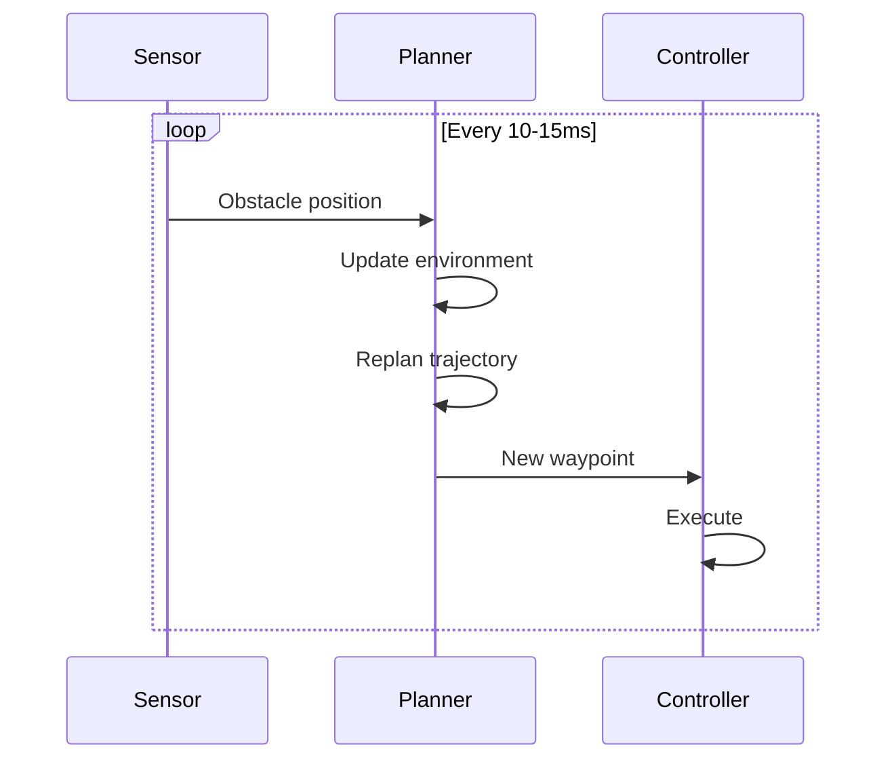

# Online Planning

Real-time trajectory replanning with moving obstacles.

## Overview

Online planning continuously replans as the environment changes:


```mermaid
sequenceDiagram
    participant Sensor
    participant Planner
    participant Controller

    loop Every 10-15ms
        Sensor->>Planner: Obstacle position
        Planner->>Planner: Update environment
        Planner->>Planner: Replan trajectory
        Planner->>Controller: New waypoint
        Controller->>Controller: Execute
    end
```

## Performance Comparison

| Method | Rate | Use Case |
|--------|------|----------|
| Task Composer | 1-5 Hz | Moderate scene changes |
| Low-Level SQP (discrete) | ~70 Hz (14 ms per replan) | Fast replanning |
| Low-Level SQP (LVS continuous) | ~20 Hz (52 ms per replan) | Swept collision between waypoints |

The low-level SQP rates come from the reference
[`online_planning_sqp_example.py`](https://github.com/tesseract-robotics/tesseract_nanobind/blob/main/src/tesseract_robotics/examples/online_planning_sqp_example.py)
on its 8-DOF gantry workcell: the median over three runs of the mean replan step after the
initial solve, on an Apple M1 Max with trajopt 0.35.0. The machine was shared at the time, so
treat them as indicative, and run the example to get local numbers.

## Low-Level SQP Example

Real-time replanning at about 70 Hz using discrete collision. The snippets below
are the real shipped source, split into three regions: `setup`, `problem`,
`sqp_loop`. For the accompanying conceptual guide see the
[Low-Level SQP API](../user-guide/low-level-sqp.md) page.

### Setup

```python title="online_planning_sqp_example.py (setup)"
--8<-- "src/tesseract_robotics/examples/online_planning_sqp_example.py:setup"
```

### Problem construction

The problem is a `TrajOptQPProblem`, built as tesseract_planning's
`online_planning_example.cpp` builds it. The start and target poses and one collision constraint
per step are constraint sets, and the joint velocity is a squared cost. Continuous mode sets the
collision check type to `LVS_DISCRETE`, which its evaluator requires; the C++ reference sets
`DISCRETE` there and throws.

```python title="online_planning_sqp_example.py (problem)"
--8<-- "src/tesseract_robotics/examples/online_planning_sqp_example.py:problem"
```

### SQP loop

```python title="online_planning_sqp_example.py (sqp_loop)"
--8<-- "src/tesseract_robotics/examples/online_planning_sqp_example.py:sqp_loop"
```

Run the complete example:

```bash
tesseract_online_planning_sqp_example
```

??? example "Expected output (indicative; the timings vary by machine)"
    ```text
    Manipulator joints (8): ['gantry_axis_1', 'gantry_axis_2', 'joint_1', 'joint_2', 'joint_3', 'joint_4', 'joint_5', 'joint_6']
    Building optimization problem (collision: discrete)...
    Running initial global solve...
    Initial solve: cost=3.9284, time=31.5ms
    Online replanning (10 iterations)...
    Replan timing: avg=14.7ms (68 Hz)
    Trajectory: 12 waypoints x 8 joints
    ```

    Between the second and third line, `problem.print()` dumps the problem's state, as the C++
    reference does. Before the first solve, trajopt 0.35.0 prints zero counts and uninitialized
    bounds there.

## Key Concepts

### 1. Variable hierarchy (0.34+)

Use `createNodesVariables` to build `NodesVariables` → `Node` → `Var`:

```python
from tesseract_robotics.trajopt_ifopt import Bounds, createNodesVariables

bounds = Bounds(-3.14, 3.14)
nodes_variables = createNodesVariables(
    "trajectory", joint_names, initial_states, bounds,
)
vars_list = [node.getVar("joints") for node in nodes_variables.getNodes()]
```

### 2. Warm-start from the previous solution

Between ticks, push the previous trajectory back into the variables:

```python
nodes_variables.setVariables(trajectory.flatten())
solver.init(problem)
solver.stepSQPSolver()
```

### 3. Reset the trust region each tick

`stepSQPSolver` shrinks the trust region — if you don't reset it, successive
ticks get smaller and smaller steps:

```python
solver.stepSQPSolver()
solver.setBoxSize(0.01)  # Reset trust region
```

### 4. Single step vs full solve

- Use `solver.solve(problem)` on the first tick for global convergence.
- Use `solver.stepSQPSolver()` per tick afterwards for incremental optimization.

### 5. Sparse collision checking

Check collision every N waypoints for speed:

```python
# Every other waypoint (faster)
for i in range(0, n_steps, 2):
    collision = DiscreteCollisionConstraint(evaluator, variables[i], ...)

# Every waypoint (slower, safer)
for i in range(n_steps):
    collision = DiscreteCollisionConstraint(evaluator, variables[i], ...)
```

## Continuous Collision

To check the motion between waypoints, not only the waypoints, use
`ContinuousCollisionConstraint` with an LVS evaluator. Each evaluator requires its own check type
in the collision config, and its constructor raises otherwise: `LVSDiscreteCollisionEvaluator`
needs `LVS_DISCRETE` (the example's continuous mode, about 20 Hz), and
`LVSContinuousCollisionEvaluator` needs `LVS_CONTINUOUS` or `CONTINUOUS`:

```python
from tesseract_robotics.tesseract_collision import CollisionEvaluatorType
from tesseract_robotics.trajopt_ifopt import (
    ContinuousCollisionConstraint,
    LVSContinuousCollisionEvaluator,
    TrajOptCollisionConfig,
)

config = TrajOptCollisionConfig(0.1, 10.0)  # margin (m), coefficient
config.collision_check_config.type = CollisionEvaluatorType.LVS_CONTINUOUS

# One constraint per segment between consecutive waypoints. The first segment starts at the
# pinned current state, so its start is fixed.
for i in range(n_steps - 1):
    evaluator = LVSContinuousCollisionEvaluator(manip, env, config, dynamic_environment=True)
    constraint = ContinuousCollisionConstraint(
        evaluator,
        variables[i], variables[i + 1],
        fixed0=(i == 0), fixed1=False,
        max_num_cnt=config.max_num_cnt,
        name=f"cont_collision_{i}",
    )
    problem.addConstraintSet(constraint)
```

## Visualization

Animate a trajectory in the viewer:

```python
from tesseract_robotics.viewer import TesseractViewer

viewer = TesseractViewer()
viewer.update_environment(robot.env, [0, 0, 0])

# Convert trajectory to viewer format (joints + time column)
dt = 0.1
trajectory_list = [wp.tolist() + [i * dt] for i, wp in enumerate(trajectory)]

viewer.update_trajectory_list(joint_names, trajectory_list)
viewer.start_serve_background()
```

## Task Composer Alternative

For slower updates (1-5 Hz) with higher-level abstractions, use Task Composer.
See [`online_planning_example.py`](https://github.com/tesseract-robotics/tesseract_nanobind/blob/main/src/tesseract_robotics/examples/online_planning_example.py):

```bash
tesseract_online_planning_example
```

## Running the Examples

```bash
# Low-level SQP (discrete collision)
tesseract_online_planning_sqp_example

# Task Composer based
tesseract_online_planning_example
```

Or via module invocation:

```bash
pixi run python -m tesseract_robotics.examples.online_planning_sqp_example
pixi run python -m tesseract_robotics.examples.online_planning_example
```

## Performance Tuning

### Faster planning

```python
# Fewer waypoints
n_steps = 8  # Instead of 12

# Fewer collision checks
for i in range(0, n_steps, 3):  # Every third waypoint
    ...

# Smaller trust region (faster convergence)
solver.params.initial_trust_box_size = 0.01

# Fewer iterations per step
solver.params.max_iterations = 5
```

### Better quality

```python
# More waypoints
n_steps = 20

# Continuous collision
# (use ContinuousCollisionConstraint + LVSContinuousCollisionEvaluator)

# More iterations
solver.params.max_iterations = 50

# Tighter convergence
solver.params.min_approx_improve = 1e-5
```

## Next Steps

- [Low-Level SQP Guide](../user-guide/low-level-sqp.md) - Full API reference
- [Collision Detection](../user-guide/collision.md) - Collision configuration
