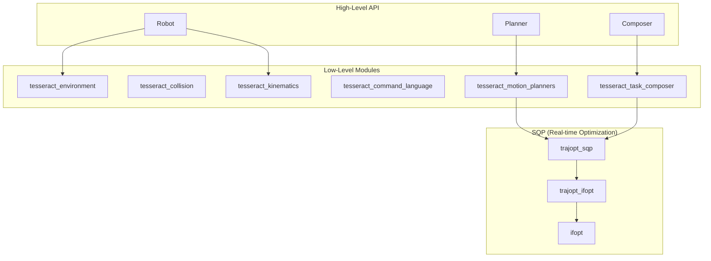

# tesseract_robotics

Python bindings for the Tesseract Motion Planning Framework.

## Overview

**tesseract_robotics** provides Python bindings for [Tesseract](https://github.com/tesseract-robotics/tesseract), an industrial-grade motion planning framework. It enables:

- **Robot modeling** from URDF/SRDF files
- **Collision detection** using FCL and Bullet
- **Forward/inverse kinematics** with KDL and OPW solvers
- **Motion planning** with OMPL, TrajOpt, Descartes, and more
- **Real-time trajectory optimization** with the low-level SQP API

## Architecture



## Quick Example

```python
from tesseract_robotics.planning import Robot
import numpy as np

# Load robot from URDF
robot = Robot.from_urdf("robot.urdf", "robot.srdf")

# Forward kinematics
joints = np.array([0.0, -0.5, 0.5, 0.0, 0.5, 0.0])
tcp_pose = robot.fk(joints, group="manipulator")
print(f"TCP position: {tcp_pose.translation()}")

# Inverse kinematics
target = tcp_pose
target.translate([0.1, 0, 0])  # Move 10cm in X
solutions = robot.ik(target, group="manipulator")

# Check for collisions
is_collision_free = robot.check_collision(solutions[0])

# Plan motion
trajectory = robot.plan(
    start=joints,
    goal=solutions[0],
    planner="ompl"
)
```

## Planners

| Planner | Type | Use Case |
|---------|------|----------|
| **OMPL** | Sampling-based | Free-space motion, complex environments |
| **TrajOpt** | Optimization | Cartesian paths, collision avoidance |
| **TrajOptIfopt** | SQP/OSQP | Real-time replanning, online control |
| **Descartes** | Graph search | Dense Cartesian toolpaths |
| **Simple** | Interpolation | Joint-space interpolation |

## Performance

The low-level SQP API enables real-time trajectory optimization:

| Configuration | Rate |
|---------------|------|
| Without collision | 128 Hz |
| With discrete collision | 73 Hz |
| With LVS continuous collision | 5-10 Hz |

## Next Steps

- [Installation](getting-started/installation.md) - Install the package
- [Quickstart](getting-started/quickstart.md) - Your first motion plan
- [Core Concepts](getting-started/concepts.md) - Understand the architecture
- [Examples](examples/index.md) - Learn from working examples
