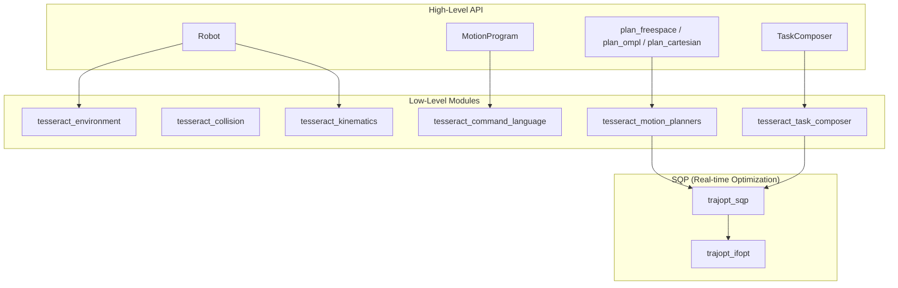

# tesseract_robotics

Python bindings for the Tesseract Motion Planning Framework.

## Overview

**tesseract_robotics** provides Python bindings for [Tesseract](https://github.com/tesseract-robotics/tesseract), an industrial-grade motion planning framework. It enables:

- **Robot modeling** from URDF/SRDF files
- **Collision detection** using FCL and Bullet
- **Forward/inverse kinematics** with KDL and OPW solvers
- **Motion planning** with OMPL, TrajOpt, Descartes, and more
- **Real-time trajectory optimization** with the low-level SQP API

## Architecture


```mermaid
graph TB
    subgraph high["High-Level API"]
        Robot["Robot"]
        MP["MotionProgram"]
        PF["plan_freespace / plan_ompl / plan_cartesian"]
        TC["TaskComposer"]
    end

    subgraph low["Low-Level Modules"]
        env["tesseract_environment"]
        col["tesseract_collision"]
        kin["tesseract_kinematics"]
        cmd["tesseract_command_language"]
        mp["tesseract_motion_planners"]
        tc["tesseract_task_composer"]
    end

    subgraph sqp["SQP (Real-time Optimization)"]
        tsqp["trajopt_sqp"]
        tifopt["trajopt_ifopt"]
    end

    Robot --> env
    Robot --> kin
    MP --> cmd
    PF --> mp
    TC --> tc
    mp --> tsqp
    tc --> tsqp
    tsqp --> tifopt
```

## Quick Example

```python
import numpy as np
from tesseract_robotics.planning import (
    Robot, MotionProgram, JointTarget, CartesianTarget, Pose, plan_freespace,
)

# Load a bundled robot
robot = Robot.from_tesseract_support("abb_irb2400")

# Forward kinematics (note: group_name is first positional arg)
joints = np.zeros(6)
tcp_pose = robot.fk("manipulator", joints)
print(f"TCP position: {tcp_pose.position}")

# Inverse kinematics
target = Pose.from_xyz_rpy(0.6, 0.0, 0.5, 0.0, 0.0, 0.0)
ik_solution = robot.ik("manipulator", target, seed=joints)

# Plan a freespace motion
program = (
    MotionProgram("manipulator")
    .move_to(JointTarget(joints))
    .move_to(CartesianTarget(target))
)
result = plan_freespace(robot, program)
if result.successful:
    print(f"Found trajectory with {len(result.trajectory)} waypoints")
```

## Planners

| Planner | Type | Use Case |
|---------|------|----------|
| **OMPL** | Sampling-based | Free-space motion, complex environments |
| **TrajOpt** | Optimization | Cartesian paths, collision avoidance |
| **TrajOptIfopt** | SQP/OSQP | Real-time replanning, online control |
| **Descartes** | Graph search | Dense Cartesian toolpaths |
| **Simple** | Interpolation | Joint-space interpolation |

## Performance

The low-level SQP API enables real-time trajectory optimization.
Rates depend on problem size and collision mode. See
[`online_planning_sqp_example.py`](https://github.com/tesseract-robotics/tesseract_nanobind/blob/main/src/tesseract_robotics/examples/online_planning_sqp_example.py)
which prints measured rates for a reference 6-DOF problem on your machine.

## Next Steps

- [Installation](getting-started/installation.md) - Install the package
- [Quickstart](getting-started/quickstart.md) - Your first motion plan
- [Core Concepts](getting-started/concepts.md) - Understand the architecture
- [Examples](examples/index.md) - Learn from working examples

