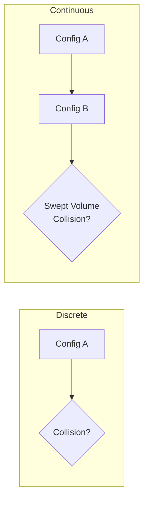
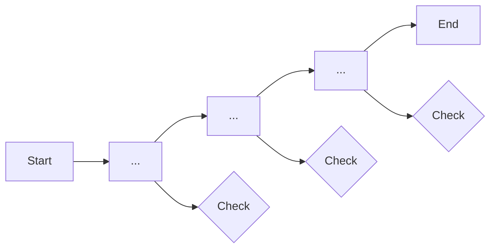

# Collision Detection

tesseract_robotics provides discrete and continuous collision checking using FCL and Bullet backends.

## Quick Collision Check

=== "High-Level API"

    ```python
    from tesseract_robotics.planning import Robot
    import numpy as np

    robot = Robot.from_tesseract_support("abb_irb2400")
    joints = np.array([0.5, -0.5, 0.5, 0.0, 0.5, 0.0])

    # Simple check
    is_safe = robot.check_collision(joints)
    print(f"Collision-free: {is_safe}")
    ```

=== "With Contact Details"

    ```python
    contacts = robot.get_contacts(joints)

    for contact in contacts:
        print(f"Contact: {contact.link_names[0]} <-> {contact.link_names[1]}")
        print(f"  Distance: {contact.distance:.4f} m")
        print(f"  Point: {contact.nearest_points[0]}")
    ```

## Collision Managers

tesseract supports multiple collision backends:

| Manager | Strengths | Use Case |
|---------|-----------|----------|
| **FCL** | Fast broad-phase | General purpose |
| **Bullet** | Continuous collision | Trajectory validation |
| **BulletCast** | Swept volumes | Time-parameterized paths |

### Discrete vs Continuous



!!! info "When to Use Continuous"
    - **Discrete**: Fast point checks, obstacle avoidance in planning
    - **Continuous**: Trajectory validation, fast-moving robots, thin obstacles

## Discrete Collision Checking

```python
from tesseract_robotics.tesseract_collision import (
    DiscreteContactManager,
    ContactRequest,
    ContactTestType
)

# Get discrete manager
manager = env.getDiscreteContactManager()

# Configure request
request = ContactRequest()
request.type = ContactTestType.ALL  # or FIRST, CLOSEST
request.calculate_distance = True
request.calculate_penetration = True

# Set state and check
env.setState(joint_names, joint_values)
manager.setActiveCollisionObjects(env.getActiveLinkNames())
manager.setContactDistanceThreshold(0.05)  # 5cm margin

contacts = manager.contactTest(request)

for key, results in contacts.items():
    link_a, link_b = key
    for result in results:
        print(f"{link_a} <-> {link_b}: {result.distance:.4f}m")
```

## Continuous Collision Checking

Check for collisions along a motion segment:

```python
from tesseract_robotics.tesseract_collision import ContinuousContactManager

# Get continuous manager
manager = env.getContinuousContactManager()

# Set start and end transforms
manager.setCollisionObjectsTransform(
    link_names,
    start_transforms,
    end_transforms
)

# Check swept volume
contacts = manager.contactTest(request)
```

## LVS (Longest Valid Segment)

LVS interpolates between waypoints and checks at discrete points:



Used in TrajOpt for efficient continuous collision approximation:

```python
from tesseract_robotics.trajopt_common import TrajOptCollisionConfig

config = TrajOptCollisionConfig()
config.contact_margin_data.default_margin = 0.025  # 2.5cm
config.collision_margin_buffer = 0.05  # Additional buffer for LVS
config.longest_valid_segment_length = 0.05  # 5cm interpolation
```

## Contact Margins

Contact margins define the safety buffer around objects:

```python
from tesseract_robotics.tesseract_collision import ContactMarginData

margin_data = ContactMarginData()

# Default margin for all pairs
margin_data.default_margin = 0.02  # 2cm

# Override for specific pair
margin_data.setPairMargin("link_6", "obstacle", 0.05)  # 5cm for this pair

manager.setContactMarginData(margin_data)
```

### Margin Visualization

```
┌──────────────────────────────────────┐
│                                      │
│   ┌─────────┐      ┌─────────┐       │
│   │  Link   │      │Obstacle │       │
│   │         │ 2cm  │         │       │
│   │  ┌───┐  │<---->│  ┌───┐  │       │
│   │  │   │  │margin│  │   │  │       │
│   │  └───┘  │      │  └───┘  │       │
│   └─────────┘      └─────────┘       │
│                                      │
└──────────────────────────────────────┘
```

## Allowed Collision Matrix

Skip collision checks for adjacent or always-safe pairs:

```python
acm = env.getAllowedCollisionMatrix()

# Links always in contact (adjacent)
acm.addAllowedCollision("link_1", "link_2", "Adjacent")

# Robot holding an object
acm.addAllowedCollision("gripper", "workpiece", "Attached")

# Apply to manager
manager.setIsContactAllowedFn(acm.isCollisionAllowed)
```

## Performance Optimization

!!! tip "Reduce Active Objects"
    Only check links that can actually collide:

    ```python
    # Skip static links that can't reach each other
    active_links = ["link_4", "link_5", "link_6", "tool0"]
    manager.setActiveCollisionObjects(active_links)
    ```

!!! tip "Use Appropriate Margin"
    Larger margins = slower checks. Use the minimum safe margin:

    - Motion planning: 2-5cm
    - Final validation: 0-1cm
    - Real-time: As small as safe

!!! tip "Choose the Right Test Type"
    ```python
    # Stop at first collision (fastest)
    request.type = ContactTestType.FIRST

    # Get all collisions (for debugging)
    request.type = ContactTestType.ALL
    ```

## Integration with Planning

Planners automatically use collision checking:

```python
from tesseract_robotics.planning import Planner

planner = Planner(robot)

# OMPL checks at sampled states
trajectory = planner.plan(start, goal, planner="ompl")

# TrajOpt uses collision cost/constraint
trajectory = planner.plan(
    start, goal,
    planner="trajopt",
    collision_margin=0.025
)
```

## Collision Geometry Types

| Type | Performance | Accuracy |
|------|-------------|----------|
| **Sphere** | Fastest | Low |
| **Box** | Fast | Medium |
| **Cylinder** | Fast | Medium |
| **Capsule** | Fast | Medium |
| **Mesh** | Slow | High |
| **ConvexMesh** | Medium | High |

!!! tip "Use Convex Decomposition"
    For complex meshes, use convex decomposition for better performance:

    ```python
    from tesseract_robotics.tesseract_geometry import ConvexMesh

    convex = ConvexMesh.fromMesh(mesh, convex_hull=True)
    ```

## Debugging Collisions

```python
def debug_collision(robot, joints):
    """Print detailed collision info."""
    contacts = robot.get_contacts(joints)

    if not contacts:
        print("No collisions detected")
        return

    print(f"Found {len(contacts)} contact(s):")
    for i, contact in enumerate(contacts):
        print(f"\n  Contact {i+1}:")
        print(f"    Links: {contact.link_names[0]} <-> {contact.link_names[1]}")
        print(f"    Distance: {contact.distance:.4f} m")
        print(f"    Normal: {contact.normal}")
        if contact.distance < 0:
            print(f"    PENETRATION: {-contact.distance:.4f} m")
```

## Next Steps

- [Motion Planning](planning.md) - Collision-aware planning
- [Low-Level SQP](low-level-sqp.md) - Real-time collision avoidance
