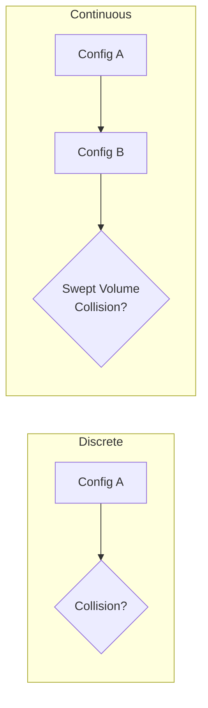
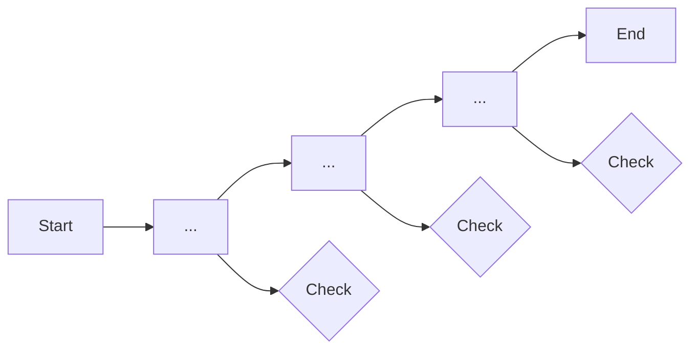

# Collision Detection

tesseract_robotics provides discrete and continuous collision checking using FCL and Bullet backends.

## Quick Collision Check

The collision API is driven by the environment's contact manager — there is no one-call shortcut on `Robot`. See [`src/tesseract_robotics/examples/tesseract_collision_example.py`](https://github.com/tesseract-robotics/tesseract_nanobind/blob/main/src/tesseract_robotics/examples/tesseract_collision_example.py) for the canonical pattern.

```python
from tesseract_robotics.planning import Robot
from tesseract_robotics.tesseract_collision import (
    ContactRequest,
    ContactResultMap,
    ContactResultVector,
    ContactTestType_ALL,
)
import numpy as np

robot = Robot.from_tesseract_support("abb_irb2400")
joint_names = [f"joint_{i + 1}" for i in range(6)]
joints = np.array([0.5, -0.5, 0.5, 0.0, 0.5, 0.0])

# Update state, then sync the manager with the new link transforms
robot.set_joints(joints, joint_names=joint_names)
state = robot.env.getState()

manager = robot.env.getDiscreteContactManager()
manager.setActiveCollisionObjects(robot.env.getActiveLinkNames())
manager.setCollisionObjectsTransform(state.link_transforms)

# contactTest() populates the ContactResultMap passed in (returns None)
contacts = ContactResultMap()
manager.contactTest(contacts, ContactRequest(ContactTestType_ALL))

print(f"Collision-free: {contacts.size() == 0}")

# Flatten to a vector for iteration
results = ContactResultVector()
contacts.flattenMoveResults(results)
for i in range(len(results)):
    r = results[i]
    print(f"{r.link_names[0]} <-> {r.link_names[1]}: distance = {r.distance:.4f} m")
```

## Collision Managers

tesseract supports multiple collision backends:

| Manager | Strengths | Use Case |
|---------|-----------|----------|
| **FCL** | Fast broad-phase | General purpose |
| **Bullet** | Continuous collision | Trajectory validation |
| **BulletCast** | Swept volumes | Time-parameterized paths |

### Discrete vs Continuous


```mermaid
graph LR
    subgraph Discrete
        A[Config A] --> B{Collision?}
    end

    subgraph Continuous
        C[Config A] --> D[Config B]
        D --> E{Swept Volume<br/>Collision?}
    end
```

!!! info "When to Use Continuous"
    - **Discrete**: Fast point checks, obstacle avoidance in planning
    - **Continuous**: Trajectory validation, fast-moving robots, thin obstacles

## Discrete Collision Checking

```python
from tesseract_robotics.tesseract_collision import (
    ContactRequest,
    ContactResultMap,
    ContactTestType_ALL,
)

# Get discrete manager
manager = robot.env.getDiscreteContactManager()

# Configure request
request = ContactRequest(ContactTestType_ALL)  # or _FIRST, _CLOSEST, _LIMITED
request.calculate_distance = True
request.calculate_penetration = True

# Sync manager with current state
manager.setActiveCollisionObjects(robot.env.getActiveLinkNames())
manager.setCollisionObjectsTransform(robot.env.getState().link_transforms)
manager.setDefaultCollisionMargin(0.05)  # 5cm margin

# contactTest populates `contacts` in-place
contacts = ContactResultMap()
manager.contactTest(contacts, request)

# Iterate pairs via flattened vector (simplest idiom)
from tesseract_robotics.tesseract_collision import ContactResultVector
results = ContactResultVector()
contacts.flattenMoveResults(results)
for i in range(len(results)):
    r = results[i]
    print(f"{r.link_names[0]} <-> {r.link_names[1]}: {r.distance:.4f}m")
```

## Continuous Collision Checking

Check for collisions along a motion segment. Each active link needs a start and end transform via `setCollisionObjectsTransformCast`:

```python
from tesseract_robotics.tesseract_collision import (
    ContactRequest,
    ContactResultMap,
    ContactTestType_ALL,
)

# Resolve link transforms at the two endpoints
joint_names = robot.get_joint_names("manipulator")
start_transforms = robot.env.getState(joint_names, start_joints).link_transforms
end_transforms = robot.env.getState(joint_names, end_joints).link_transforms

# Get continuous manager
manager = robot.env.getContinuousContactManager()
manager.setActiveCollisionObjects(robot.env.getActiveLinkNames())

# Set start and end poses per link
for link_name, pose_start in start_transforms.items():
    pose_end = end_transforms[link_name]
    manager.setCollisionObjectsTransformCast(link_name, pose_start, pose_end)

# Check swept volume
contacts = ContactResultMap()
manager.contactTest(contacts, ContactRequest(ContactTestType_ALL))
```

## LVS (Longest Valid Segment)

LVS interpolates between waypoints and checks at discrete points:


```mermaid
graph LR
    A[Start] --> B[...]
    B --> C[...]
    C --> D[...]
    D --> E[End]

    B --> F{Check}
    C --> G{Check}
    D --> H{Check}
```

Used in TrajOpt for efficient continuous collision approximation:

```python
from tesseract_robotics.trajopt_ifopt import TrajOptCollisionConfig
from tesseract_robotics.tesseract_collision import CollisionEvaluatorType

# TrajOptCollisionConfig(margin, coeff)
config = TrajOptCollisionConfig(0.025, 20.0)  # 2.5cm margin, coeff=20
config.collision_margin_buffer = 0.005  # Additional buffer beyond margin
config.collision_check_config.type = CollisionEvaluatorType.LVS_DISCRETE
config.collision_check_config.longest_valid_segment_length = 0.05  # 5cm interpolation
```

`CollisionEvaluatorType` members (from `tesseract_collision`): `DISCRETE`, `CONTINUOUS`, `LVS_DISCRETE`, `LVS_CONTINUOUS`.

## Contact Margins

Contact margins define the safety buffer around objects. Use `CollisionMarginData` from `tesseract_common`:

```python
from tesseract_robotics.tesseract_common import CollisionMarginData

# Default margin for all pairs (applied to the contact manager)
manager.setCollisionMarginData(CollisionMarginData(0.02))  # 2cm

# Or set the default margin directly
manager.setDefaultCollisionMargin(0.02)

# Per-pair override (link-a, link-b, margin)
manager.setCollisionMarginPair("link_6", "obstacle", 0.05)
```

### Margin Visualization

```
┌──────────────────────────────────────┐
│                                      │
│   ┌─────────┐      ┌─────────┐       │
│   │  Link   │      │Obstacle │       │
│   │         │ 2cm  │         │       │
│   │  ┌───┐  │<---->│  ┌───┐  │       │
│   │  │   │  │margin│  │   │  │       │
│   │  └───┘  │      │  └───┘  │       │
│   └─────────┘      └─────────┘       │
│                                      │
└──────────────────────────────────────┘
```

## Allowed Collision Matrix

Skip collision checks for adjacent or always-safe pairs. The ACM lives on the scene graph and is owned by the environment:

```python
# Fetch the ACM (mutable via scene graph commands on the environment)
acm = robot.env.getAllowedCollisionMatrix()

# Query whether a pair is allowed
if acm.isCollisionAllowed("link_1", "link_2"):
    print("link_1 and link_2 are whitelisted")
```

To add entries, issue a scene graph command through the environment (see `car_seat_example.py` for the canonical pattern):

```python
from tesseract_robotics.tesseract_common import AllowedCollisionMatrix
from tesseract_robotics.tesseract_environment import (
    ModifyAllowedCollisionsCommand, ModifyAllowedCollisionsType,
)

additions = AllowedCollisionMatrix()
additions.addAllowedCollision("gripper", "workpiece", "Attached")
robot.env.applyCommand(
    ModifyAllowedCollisionsCommand(additions, ModifyAllowedCollisionsType.ADD)
)
```

Adjacent links already defined in the SRDF are added automatically when the environment is loaded.

## Performance Optimization

!!! tip "Reduce Active Objects"
    Only check links that can actually collide:

    ```python
    # Skip static links that can't reach each other
    active_links = ["link_4", "link_5", "link_6", "tool0"]
    manager.setActiveCollisionObjects(active_links)
    ```

!!! tip "Use Appropriate Margin"
    Larger margins = slower checks. Use the minimum safe margin:

    - Motion planning: 2-5cm
    - Final validation: 0-1cm
    - Real-time: As small as safe

!!! tip "Choose the Right Test Type"
    ```python
    from tesseract_robotics.tesseract_collision import (
        ContactTestType_FIRST,
        ContactTestType_ALL,
    )

    # Stop at first collision (fastest)
    request = ContactRequest(ContactTestType_FIRST)

    # Get all collisions (for debugging)
    request = ContactRequest(ContactTestType_ALL)
    ```

## Integration with Planning

Planners automatically use collision checking — configure collision margins through planner profiles rather than calling the contact manager yourself:

```python
from tesseract_robotics.planning import (
    MotionProgram, JointTarget, plan_freespace,
)
import numpy as np

# Build a program (start/goal joint states)
program = (
    MotionProgram("manipulator")
    .move_to(JointTarget(np.zeros(6)))
    .move_to(JointTarget(np.array([0.5, -0.5, 0.5, 0.0, 0.5, 0.0])))
)

# OMPL (sampling) — checks collisions at sampled states
# TrajOpt — would use collision cost/constraint via TrajOptCollisionConfig
# Descartes (plan_cartesian) — expects Cartesian targets, not joint targets
result = plan_freespace(robot, program)
```

Collision margins for TrajOpt pipelines live in `TrajOptCollisionConfig` (see LVS section above) and are applied via composite profiles — see [`src/tesseract_robotics/planning/profiles.py`](https://github.com/tesseract-robotics/tesseract_nanobind/blob/main/src/tesseract_robotics/planning/profiles.py) for the stock profile builder.

## Collision Geometry Types

| Type | Performance | Accuracy |
|------|-------------|----------|
| **Sphere** | Fastest | Low |
| **Box** | Fast | Medium |
| **Cylinder** | Fast | Medium |
| **Capsule** | Fast | Medium |
| **Mesh** | Slow | High |
| **ConvexMesh** | Medium | High |
| **Octree** | Medium | Voxel-discrete |

!!! tip "Use Convex Decomposition"
    For complex meshes, use `makeConvexMesh` to build a convex hull:

    ```python
    from tesseract_robotics.tesseract_collision import makeConvexMesh

    convex = makeConvexMesh(mesh)
    ```

    To load a convex mesh directly from a file, use the planning helper:

    ```python
    from tesseract_robotics.planning import convex_mesh_from_file

    convex = convex_mesh_from_file("/path/to/mesh.stl")
    ```

## Point Clouds as Collision Obstacles

Sensor-derived obstacles — depth-camera scans, LiDAR, fused mapping output —
go through a `tesseract_geometry.Octree`. Each occupied voxel becomes a
sub-shape the discrete contact manager checks against the robot, so
planners and collision queries treat the cloud just like any other
geometry.

**1. Build the octree and attach it as a link.** 

Load your points into a `PointCloud`, pass it through `createOctree`, and wrap
the result in `tesseract_geometry.Octree`. Then hand the geometry to
`create_obstacle()`.

```python
import numpy as np
from tesseract_robotics.planning import Pose, create_obstacle
from tesseract_robotics.tesseract_geometry import (
    Octree, OctreeSubType, PointCloud, createOctree,
)

# verts: (N, 3) float64 ndarray — pulled from your loader of choice
pc = PointCloud()
for x, y, z in verts:
    pc.addPoint(float(x), float(y), float(z))

# resolution = leaf edge length in metres; smaller = finer = more sub-shapes
octree = Octree(createOctree(pc, resolution=0.02, prune=True, binary=True),
                OctreeSubType.BOX, pruned=True, binary_octree=True)

create_obstacle(
    robot,
    name="scan",
    geometry=octree,
    transform=Pose.from_xyz(1.3, 0.3, 0.0),
)
```

`OctreeSubType` picks the per-leaf primitive — `BOX` is the cheap default,
`SPHERE_INSIDE`/`SPHERE_OUTSIDE` use inscribed/circumscribed spheres if you
need rounder swept volumes.

**2. Margins.** The discrete contact manager applies a margin to every pair
(see [Contact Margins](#contact-margins)). For an octree obstacle the
defaults work fine — set a single value on the manager:

```python
manager = robot.env.getDiscreteContactManager()
manager.setActiveCollisionObjects(robot.env.getActiveLinkNames())
manager.setCollisionMarginData(CollisionMarginData(0.02))  # 2 cm safety buffer
```

TrajOpt-based planners route around the cloud out of the box —
`create_trajopt_default_profiles()` enables both the collision cost
(`coeff=50`) and the collision constraint (`coeff=10`) against every
geometry in the env, including the octree. No octree-specific tuning
needed.

!!! tip "Choosing a resolution"
    The leaf size is the dominant cost knob — halving it roughly 8×s the
    sub-shape count. A 1–2 cm leaf is a typical starting point for
    depth-camera scans of a tabletop workspace; coarsen aggressively for
    full-room scans. At sub-centimetre resolutions TrajOpt can saturate
    its iteration budget; coarsen until the planner converges.

For a full collision-aware vs. collision-disabled comparison with a viewer
walkthrough, see the
[Point cloud → Octree](../examples/basic.md#point-cloud-octree) example.

## Debugging Collisions

```python
from tesseract_robotics.tesseract_collision import (
    ContactRequest,
    ContactResultMap,
    ContactResultVector,
    ContactTestType_ALL,
)

def debug_collision(robot, joints, joint_names):
    """Print detailed collision info."""
    robot.set_joints(joints, joint_names=joint_names)
    state = robot.env.getState()

    manager = robot.env.getDiscreteContactManager()
    manager.setActiveCollisionObjects(robot.env.getActiveLinkNames())
    manager.setCollisionObjectsTransform(state.link_transforms)

    contacts = ContactResultMap()
    manager.contactTest(contacts, ContactRequest(ContactTestType_ALL))

    if contacts.size() == 0:
        print("No collisions detected")
        return

    results = ContactResultVector()
    contacts.flattenMoveResults(results)
    print(f"Found {len(results)} contact(s):")
    for i in range(len(results)):
        r = results[i]
        print(f"\n  Contact {i + 1}:")
        print(f"    Links: {r.link_names[0]} <-> {r.link_names[1]}")
        print(f"    Distance: {r.distance:.4f} m")
        print(f"    Normal: {r.normal}")
        if r.distance < 0:
            print(f"    PENETRATION: {-r.distance:.4f} m")
```

## Next Steps

- [Motion Planning](planning.md) - Collision-aware planning
- [Low-Level SQP](low-level-sqp.md) - Real-time collision avoidance
