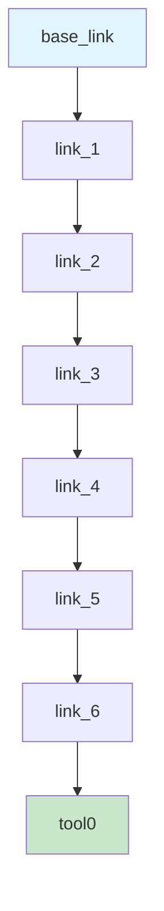

# Environment & Scene Graph

The Environment is the central data structure in tesseract_robotics, containing the robot model, scene graph, and collision information.

## Creating an Environment

=== "From URDF/SRDF"

    ```python
    from tesseract_robotics.planning import Robot

    robot = Robot.from_urdf(
        urdf_path="/path/to/robot.urdf",
        srdf_path="/path/to/robot.srdf"
    )
    env = robot.env
    ```

=== "From Bundled Models"

    ```python
    from tesseract_robotics.planning import Robot

    # Available: abb_irb2400, kuka_iiwa, fanuc_lrmate200id
    robot = Robot.from_tesseract_support("abb_irb2400")
    env = robot.env
    ```

## Scene Graph Structure

The scene graph represents the kinematic tree of links and joints:



### Accessing Links and Joints

```python
scene = env.getSceneGraph()

# Get all links
links = scene.getLinks()
for link in links:
    print(f"Link: {link.getName()}")

# Get all joints
joints = scene.getJoints()
for joint in joints:
    print(f"Joint: {joint.getName()} ({joint.type})")

# Get specific link/joint
link = scene.getLink("tool0")
joint = scene.getJoint("joint_6")
```

## Modifying the Scene

### Adding Objects

```python
from tesseract_robotics.tesseract_geometry import Box, Sphere, Cylinder
from tesseract_robotics.tesseract_scene_graph import Link, Joint, JointType
from tesseract_robotics.tesseract_common import Isometry3d
import numpy as np

# Create a box obstacle
box = Box(0.5, 0.5, 0.5)  # 50cm cube

# Create link with visual and collision
obstacle_link = Link("obstacle")
visual = Visual()
visual.geometry = box
visual.origin = Isometry3d.Identity()
obstacle_link.addVisual(visual)

collision = Collision()
collision.geometry = box
collision.origin = Isometry3d.Identity()
obstacle_link.addCollision(collision)

# Create fixed joint to world
obstacle_joint = Joint("obstacle_joint")
obstacle_joint.type = JointType.FIXED
obstacle_joint.parent_link_name = "base_link"
obstacle_joint.child_link_name = "obstacle"
obstacle_joint.parent_to_joint_origin_transform = Isometry3d.Identity()
obstacle_joint.parent_to_joint_origin_transform.translate([1.0, 0, 0.5])

# Add to scene
env.applyCommand(AddLinkCommand(obstacle_link, obstacle_joint))
```

!!! tip "Use `addVisual` and `addCollision`"
    Always use `link.addVisual(v)` and `link.addCollision(c)` instead of
    `link.visual.append(v)`. The append method silently fails due to
    nanobind returning copies of C++ vectors.

### Moving Objects

```python
# Move an existing link
transform = Isometry3d.Identity()
transform.translate([2.0, 0, 0.5])

env.applyCommand(MoveLinkCommand(obstacle_joint))
```

### Removing Objects

```python
env.applyCommand(RemoveLinkCommand("obstacle"))
```

## State Management

### Getting Current State

```python
# Get current joint state
state = env.getState()
joint_names = state.joint_names
joint_values = state.position

print(f"Current state: {dict(zip(joint_names, joint_values))}")
```

### Setting State

```python
# Set specific joints
env.setState({"joint_1": 0.5, "joint_2": -0.3})

# Or set all joints
env.setState(joint_names, joint_values)
```

### Link Transforms

```python
# Get transform of any link in current state
tcp_transform = env.getLinkTransform("tool0")
print(f"TCP position: {tcp_transform.translation()}")
print(f"TCP rotation:\n{tcp_transform.rotation()}")
```

## Allowed Collision Matrix

The ACM defines which link pairs should be ignored during collision checking:

```python
acm = env.getAllowedCollisionMatrix()

# Check if collision is allowed between two links
is_allowed = acm.isCollisionAllowed("link_1", "link_2")

# Add allowed collision pair
acm.addAllowedCollision("link_a", "link_b", "Adjacent links")

# Remove allowed collision
acm.removeAllowedCollision("link_a", "link_b")
```

!!! info "SRDF Defines Default ACM"
    The SRDF file typically defines adjacent link pairs and self-collision
    exclusions. You only need to modify the ACM for dynamic objects.

## Environment Commands

All scene modifications use the command pattern:

| Command | Purpose |
|---------|---------|
| `AddLinkCommand` | Add new link and joint |
| `RemoveLinkCommand` | Remove link from scene |
| `MoveLinkCommand` | Change joint transform |
| `MoveJointCommand` | Reparent a joint |
| `AddSceneGraphCommand` | Add entire sub-graph |
| `ChangeJointOriginCommand` | Modify joint origin |
| `ChangeJointPositionLimitsCommand` | Update position limits |
| `ChangeJointVelocityLimitsCommand` | Update velocity limits |

## Best Practices

!!! warning "Thread Safety"
    The Environment is **not thread-safe**. Use `env.clone()` if you need
    concurrent access from multiple threads.

!!! tip "Cloning for Planning"
    Motion planners internally clone the environment. You don't need to
    clone manually unless doing parallel planning.

```python
# Clone for thread-safe access
env_copy = env.clone()
```

## Next Steps

- [Kinematics Guide](kinematics.md) - Forward and inverse kinematics
- [Collision Detection](collision.md) - Collision checking details
- [Motion Planning](planning.md) - Planning with the environment
