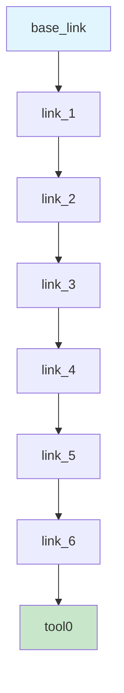

# Environment & Scene Graph

The `Environment` is the central data structure in tesseract_robotics — it owns the robot model, the scene graph of links/joints, the current state, and the collision data. The high-level `Robot` wrapper exposes it via `robot.env`.

## Creating an Environment

=== "From URDF/SRDF"

    ```python
    from tesseract_robotics.planning import Robot

    robot = Robot.from_files(
        "/path/to/robot.urdf",
        "/path/to/robot.srdf",
    )
    env = robot.env
    ```

=== "From `package://` URLs"

    ```python
    from tesseract_robotics.planning import Robot

    robot = Robot.from_urdf(
        "package://my_robot/urdf/robot.urdf",
        "package://my_robot/urdf/robot.srdf",
    )
    env = robot.env
    ```

=== "From Bundled Models"

    ```python
    from tesseract_robotics.planning import Robot

    # Available: abb_irb2400, lbr_iiwa_14_r820, ...
    robot = Robot.from_tesseract_support("abb_irb2400")
    env = robot.env
    ```

!!! info "`Environment.init()` signature"
    `Robot.from_files()` wraps `Environment.init(urdf_path, srdf_path, locator)`. See `src/tesseract_environment/tesseract_environment_bindings.cpp` for the other overloads (scene graph, URDF string, etc.).

## Scene Graph Structure

The scene graph represents the kinematic tree of links and joints:


```mermaid
graph TD
    A[base_link] --> B[link_1]
    B --> C[link_2]
    C --> D[link_3]
    D --> E[link_4]
    E --> F[link_5]
    F --> G[link_6]
    G --> H[tool0]

    style A fill:#e1f5fe
    style H fill:#c8e6c9
```

### Accessing Links and Joints

```python
scene = env.getSceneGraph()

# Get all links
for link in scene.getLinks():
    print(f"Link: {link.getName()}")

# Get all joints
for joint in scene.getJoints():
    print(f"Joint: {joint.getName()} ({joint.type})")

# Get specific link/joint
link = scene.getLink("tool0")
joint = scene.getJoint("joint_6")
```

## Modifying the Scene

Scene modifications are issued as **commands** applied through `env.applyCommand(...)`. The command classes live in `tesseract_robotics.tesseract_environment`.

### Adding Objects

```python
from tesseract_robotics.tesseract_common import Isometry3d
from tesseract_robotics.tesseract_environment import AddLinkCommand
from tesseract_robotics.tesseract_geometry import Box
from tesseract_robotics.tesseract_scene_graph import (
    Collision, Joint, JointType, Link, Visual,
)
import numpy as np

# Create a box obstacle
box = Box(0.5, 0.5, 0.5)  # 50cm cube

# Create link with visual and collision
obstacle_link = Link("obstacle")

visual = Visual()
visual.geometry = box
visual.origin = Isometry3d.Identity()
obstacle_link.addVisual(visual)

collision = Collision()
collision.geometry = box
collision.origin = Isometry3d.Identity()
obstacle_link.addCollision(collision)

# Create a fixed joint attaching the obstacle to the world
obstacle_joint = Joint("obstacle_joint")
obstacle_joint.type = JointType.FIXED
obstacle_joint.parent_link_name = "base_link"
obstacle_joint.child_link_name = "obstacle"

origin = np.eye(4)
origin[:3, 3] = [1.0, 0.0, 0.5]
obstacle_joint.parent_to_joint_origin_transform = Isometry3d(origin)

# Add to scene
env.applyCommand(AddLinkCommand(obstacle_link, obstacle_joint))
```

!!! tip "Use `addVisual` and `addCollision`"
    Always use `link.addVisual(v)` and `link.addCollision(c)` instead of
    `link.visual.append(v)`. The append method silently fails because
    nanobind returns copies of the underlying C++ vectors.

### Moving Objects

`MoveLinkCommand` takes a replacement `Joint` that re-parents the child link.

```python
from tesseract_robotics.tesseract_environment import MoveLinkCommand

origin = np.eye(4)
origin[:3, 3] = [2.0, 0.0, 0.5]
obstacle_joint.parent_to_joint_origin_transform = Isometry3d(origin)

env.applyCommand(MoveLinkCommand(obstacle_joint))
```

### Removing Objects

```python
from tesseract_robotics.tesseract_environment import RemoveLinkCommand

env.applyCommand(RemoveLinkCommand("obstacle"))
```

## State Management

### Getting Current State

`env.getState()` returns a `SceneState` whose key fields are:

- `state.joints` — `dict[str, float]` mapping joint name to value
- `state.link_transforms` — `dict[str, Isometry3d]` for every link
- `state.joint_transforms` — `dict[str, Isometry3d]` for every joint

```python
state = env.getState()
print(dict(state.joints))          # {'joint_1': 0.0, 'joint_2': 0.0, ...}

# Get a subset of joint values as a numpy array
vals = state.getJointValues(["joint_1", "joint_2"])
```

### Setting State

```python
# By joint-name dict
env.setState({"joint_1": 0.5, "joint_2": -0.3})

# Or by parallel name/value sequences
joint_names = ["joint_1", "joint_2", "joint_3", "joint_4", "joint_5", "joint_6"]
joint_values = np.zeros(6)
env.setState(joint_names, joint_values)
```

The `Robot` wrapper exposes the same behaviour via `robot.set_joints({...})` or `robot.set_joints(values, joint_names=[...])`.

### Link Transforms

```python
tcp_transform = env.getLinkTransform("tool0")
print(f"TCP position: {tcp_transform.translation()}")  # np.ndarray(3,)
print(f"TCP rotation:\n{tcp_transform.rotation()}")    # np.ndarray(3, 3)
```

## Collision Checking

Collision checking runs through the environment's discrete (or continuous) contact manager. This is the canonical pattern used throughout the examples:

```python
from tesseract_robotics.tesseract_collision import (
    ContactRequest, ContactResultMap, ContactTestType_ALL,
)

manager = robot.env.getDiscreteContactManager()
manager.setActiveCollisionObjects(robot.env.getActiveLinkNames())
manager.setCollisionObjectsTransform(robot.env.getState().link_transforms)

contacts = ContactResultMap()
manager.contactTest(contacts, ContactRequest(ContactTestType_ALL))
print(f"Collision-free: {contacts.size() == 0}")
```

See the [Collision Detection guide](collision.md) for continuous collision, flattening `ContactResultMap` into a vector, and margin configuration.

## Allowed Collision Matrix

The ACM defines which link pairs should be ignored during collision checking. The SRDF typically seeds it with adjacent-link exclusions.

```python
acm = env.getAllowedCollisionMatrix()
if acm.isCollisionAllowed("link_1", "link_2"):
    print("link_1 <-> link_2 is whitelisted")
```

To add or remove entries, issue a `ModifyAllowedCollisionsCommand`:

```python
from tesseract_robotics.tesseract_common import AllowedCollisionMatrix
from tesseract_robotics.tesseract_environment import (
    ModifyAllowedCollisionsCommand, ModifyAllowedCollisionsType,
)

additions = AllowedCollisionMatrix()
additions.addAllowedCollision("gripper", "workpiece", "Attached")
env.applyCommand(
    ModifyAllowedCollisionsCommand(additions, ModifyAllowedCollisionsType.ADD)
)
```

## Environment Commands

All scene modifications use the command pattern. The full list is bound in `tesseract_environment/tesseract_environment_bindings.cpp`:

| Command | Purpose |
|---------|---------|
| `AddLinkCommand` | Add new link and optional parent joint |
| `RemoveLinkCommand` | Remove link (and children) from scene |
| `MoveLinkCommand` | Re-parent a link via a new joint |
| `MoveJointCommand` | Re-parent an existing joint |
| `AddSceneGraphCommand` | Add an entire sub-graph |
| `ChangeJointOriginCommand` | Modify joint origin |
| `ChangeJointPositionLimitsCommand` | Update position limits |
| `ChangeJointVelocityLimitsCommand` | Update velocity limits |
| `ChangeCollisionMarginsCommand` | Change default/pair collision margins |
| `ModifyAllowedCollisionsCommand` | Add/remove ACM entries |

## Best Practices

!!! warning "Thread Safety"
    The Environment is **not thread-safe**. Use `env.clone()` if you need
    concurrent access from multiple threads.

!!! tip "Cloning for Planning"
    Motion planners internally clone the environment. You don't need to
    clone manually unless you're running parallel planners.

```python
env_copy = env.clone()
```

## Next Steps

- [Kinematics Guide](kinematics.md) — Forward and inverse kinematics
- [Collision Detection](collision.md) — Collision checking details
- [Motion Planning](planning.md) — Planning with the environment
