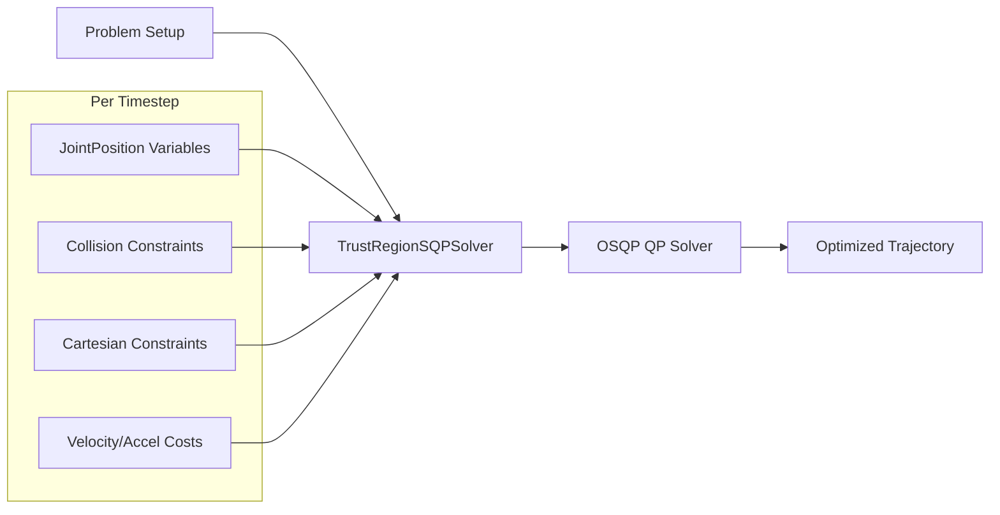

# Low-Level SQP API

The low-level SQP (Sequential Quadratic Programming) API enables real-time trajectory optimization at 100+ Hz.

## Overview



## Performance

| Configuration | Update Rate |
|---------------|-------------|
| Without collision | 128 Hz |
| Discrete collision | 73 Hz |
| LVS continuous collision | 5-10 Hz |

## Modules

Three modules provide the SQP functionality:

| Module | Purpose |
|--------|---------|
| `tesseract_robotics.ifopt` | Base optimization classes (Bounds, VariableSet, ConstraintSet) |
| `tesseract_robotics.trajopt_ifopt` | Robotics-specific constraints (collision, Cartesian, joint limits) |
| `tesseract_robotics.trajopt_sqp` | SQP solver (TrustRegionSQPSolver, OSQPEigenSolver) |

## Basic Example

```python
import numpy as np
from tesseract_robotics.planning import Robot
from tesseract_robotics.ifopt import Bounds
from tesseract_robotics.trajopt_ifopt import (
    JointPosition, CartPosConstraint, CartPosInfo, CartPosInfoType,
    TrajOptCollisionConfig, CollisionCache, SingleTimestepCollisionEvaluator,
    DiscreteCollisionConstraint
)
from tesseract_robotics.trajopt_sqp import (
    TrustRegionSQPSolver, OSQPEigenSolver, IfoptQPProblem,
    SQPParameters, CostPenaltyType
)

# Load robot
robot = Robot.from_tesseract_support("abb_irb2400")
env = robot.env
manip = env.getKinematicGroup("manipulator")

# Problem parameters
n_steps = 10
joint_names = list(manip.getJointNames())
n_joints = len(joint_names)

# Get joint limits
limits = manip.getLimits()
lower = limits.joint_limits[:, 0]
upper = limits.joint_limits[:, 1]

# Create QP problem
qp_problem = IfoptQPProblem()

# Add joint position variables for each timestep
variables = []
for i in range(n_steps):
    var = JointPosition(
        np.zeros(n_joints),  # Initial values
        joint_names,
        f"joint_pos_{i}"
    )
    var.SetBounds([Bounds(lower[j], upper[j]) for j in range(n_joints)])
    variables.append(var)
    qp_problem.addVariableSet(var)

# Add Cartesian goal constraint (last waypoint)
target_pose = robot.fk(np.array([0.5, -0.3, 0.4, 0, 0.3, 0]))
cart_info = CartPosInfo(
    manip, "tool0", "base_link",
    target_pose, CartPosInfoType.FULL
)
cart_constraint = CartPosConstraint(cart_info, variables[-1], "cart_goal")
qp_problem.addConstraintSet(cart_constraint)

# Configure solver
solver = TrustRegionSQPSolver(OSQPEigenSolver())
solver.params.max_iterations = 100
solver.params.min_approx_improve = 1e-3
solver.params.initial_trust_box_size = 0.1

# Solve
solver.init(qp_problem)
solver.solve(qp_problem)

# Extract trajectory
trajectory = np.array([var.GetValues() for var in variables])
```

## Variables

### JointPosition

Represents joint values at a single timestep:

```python
from tesseract_robotics.trajopt_ifopt import JointPosition
from tesseract_robotics.ifopt import Bounds

# Create variable
var = JointPosition(
    initial_values,  # np.array of joint values
    joint_names,     # List of joint names
    "waypoint_0"     # Unique name
)

# Set bounds
bounds = [Bounds(lower[i], upper[i]) for i in range(n_joints)]
var.SetBounds(bounds)

# Access values
values = var.GetValues()
var.SetVariables(new_values)
```

### Bounds

Define variable limits:

```python
from tesseract_robotics.ifopt import Bounds

# Position bound
pos_bound = Bounds(-3.14, 3.14)

# Special bounds
no_bound = Bounds.NoBound()      # (-inf, inf)
zero = Bounds.BoundZero()        # (0, 0)
positive = Bounds.BoundGreaterZero()  # (0, inf)
negative = Bounds.BoundSmallerZero()  # (-inf, 0)
```

## Constraints

### CartPosConstraint

Constrain end-effector pose:

```python
from tesseract_robotics.trajopt_ifopt import (
    CartPosConstraint, CartPosInfo, CartPosInfoType
)

# Full 6-DOF constraint
cart_info = CartPosInfo(
    manip,           # Kinematic group
    "tool0",         # Target link
    "base_link",     # Source link
    target_pose,     # Isometry3d target
    CartPosInfoType.FULL
)

constraint = CartPosConstraint(cart_info, joint_var, "cart_goal")
qp_problem.addConstraintSet(constraint)
```

CartPosInfoType options:

| Type | Constrains |
|------|------------|
| `FULL` | Position + Orientation (6 DOF) |
| `POSITION_ONLY` | Position only (3 DOF) |

### JointPosConstraint

Limit joint positions:

```python
from tesseract_robotics.trajopt_ifopt import JointPosConstraint

constraint = JointPosConstraint(
    joint_var,
    target_values,
    [0, 1, 2],  # Indices to constrain
    "joint_pos"
)
```

### JointVelConstraint

Limit joint velocities between timesteps:

```python
from tesseract_robotics.trajopt_ifopt import JointVelConstraint

constraint = JointVelConstraint(
    var_prev, var_next,  # Adjacent timesteps
    velocity_limits,      # Max velocities
    "joint_vel"
)
```

### JointAccelConstraint

Limit joint accelerations:

```python
from tesseract_robotics.trajopt_ifopt import JointAccelConstraint

constraint = JointAccelConstraint(
    var_prev, var_curr, var_next,  # Three consecutive timesteps
    accel_limits,
    "joint_accel"
)
```

### DiscreteCollisionConstraint

Avoid collisions at a single timestep:

```python
from tesseract_robotics.trajopt_ifopt import (
    TrajOptCollisionConfig, CollisionCache,
    SingleTimestepCollisionEvaluator, DiscreteCollisionConstraint
)

# Collision configuration (0.33 API)
# Constructor: TrajOptCollisionConfig(margin, coeff) or default
config = TrajOptCollisionConfig(0.025, 20.0)  # 2.5cm margin, coeff=20
config.collision_margin_buffer = 0.005  # Additional buffer beyond margin

# Create evaluator
cache = CollisionCache(100)  # Cache size
evaluator = SingleTimestepCollisionEvaluator(
    cache, manip, env, config
)

# Add constraint
collision_constraint = DiscreteCollisionConstraint(
    evaluator, joint_var, "collision"
)
qp_problem.addConstraintSet(collision_constraint)
```

### ContinuousCollisionConstraint

Avoid collisions between consecutive timesteps:

```python
from tesseract_robotics.trajopt_ifopt import (
    LVSDiscreteCollisionEvaluator, ContinuousCollisionConstraint
)

# LVS evaluator (samples along segment)
evaluator = LVSDiscreteCollisionEvaluator(
    cache, manip, env, config,
    dynamic_environment=False
)

# Constraint between adjacent variables
constraint = ContinuousCollisionConstraint(
    evaluator,
    var_prev, var_next,
    fixed0=False, fixed1=False,
    max_num_cnt=3,
    name="continuous_collision"
)
```

## Solver Configuration

### SQPParameters

```python
from tesseract_robotics.trajopt_sqp import SQPParameters, CostPenaltyType

params = SQPParameters()

# Convergence criteria
params.max_iterations = 100
params.min_approx_improve = 1e-3
params.min_approx_improve_frac = 1e-4
params.min_trust_box_size = 1e-4

# Trust region
params.initial_trust_box_size = 0.1
params.trust_shrink_ratio = 0.1
params.trust_expand_ratio = 1.5

# Penalty method
params.initial_constraint_penalty = 10.0
params.constraint_penalty_type = CostPenaltyType.SQUARED
```

### Solver Methods

```python
solver = TrustRegionSQPSolver(OSQPEigenSolver())
solver.params = params

# Initialize with problem
solver.init(qp_problem)

# Solve to convergence
status = solver.solve(qp_problem)

# Or take single step (for real-time)
status = solver.stepSQPSolver(qp_problem)

# Reset trust region after step
solver.setBoxSize(params.initial_trust_box_size)
```

## Real-Time Planning Pattern

For online/incremental planning, rebuild the problem each iteration:

```python
def plan_step(current_joints, target_pose, obstacle_pose):
    """Single planning iteration (~10-70ms)."""

    # 1. Update environment with new obstacle position
    update_obstacle(env, obstacle_pose)

    # 2. Build fresh problem
    qp_problem = IfoptQPProblem()

    # Add variables (warm-start from previous solution)
    variables = []
    for i in range(n_steps):
        if i == 0:
            init = current_joints  # Fix start
        else:
            init = previous_trajectory[i]  # Warm-start
        var = JointPosition(init, joint_names, f"joint_pos_{i}")
        var.SetBounds(joint_bounds)
        variables.append(var)
        qp_problem.addVariableSet(var)

    # Fix start position
    for j in range(n_joints):
        variables[0].SetBounds([Bounds(current_joints[j], current_joints[j])])

    # Add constraints
    add_collision_constraints(qp_problem, variables)
    add_cartesian_goal(qp_problem, variables[-1], target_pose)

    # 3. Solve incrementally
    solver.init(qp_problem)
    solver.stepSQPSolver(qp_problem)
    solver.setBoxSize(0.01)  # Reset trust region

    # 4. Extract trajectory
    trajectory = np.array([var.GetValues() for var in variables])
    return trajectory
```

!!! warning "Rebuild Problem Each Iteration"
    Due to shared_ptr lifecycle issues, you must rebuild the QP problem
    each iteration. Reusing the same problem causes segfaults.

## Results and Status

### SQPStatus

```python
from tesseract_robotics.trajopt_sqp import SQPStatus

status = solver.solve(qp_problem)

if status == SQPStatus.CONVERGED:
    print("Optimization converged")
elif status == SQPStatus.ITERATION_LIMIT:
    print("Hit iteration limit")
elif status == SQPStatus.CALLBACK_STOPPED:
    print("Stopped by callback")
```

### SQPResults

```python
results = solver.getResults()

print(f"Final cost: {results.overall_cost}")
print(f"Iterations: {results.iterations}")
print(f"Best variables: {results.best_var_vals}")
```

## Callbacks

Monitor optimization progress:

```python
from tesseract_robotics.trajopt_sqp import SQPCallback

class MyCallback(SQPCallback):
    def __call__(self, iteration, cost, constraint_violation):
        print(f"Iter {iteration}: cost={cost:.4f}, viol={constraint_violation:.6f}")
        return True  # Continue optimization

solver.registerCallback(MyCallback())
```

## Velocity Smoothing Cost

Add velocity smoothing as a cost:

```python
from tesseract_robotics.trajopt_ifopt import JointVelConstraint
from tesseract_robotics.ifopt import Bounds

# Create "constraint" with slack (acts as cost)
for i in range(n_steps - 1):
    vel_cost = JointVelConstraint(
        variables[i], variables[i+1],
        velocity_limits,
        f"vel_cost_{i}"
    )
    # Set loose bounds to make it a soft cost
    vel_cost.SetBounds([Bounds(-1e10, 1e10)] * n_joints)
    qp_problem.addConstraintSet(vel_cost)
```

## Complete Online Planning Example

See `examples/online_planning_sqp_example.py` for a complete example that:

1. Loads ABB IRB2400 with human obstacle
2. Moves obstacle along a trajectory
3. Replans at 73 Hz using discrete collision
4. Visualizes in TesseractViewer

```python
# Run the example
python examples/online_planning_sqp_example.py
```

## Comparison: High-Level vs Low-Level

| Aspect | Task Composer | Low-Level SQP |
|--------|---------------|---------------|
| Setup complexity | Low | High |
| Planning time | 100ms - 10s | 1-20ms |
| Real-time capable | No | Yes |
| Collision handling | Automatic | Manual |
| Use case | Offline planning | Online control |

## Next Steps

- [Online Planning Example](../examples/online-planning.md) - Full walkthrough
- [Task Composer](task-composer.md) - High-level alternative
