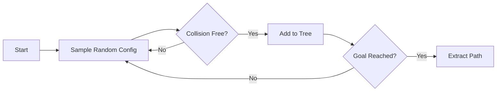
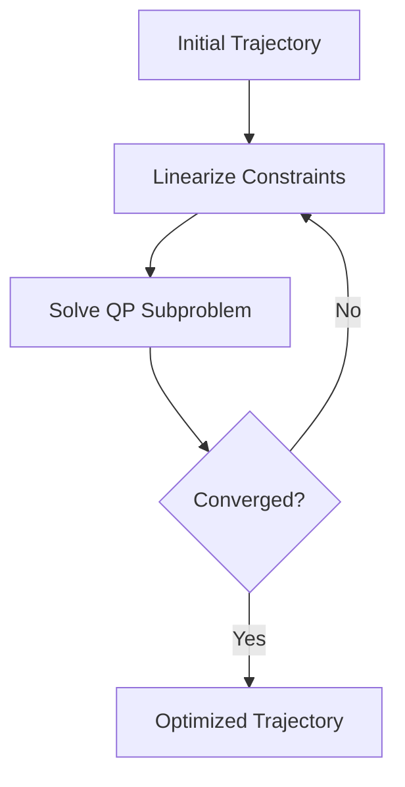
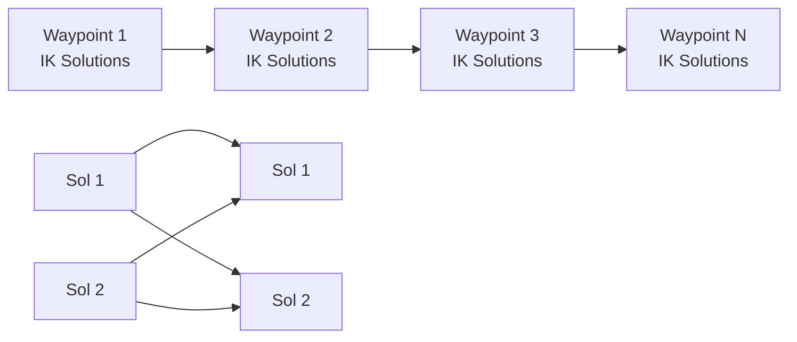

# Motion Planning

tesseract_robotics provides multiple motion planners for different use cases.

## Planner Comparison

| Planner | Type | Speed | Quality | Use Case |
|---------|------|-------|---------|----------|
| **OMPL** | Sampling | Medium | Good | Free-space, complex environments |
| **TrajOpt** | Optimization | Fast | Excellent | Cartesian paths, smoothing |
| **TrajOptIfopt** | SQP/OSQP | Very Fast | Excellent | Real-time replanning |
| **Descartes** | Graph Search | Slow | Optimal | Dense Cartesian toolpaths |
| **Simple** | Interpolation | Instant | N/A | Joint-space interpolation |

## Quick Planning

=== "OMPL (Freespace)"

    ```python
    from tesseract_robotics.planning import Robot, Planner
    import numpy as np

    robot = Robot.from_tesseract_support("abb_irb2400")
    planner = Planner(robot)

    start = np.zeros(6)
    goal = np.array([0.5, -0.5, 0.5, 0.0, 0.5, 0.0])

    trajectory = planner.plan(
        start=start,
        goal=goal,
        planner="ompl"
    )
    ```

=== "TrajOpt (Cartesian)"

    ```python
    from tesseract_robotics.tesseract_common import Isometry3d

    target_pose = Isometry3d.Identity()
    target_pose.translate([0.8, 0.2, 0.5])

    trajectory = planner.plan(
        start=start,
        goal=target_pose,  # Cartesian goal
        planner="trajopt"
    )
    ```

=== "Hybrid (OMPL + TrajOpt)"

    ```python
    # OMPL finds path, TrajOpt smooths it
    trajectory = planner.plan(
        start=start,
        goal=goal,
        planner="freespace_hybrid"
    )
    ```

## OMPL Planner

Sampling-based planner for complex environments:



### OMPL Profiles

```python
from tesseract_robotics.tesseract_motion_planners_ompl import (
    OMPLDefaultPlanProfile
)

profile = OMPLDefaultPlanProfile()
profile.planning_time = 5.0  # Max planning time (seconds)
profile.simplify = True      # Simplify path after planning
profile.collision_check_config.contact_margin = 0.02  # 2cm margin
```

### Available OMPL Planners

| Planner | Description |
|---------|-------------|
| `RRTConnect` | Bidirectional RRT (default, fast) |
| `RRT` | Single-tree RRT |
| `RRTstar` | Asymptotically optimal RRT |
| `PRM` | Probabilistic Roadmap |
| `LazyPRM` | Lazy collision checking PRM |
| `BKPIECE` | Bi-directional KPIECE |

## TrajOpt Planner

Optimization-based planner using sequential convex optimization:



### TrajOpt Costs and Constraints

```python
from tesseract_robotics.tesseract_motion_planners_trajopt import (
    TrajOptDefaultPlanProfile,
    TrajOptDefaultCompositeProfile
)

# Plan profile (per-waypoint settings)
plan_profile = TrajOptDefaultPlanProfile()
plan_profile.cartesian_coeff = [5, 5, 5, 5, 5, 5]  # Position/orientation weights

# Composite profile (trajectory-wide settings)
composite_profile = TrajOptDefaultCompositeProfile()
composite_profile.collision_cost_config.enabled = True
composite_profile.collision_cost_config.margin = 0.025
composite_profile.collision_cost_config.coeff = 20.0
composite_profile.smooth_velocities = True
composite_profile.smooth_accelerations = True
```

### Collision Configuration

```python
from tesseract_robotics.trajopt_common import TrajOptCollisionConfig

collision_config = TrajOptCollisionConfig()
collision_config.contact_margin_data.default_margin = 0.025  # 2.5cm
collision_config.collision_margin_buffer = 0.05
collision_config.type = CollisionEvaluatorType.DISCRETE
```

!!! tip "Collision Cost vs Constraint"
    - **Cost**: Soft penalty, allows small violations (faster)
    - **Constraint**: Hard limit, must be satisfied (more reliable)

    Use cost for initial optimization, constraint for final refinement.

## Descartes Planner

Graph-search planner for dense Cartesian toolpaths:



Best for:

- Welding paths
- Painting trajectories
- Machining toolpaths

```python
from tesseract_robotics.tesseract_motion_planners_descartes import (
    DescartesDefaultPlanProfile
)

profile = DescartesDefaultPlanProfile()
profile.num_threads = 4  # Parallel IK solving
```

## Motion Types

### Freespace Motion

Any collision-free path between configurations:

```python
from tesseract_robotics.tesseract_command_language import (
    MoveInstruction, MoveInstructionType
)

move = MoveInstruction(waypoint, MoveInstructionType.FREESPACE, "DEFAULT")
```

### Linear Motion

Straight-line Cartesian path:

```python
move = MoveInstruction(waypoint, MoveInstructionType.LINEAR, "DEFAULT")
```

!!! warning "Linear Motion Requirements"
    Linear motion requires:

    - Reachable start and end poses
    - Collision-free swept volume
    - Within joint velocity limits

### Circular Motion

Arc motion (specialized planners):

```python
move = MoveInstruction(waypoint, MoveInstructionType.CIRCULAR, "DEFAULT")
```

## Program Structure

Complex motions are defined as programs:

```python
from tesseract_robotics.tesseract_command_language import (
    CompositeInstruction, MoveInstruction,
    StateWaypointPoly, CartesianWaypointPoly
)

# Create program
program = CompositeInstruction("DEFAULT")

# Add start state
start_wp = StateWaypointPoly.wrap_StateWaypoint(
    StateWaypoint(joint_names, start_joints)
)
program.appendMoveInstruction(
    MoveInstruction(start_wp, MoveInstructionType.START, "DEFAULT")
)

# Add goal waypoints
for pose in waypoints:
    cart_wp = CartesianWaypointPoly.wrap_CartesianWaypoint(
        CartesianWaypoint(pose)
    )
    program.appendMoveInstruction(
        MoveInstruction(cart_wp, MoveInstructionType.LINEAR, "DEFAULT")
    )
```

## Planning with Constraints

### Orientation Constraints

Keep end-effector upright (e.g., carrying a glass):

```python
# In TrajOpt profile
profile.cartesian_coeff = [1, 1, 1, 10, 10, 1]  # High rotation weights
```

### Joint Constraints

Limit specific joints:

```python
# Lock joint 1
profile.joint_coeff = [100, 1, 1, 1, 1, 1]  # High weight on joint 1
```

## Handling Planning Failures

```python
trajectory = planner.plan(start, goal, planner="ompl")

if trajectory is None:
    print("Planning failed!")

    # Debug strategies:
    # 1. Check if start/goal are collision-free
    print(f"Start collision-free: {robot.check_collision(start)}")
    print(f"Goal collision-free: {robot.check_collision(goal)}")

    # 2. Increase planning time
    trajectory = planner.plan(
        start, goal,
        planner="ompl",
        planning_time=10.0
    )

    # 3. Try different planner
    trajectory = planner.plan(start, goal, planner="trajopt")
```

## Trajectory Output

```python
if trajectory:
    print(f"Waypoints: {len(trajectory)}")

    for i, waypoint in enumerate(trajectory):
        print(f"  [{i}] positions: {waypoint.positions}")
        print(f"       velocities: {waypoint.velocities}")
        print(f"       time: {waypoint.time}")
```

## Performance Tips

!!! tip "Warm-Start TrajOpt"
    Provide an initial trajectory for faster convergence:

    ```python
    # Use OMPL solution as TrajOpt initial guess
    initial = planner.plan(start, goal, planner="ompl")
    refined = planner.refine(initial, planner="trajopt")
    ```

!!! tip "Reduce Search Space"
    ```python
    # Tighter joint limits for faster planning
    profile.joint_limits_scale = 0.8  # 80% of full limits
    ```

!!! tip "Profile Caching"
    Profiles are expensive to create. Cache and reuse:

    ```python
    # Create once
    self.ompl_profile = OMPLDefaultPlanProfile()

    # Reuse for all plans
    trajectory = planner.plan(..., profile=self.ompl_profile)
    ```

## Next Steps

- [Task Composer](task-composer.md) - Complex multi-step planning
- [Low-Level SQP](low-level-sqp.md) - Real-time trajectory optimization
