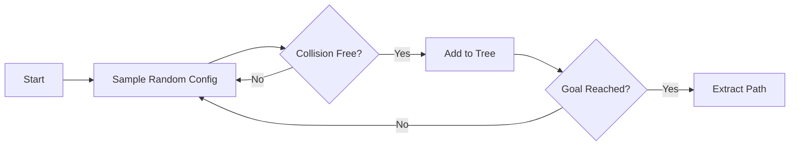
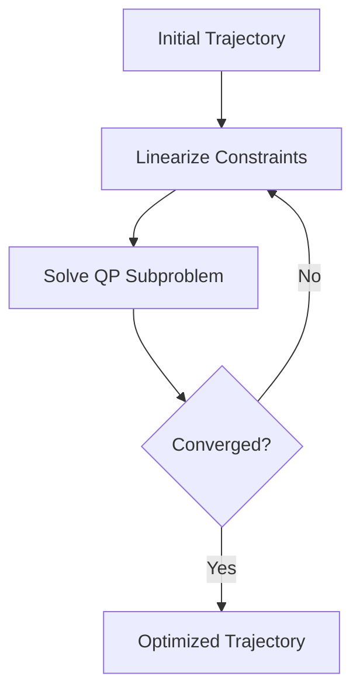
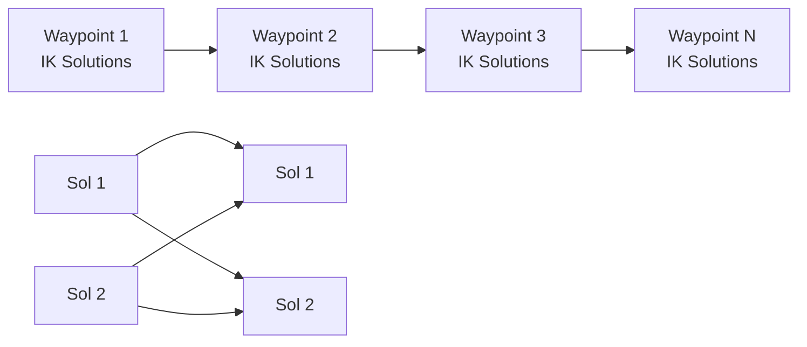

# Motion Planning

tesseract_robotics provides multiple motion planners for different use cases. The
high-level `tesseract_robotics.planning` API exposes three module-level entry
points — `plan_freespace`, `plan_ompl`, and `plan_cartesian` — each accepting a
`MotionProgram` describing the waypoints. Under the hood these dispatch to
`TaskComposer` pipelines, so you can drop down to `TaskComposer.plan(...)` when
you need a specific pipeline variant.

## Planner Comparison

| Planner | Type | Speed | Quality | Use Case |
|---------|------|-------|---------|----------|
| **OMPL** | Sampling | Medium | Good | Free-space, complex environments |
| **TrajOpt** | Optimization | Fast | Excellent | Cartesian paths, smoothing |
| **TrajOptIfopt** | SQP/OSQP | Very Fast | Excellent | Real-time replanning |
| **Descartes** | Graph Search | Slow | Optimal | Dense Cartesian toolpaths |
| **Simple** | Interpolation | Instant | N/A | Joint-space interpolation |

## Quick Planning

All three entry points take the same shape: a `Robot` plus a `MotionProgram` of
`JointTarget` / `CartesianTarget` waypoints.

=== "OMPL (Freespace)"

    `plan_ompl` defaults to the `FreespacePipeline` — OMPL RRTConnect for path
    finding, TrajOpt for smoothing, and time parameterization.

    ```python
    import numpy as np
    from tesseract_robotics.planning import (
        Robot, MotionProgram, JointTarget, plan_ompl,
    )

    robot = Robot.from_tesseract_support("abb_irb2400")
    program = (
        MotionProgram("manipulator")
        .move_to(JointTarget(np.zeros(6)))
        .move_to(JointTarget(np.array([0.5, -0.5, 0.5, 0.0, 0.5, 0.0])))
    )

    result = plan_ompl(robot, program)
    if result.successful:
        for state in result.trajectory:
            print(state.positions)
    ```

=== "TrajOpt (Freespace)"

    `plan_freespace` drives the `TrajOptPipeline` — pure optimization-based
    freespace planning. Ideal when the direct path is roughly correct and just
    needs smoothing plus collision margin enforcement.

    ```python
    from tesseract_robotics.planning import plan_freespace

    result = plan_freespace(robot, program)
    ```

=== "Cartesian (Descartes)"

    `plan_cartesian` drives the `DescartesPipeline` — Descartes graph search for
    precise Cartesian paths, with TrajOpt smoothing. Use this when the program
    contains `CartesianTarget` waypoints and you need tool-pose accuracy.

    ```python
    from tesseract_robotics.planning import CartesianTarget, Pose, plan_cartesian

    program = (
        MotionProgram("manipulator", tcp_frame="tool0")
        .move_to(CartesianTarget(Pose.from_xyz(0.5, -0.2, 0.5)))
        .linear_to(CartesianTarget(Pose.from_xyz(0.5, 0.2, 0.5)))
    )

    result = plan_cartesian(robot, program)
    ```

=== "Hybrid (OMPL + TrajOpt)"

    For hybrid planning (OMPL for global search, TrajOpt for local refinement)
    use the `FreespacePipeline` directly via `TaskComposer` — it chains OMPL,
    TrajOpt, and time parameterization in one call.

    ```python
    from tesseract_robotics.planning import TaskComposer

    composer = TaskComposer.from_config()
    result = composer.plan(robot, program, pipeline="FreespacePipeline")
    ```

    `plan_ompl(robot, program)` is a shortcut for exactly this pipeline.

## OMPL Planner

Sampling-based planner for complex environments:


```mermaid
graph LR
    A[Start] --> B[Sample Random Config]
    B --> C{Collision Free?}
    C -->|Yes| D[Add to Tree]
    C -->|No| B
    D --> E{Goal Reached?}
    E -->|No| B
    E -->|Yes| F[Extract Path]
```

### OMPL Profiles

Profiles control per-call planner behaviour. The `create_ompl_default_profiles`
helper packages sensible defaults (parallel RRTConnect with a 10 s budget):

```python
from tesseract_robotics.planning.profiles import create_ompl_default_profiles

profiles = create_ompl_default_profiles(
    planning_time=5.0,   # Max planning time (seconds)
    num_planners=4,      # Parallel RRTConnect instances
    max_solutions=10,    # Stop after this many solutions
    optimize=True,       # Continue improving until timeout
)

result = plan_ompl(robot, program, profiles=profiles)
```

For freespace-pipeline use (OMPL + TrajOpt together), use
`create_freespace_pipeline_profiles` — same arguments plus the TrajOpt smoothing
profile in the same dictionary.

### Available OMPL Planners

| Planner | Description |
|---------|-------------|
| `RRTConnect` | Bidirectional RRT (default, fast) |
| `RRT` | Single-tree RRT |
| `RRTstar` | Asymptotically optimal RRT |
| `PRM` | Probabilistic Roadmap |
| `LazyPRM` | Lazy collision checking PRM |
| `BKPIECE` | Bi-directional KPIECE |

Use `create_ompl_planner_configurators` to mix planner types inside one profile.

## TrajOpt Planner

Optimization-based planner using sequential convex optimization:


```mermaid
graph TD
    A[Initial Trajectory] --> B[Linearize Constraints]
    B --> C[Solve QP Subproblem]
    C --> D{Converged?}
    D -->|No| B
    D -->|Yes| E[Optimized Trajectory]
```

### TrajOpt Costs and Constraints

```python
from tesseract_robotics.tesseract_motion_planners_trajopt import (
    TrajOptDefaultPlanProfile,
    TrajOptDefaultCompositeProfile,
)
from tesseract_robotics.tesseract_collision import CollisionEvaluatorType

# Plan profile (per-waypoint settings)
plan_profile = TrajOptDefaultPlanProfile()
plan_profile.cartesian_constraint_config.enabled = True
plan_profile.cartesian_constraint_config.coeff = [5, 5, 5, 5, 5, 5]  # Position/orientation weights

# Composite profile (trajectory-wide settings)
composite_profile = TrajOptDefaultCompositeProfile()
composite_profile.collision_cost_config.enabled = True
composite_profile.collision_cost_config.collision_margin_buffer = 0.025  # 2.5cm buffer
composite_profile.collision_cost_config.collision_coeff_data.setDefaultCollisionCoeff(20.0)
composite_profile.collision_cost_config.collision_check_config.type = CollisionEvaluatorType.DISCRETE
composite_profile.smooth_velocities = True
composite_profile.smooth_accelerations = True
```

### Collision Configuration

```python
from tesseract_robotics.tesseract_motion_planners_trajopt import TrajOptCollisionConfig
from tesseract_robotics.tesseract_collision import CollisionEvaluatorType

# TrajOptCollisionConfig constructor: (margin, coeff) or default
collision_config = TrajOptCollisionConfig(0.025, 20.0)  # margin=2.5cm, coeff=20
collision_config.collision_margin_buffer = 0.005  # Additional buffer
collision_config.collision_check_config.type = CollisionEvaluatorType.DISCRETE
collision_config.collision_check_config.longest_valid_segment_length = 0.05  # For LVS modes
```

`TrajOptCollisionConfig` lives in `trajopt_ifopt` (trajopt_common) and is
re-exported from `tesseract_motion_planners_trajopt`, so either import works.

## Costs vs Constraints (Soft vs Hard)

TrajOpt distinguishes between **costs** (soft constraints) and **constraints** (hard constraints):

| Type | Behavior | Solver Treatment | Use When |
|------|----------|------------------|----------|
| **Cost** | Penalized, can be violated | Added to objective function | Preferences, nice-to-haves |
| **Constraint** | Must be satisfied exactly | Strict equality/inequality | Safety-critical requirements |

### When to Use Each

**Use Costs (Soft) for:**

- Collision avoidance during optimization (allows exploration)
- Smoothness objectives (velocity, acceleration, jerk)
- Preferred poses or configurations
- Joint centering (stay near middle of range)

**Use Constraints (Hard) for:**

- Final collision check (must be collision-free)
- Exact Cartesian poses (pick/place positions)
- Joint limits (physical limits)
- Orientation requirements (e.g., tool must be vertical)

### Example: Collision as Cost vs Constraint

```python
from tesseract_robotics.tesseract_motion_planners_trajopt import (
    TrajOptDefaultCompositeProfile,
)
from tesseract_robotics.tesseract_collision import CollisionEvaluatorType

profile = TrajOptDefaultCompositeProfile()

# SOFT: Collision as cost - allows temporary violations during optimization
# Good for finding paths through tight spaces
profile.collision_cost_config.enabled = True
profile.collision_cost_config.collision_margin_buffer = 0.025  # 2.5cm
profile.collision_cost_config.collision_coeff_data.setDefaultCollisionCoeff(20.0)
profile.collision_cost_config.collision_check_config.type = CollisionEvaluatorType.DISCRETE

# HARD: Collision as constraint - must be satisfied at solution
# Guarantees collision-free result (but may fail to find solution)
profile.collision_constraint_config.enabled = True
profile.collision_constraint_config.collision_margin_buffer = 0.01  # 1cm (tighter)
profile.collision_constraint_config.collision_check_config.type = CollisionEvaluatorType.DISCRETE
```

!!! tip "Recommended Pattern"
    Use **both** cost and constraint:

    1. Cost with larger margin (2.5cm) guides optimization away from obstacles
    2. Constraint with tighter margin (1cm) ensures final solution is collision-free

    The cost helps the optimizer explore, while the constraint guarantees safety.

### Example: Cartesian Pose as Cost vs Constraint

```python
from tesseract_robotics.tesseract_motion_planners_trajopt import TrajOptDefaultPlanProfile

plan_profile = TrajOptDefaultPlanProfile()

# SOFT: Cartesian cost - "try to reach this pose"
# Useful when exact pose isn't critical
plan_profile.cartesian_cost_config.enabled = True
plan_profile.cartesian_cost_config.coeff = [10, 10, 10, 5, 5, 5]  # xyz, rpy weights

# HARD: Cartesian constraint - "must reach this exact pose"
# Required for pick/place operations
plan_profile.cartesian_constraint_config.enabled = True
plan_profile.cartesian_constraint_config.coeff = [1, 1, 1, 1, 1, 1]
```

### Coefficient Interpretation

The `coeff` values control how strongly violations are penalized:

- **Higher coefficient** = stronger penalty = more important to satisfy
- **Lower coefficient** = weaker penalty = more flexibility allowed

```python
# Position matters more than orientation
plan_profile.cartesian_cost_config.coeff = [100, 100, 100, 1, 1, 1]

# Rotation around Z is free (e.g., symmetric tool)
plan_profile.cartesian_cost_config.coeff = [10, 10, 10, 10, 10, 0]
```

!!! warning "Hard Constraints Can Cause Failures"
    Over-constraining a problem makes it harder (or impossible) to solve:

    - Start with costs only, verify solution quality
    - Add constraints incrementally
    - If planning fails, check if constraints are feasible

## Descartes Planner

Graph-search planner for dense Cartesian toolpaths:


```mermaid
graph LR
    A[Waypoint 1<br/>IK Solutions] --> B[Waypoint 2<br/>IK Solutions]
    B --> C[Waypoint 3<br/>IK Solutions]
    C --> D[Waypoint N<br/>IK Solutions]

    A1[Sol 1] --> B1[Sol 1]
    A1 --> B2[Sol 2]
    A2[Sol 2] --> B1
    A2 --> B2
```

Best for:

- Welding paths
- Painting trajectories
- Machining toolpaths

```python
from tesseract_robotics.planning.profiles import create_descartes_default_profiles

profiles = create_descartes_default_profiles(
    enable_collision=True,        # Check vertex (waypoint) collisions
    enable_edge_collision=False,  # Check transition collisions (slower)
    num_threads=4,                # Parallel IK solving
)

result = plan_cartesian(robot, program, profiles=profiles)
```

## Motion Types

Motion type is set via the `MotionProgram` builder methods:

### Freespace Motion

Any collision-free path between configurations. Use `move_to(...)`:

```python
program.move_to(JointTarget(joint_values))
program.move_to(CartesianTarget(pose))  # freespace to pose
```

### Linear Motion

Straight-line Cartesian path. Use `linear_to(...)`:

```python
program.linear_to(CartesianTarget(pose))
```

!!! warning "Linear Motion Requirements"
    Linear motion requires:

    - Reachable start and end poses
    - Collision-free swept volume
    - Within joint velocity limits

### Circular Motion

Arc motion (specialized planners). Use `circular_to(...)`:

```python
program.circular_to(CartesianTarget(pose))
```

## Program Structure

Use the `MotionProgram` builder — it handles all the poly-type wrapping
automatically. For reference, the equivalent low-level call would be:

```python
from tesseract_robotics.tesseract_command_language import (
    CartesianWaypoint, CartesianWaypointPoly_wrap_CartesianWaypoint,
    CompositeInstruction, MoveInstruction, MoveInstructionType_LINEAR,
    MoveInstructionPoly_wrap_MoveInstruction,
)

composite = CompositeInstruction("DEFAULT")
for pose in waypoints:
    wp = CartesianWaypointPoly_wrap_CartesianWaypoint(CartesianWaypoint(pose))
    instr = MoveInstructionPoly_wrap_MoveInstruction(
        MoveInstruction(wp, MoveInstructionType_LINEAR, "DEFAULT")
    )
    composite.appendMoveInstruction(instr)
```

The `MotionProgram` fluent API builds exactly the same structure with far less
ceremony, and the planning entry points accept either form.

## Planning with Constraints

### Orientation Constraints

Keep end-effector upright (e.g., carrying a glass). The `UPRIGHT` profile is
pre-baked by `create_trajopt_upright_profiles`:

```python
from tesseract_robotics.planning.profiles import create_trajopt_upright_profiles

profiles = create_trajopt_upright_profiles()
result = plan_freespace(robot, program, profiles=profiles)
```

Equivalent manual setup:

```python
# In TrajOpt plan profile — position free (0), orientation constrained (5)
plan_profile.cartesian_constraint_config.coeff = [0, 0, 0, 5, 5, 5]
```

### Joint Constraints

Weight individual joints to lock or favour them:

```python
# High weight on joint 1 - strongly discouraged from moving
plan_profile.joint_constraint_config.coeff = [100, 1, 1, 1, 1, 1]
```

## Handling Planning Failures

```python
result = plan_freespace(robot, program)

if not result.successful:
    print(f"Planning failed: {result.message}")

    # Debug strategies:

    # 1. Check if start/goal are collision-free
    from tesseract_robotics.tesseract_collision import (
        ContactRequest, ContactResultMap, ContactTestType_ALL,
    )
    manager = robot.env.getDiscreteContactManager()
    manager.setActiveCollisionObjects(robot.env.getActiveLinkNames())
    manager.setCollisionObjectsTransform(robot.env.getState().link_transforms)
    contacts = ContactResultMap()
    manager.contactTest(contacts, ContactRequest(ContactTestType_ALL))
    print(f"Collision-free: {contacts.size() == 0}")

    # 2. Try a different backend
    result = plan_ompl(robot, program)       # sampling-based (OMPL + TrajOpt)
    result = plan_cartesian(robot, program)  # graph search (Descartes)

    # 3. Increase planning time on OMPL
    from tesseract_robotics.planning.profiles import create_ompl_default_profiles
    profiles = create_ompl_default_profiles(planning_time=30.0)
    result = plan_ompl(robot, program, profiles=profiles)
```

## Trajectory Output

```python
if result.successful:
    print(f"Waypoints: {len(result.trajectory)}")

    for i, state in enumerate(result.trajectory):
        print(f"  [{i}] positions:     {state.positions}")
        print(f"       velocities:    {state.velocities}")
        print(f"       accelerations: {state.accelerations}")
        print(f"       time:          {state.time}")
```

Each `TrajectoryPoint` carries `joint_names`, `positions`, and optionally
`velocities`, `accelerations`, and `time` (time from start, seconds). Velocities
and timing are populated by pipelines that include time parameterization
(`FreespacePipeline`, `CartesianPipeline`, etc.); pure OMPL output has positions
only. `result.to_numpy()` returns an `(N, num_joints)` array of positions.

## Performance Tips

!!! tip "Warm-Start via FreespacePipeline"
    The `FreespacePipeline` (what `plan_ompl` runs by default) already does
    warm-start internally: OMPL finds a feasible path, TrajOpt then refines it
    in the same call. If you only need a sampling solution, pass
    `pipeline="OMPLPipeline"` to drop the TrajOpt step.

    ```python
    from tesseract_robotics.planning import plan_ompl

    # Default: OMPL + TrajOpt refinement
    result = plan_ompl(robot, program)

    # Raw OMPL output (no refinement)
    result = plan_ompl(robot, program, pipeline="OMPLPipeline")
    ```

!!! tip "Pre-Load Plugins"
    First `plan_*()` call takes ~10–15 s due to plugin `dlopen`. In interactive
    or long-running sessions, warm up once at startup:

    ```python
    from tesseract_robotics.planning import TaskComposer

    composer = TaskComposer.from_config(warmup=True)  # ~10–15s once
    # Subsequent composer.plan() calls are fast
    ```

!!! tip "Profile Caching"
    Profile factory helpers do real work — cache and reuse the returned
    `ProfileDictionary`:

    ```python
    from tesseract_robotics.planning.profiles import (
        create_freespace_pipeline_profiles,
    )

    # Create once
    self.freespace_profiles = create_freespace_pipeline_profiles()

    # Reuse for all plans
    result = plan_ompl(robot, program, profiles=self.freespace_profiles)
    ```

## Next Steps

- [Task Composer](task-composer.md) - Complex multi-step planning
- [Low-Level SQP](low-level-sqp.md) - Real-time trajectory optimization
