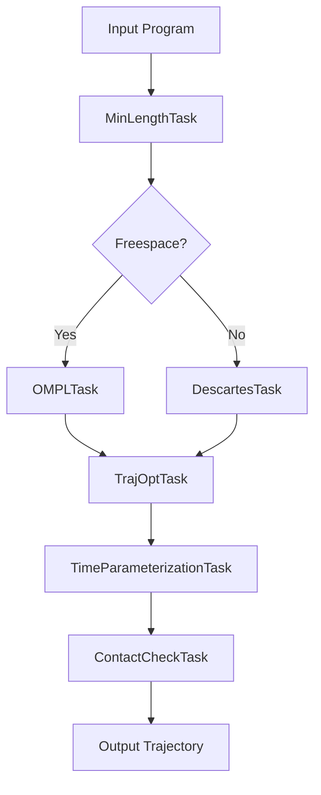

# Task Composer

The Task Composer orchestrates complex planning tasks by chaining planners together.

## Overview



## Basic Usage

=== "High-Level API"

    ```python
    from tesseract_robotics.planning import Robot, Composer
    import numpy as np

    robot = Robot.from_tesseract_support("abb_irb2400")
    composer = Composer(robot)

    # Define waypoints
    start = np.zeros(6)
    via = np.array([0.5, 0, 0, 0, 0, 0])
    goal = np.array([0.5, -0.5, 0.5, 0, 0.5, 0])

    # Add segments
    composer.add_freespace(goal_joints=via)
    composer.add_freespace(goal_joints=goal)
    composer.add_freespace(goal_joints=start)  # Return home

    # Plan all segments
    result = composer.plan()

    if result.success:
        trajectories = result.get_trajectories()
        print(f"Planned {len(trajectories)} segments")
    ```

=== "Low-Level API"

    ```python
    from tesseract_robotics.tesseract_task_composer import (
        TaskComposerPluginFactory,
        TaskComposerDataStorage,
        TaskComposerContext,
        TaskComposerFuture
    )

    # Load plugin factory
    factory = TaskComposerPluginFactory()

    # Create executor
    executor = factory.createTaskComposerExecutor("TaskflowExecutor")

    # Create pipeline
    pipeline = factory.createTaskComposerGraph("FreespaceMotionPipeline")

    # Set up data storage
    storage = TaskComposerDataStorage()
    storage.setData("planning_input", program)
    storage.setData("environment", env)
    storage.setData("profiles", profiles)

    # Execute
    future = executor.run(pipeline, storage)
    future.wait()

    # Get result
    context = future.context
    trajectory = context.data_storage.getData("output_program")
    ```

## Pipeline Types

### FreespaceMotionPipeline

For joint-space motion without Cartesian constraints:

```
MinLengthTask → OMPLTask → TrajOptTask → TimeParam → ContactCheck
```

```python
composer.add_freespace(goal_joints=target_joints)
```

### CartesianMotionPipeline

For Cartesian-constrained motion:

```
DescartesTask → TrajOptTask → TimeParam → ContactCheck
```

```python
from tesseract_robotics.tesseract_common import Isometry3d

target_pose = Isometry3d.Identity()
target_pose.translate([0.8, 0.2, 0.5])

composer.add_cartesian(goal_pose=target_pose)
```

### RasterMotionPipeline

For industrial raster patterns (welding, painting):

```
Descartes(approach) → Descartes(raster) → Descartes(departure) → TrajOpt → TimeParam
```

```python
composer.add_raster(
    approach_pose=approach,
    raster_poses=raster_waypoints,
    departure_pose=depart
)
```

## Task Types

| Task | Purpose |
|------|---------|
| `MinLengthTask` | Ensure minimum waypoints |
| `OMPLMotionPlannerTask` | Sampling-based planning |
| `TrajOptMotionPlannerTask` | Trajectory optimization |
| `DescartesMotionPlannerTask` | Cartesian graph search |
| `SimpleMotionPlannerTask` | Joint interpolation |
| `TimeOptimalParameterizationTask` | Add timing |
| `IterativeSplineParameterizationTask` | Smooth timing |
| `ContactCheckTask` | Collision validation |
| `FixStateBoundsTask` | Clamp to joint limits |
| `FixStateCollisionTask` | Push out of collision |

## Profiles

Profiles configure each task's behavior:

```python
from tesseract_robotics.tesseract_motion_planners_ompl import (
    OMPLDefaultPlanProfile
)
from tesseract_robotics.tesseract_motion_planners_trajopt import (
    TrajOptDefaultPlanProfile,
    TrajOptDefaultCompositeProfile
)

# OMPL profile
ompl_profile = OMPLDefaultPlanProfile()
ompl_profile.planning_time = 5.0

# TrajOpt profiles
trajopt_plan = TrajOptDefaultPlanProfile()
trajopt_composite = TrajOptDefaultCompositeProfile()
trajopt_composite.smooth_velocities = True

# Add to profile dictionary
profiles = ProfileDictionary()
profiles.addProfile("ompl", "DEFAULT", ompl_profile)
profiles.addProfile("trajopt", "DEFAULT", trajopt_plan)
profiles.addProfile("trajopt", "DEFAULT", trajopt_composite)
```

## Error Handling

```python
result = composer.plan()

if not result.success:
    print(f"Planning failed: {result.message}")

    # Check which task failed
    for task_name, task_result in result.task_results.items():
        if not task_result.success:
            print(f"  Failed task: {task_name}")
            print(f"  Reason: {task_result.message}")
```

### Common Failures

| Error | Cause | Solution |
|-------|-------|----------|
| "OMPL failed to find solution" | Start/goal in collision or unreachable | Check collision, increase time |
| "TrajOpt failed to converge" | Bad initial trajectory | Use simpler planner first |
| "Contact check failed" | Trajectory has collisions | Increase collision margin |
| "IK failed" | Cartesian target unreachable | Check workspace limits |

## Parallel Execution

The Task Composer uses Taskflow for parallel execution:

```python
# Configure thread pool
executor = factory.createTaskComposerExecutor(
    "TaskflowExecutor",
    num_threads=8
)
```

!!! info "Automatic Parallelization"
    Independent tasks (like IK for different waypoints) run in parallel
    automatically. The task graph determines dependencies.

## Custom Pipelines

Define custom task graphs in YAML:

```yaml
# custom_pipeline.yaml
task_composer_plugins:
  tasks:
    MyCustomPipeline:
      type: graph
      nodes:
        - name: plan_ompl
          type: OMPLMotionPlannerTask
          input: planning_input
          output: ompl_output

        - name: smooth_trajopt
          type: TrajOptMotionPlannerTask
          input: ompl_output
          output: trajopt_output
          depends: [plan_ompl]

        - name: time_param
          type: TimeOptimalParameterizationTask
          input: trajopt_output
          output: output_program
          depends: [smooth_trajopt]
```

## Integration Example

Complete pick-and-place with Task Composer:

```python
from tesseract_robotics.planning import Robot, Composer
import numpy as np

robot = Robot.from_tesseract_support("abb_irb2400")
composer = Composer(robot)

# Define poses
home = np.zeros(6)
pick_approach = np.array([0.3, -0.4, 0.3, 0, 0.5, 0])
pick = np.array([0.3, -0.4, 0.5, 0, 0.5, 0])
place_approach = np.array([-0.3, -0.4, 0.3, 0, 0.5, 0])
place = np.array([-0.3, -0.4, 0.5, 0, 0.5, 0])

# Build program
composer.add_freespace(goal_joints=pick_approach)   # Approach pick
composer.add_linear(goal_joints=pick)              # Linear to pick
# ... attach object ...
composer.add_linear(goal_joints=pick_approach)     # Retreat
composer.add_freespace(goal_joints=place_approach) # Transit to place
composer.add_linear(goal_joints=place)             # Linear to place
# ... detach object ...
composer.add_linear(goal_joints=place_approach)    # Retreat
composer.add_freespace(goal_joints=home)           # Return home

# Execute planning
result = composer.plan()

if result.success:
    # Visualize
    from tesseract_robotics_viewer import TesseractViewer
    viewer = TesseractViewer()
    viewer.update_environment(robot.env, [0, 0, 0])
    viewer.update_trajectory(result.raw_results)
    viewer.start_serve_background()
```

## Performance Tips

!!! tip "Reuse Composer"
    Creating a Composer is expensive (plugin loading). Create once, reuse:

    ```python
    class PlanningServer:
        def __init__(self, robot):
            self.composer = Composer(robot)  # Create once

        def plan_motion(self, start, goal):
            self.composer.clear()  # Clear previous program
            self.composer.add_freespace(goal_joints=goal)
            return self.composer.plan()
    ```

!!! tip "Warm Starting"
    For similar plans, use previous solution as seed:

    ```python
    result = composer.plan(seed_trajectory=previous_result.trajectory)
    ```

## Next Steps

- [Low-Level SQP](low-level-sqp.md) - Real-time trajectory optimization
- [Online Planning Example](../examples/online-planning.md) - Dynamic replanning
