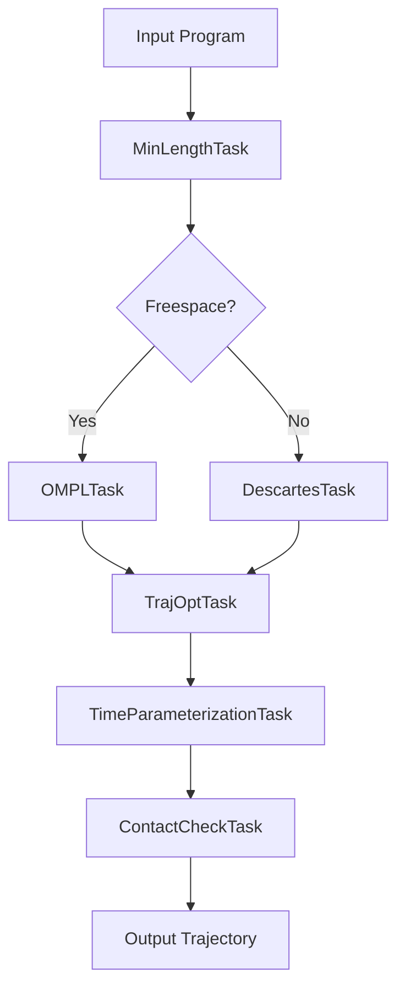

# Task Composer

The Task Composer orchestrates complex planning pipelines by chaining planners (OMPL, TrajOpt, Descartes), collision checks, and time parameterization into a dataflow graph. The high-level `TaskComposer` wrapper lives in `tesseract_robotics.planning`.

## Overview


```mermaid
graph TD
    A[Input Program] --> B[MinLengthTask]
    B --> C{Freespace?}
    C -->|Yes| D[OMPLTask]
    C -->|No| E[DescartesTask]
    D --> F[TrajOptTask]
    E --> F
    F --> G[TimeParameterizationTask]
    G --> H[ContactCheckTask]
    H --> I[Output Trajectory]
```

## Basic Usage

=== "High-Level API"

    ```python
    import numpy as np
    from tesseract_robotics.planning import (
        CartesianTarget, JointTarget, MotionProgram, Pose, Robot, TaskComposer,
    )

    robot = Robot.from_tesseract_support("abb_irb2400")

    program = (
        MotionProgram("manipulator")
        .move_to(JointTarget(np.zeros(6)))
        .move_to(CartesianTarget(Pose.from_xyz_rpy(0.6, 0.0, 0.5, 0, 0, 0)))
    )

    composer = TaskComposer.from_config()
    result = composer.plan(robot, program, pipeline="TrajOptPipeline")

    if result.successful:
        print(f"Planned {len(result.trajectory)} waypoints")
        for state in result.trajectory:
            print(state.positions)
    else:
        print(f"Planning failed: {result.message}")
    ```

=== "Low-Level API"

    ```python
    from tesseract_robotics.tesseract_common import FilesystemPath, GeneralResourceLocator
    from tesseract_robotics.tesseract_task_composer import (
        AnyPoly_wrap_CompositeInstruction,
        AnyPoly_wrap_EnvironmentConst,
        AnyPoly_wrap_ProfileDictionary,
        TaskComposerDataStorage,
        TaskComposerPluginFactory,
    )

    locator = GeneralResourceLocator()
    factory = TaskComposerPluginFactory(FilesystemPath(str(config_path)), locator)

    # Executor + pipeline node
    executor = factory.createTaskComposerExecutor("TaskflowExecutor")
    pipeline = factory.createTaskComposerNode("TrajOptPipeline")

    # AnyPoly-wrap the inputs the pipeline expects
    storage = TaskComposerDataStorage()
    storage.setData("planning_input", AnyPoly_wrap_CompositeInstruction(composite))
    storage.setData("environment",    AnyPoly_wrap_EnvironmentConst(env))
    storage.setData("profiles",       AnyPoly_wrap_ProfileDictionary(profiles))

    # Execute
    future = executor.run(pipeline, storage)
    future.wait()

    output_key = pipeline.getOutputKeys().get("program")
    output = future.context.data_storage.getData(output_key)
    ```

!!! tip "Prefer the wrapper"
    `TaskComposer` hides all the AnyPoly wrapping, input/output key discovery,
    profile selection and trajectory extraction. Drop to the low-level API
    only when you need to assemble a custom task graph at runtime.

## Plugin Warmup

!!! warning "First `plan()` call is slow (~10-15 s)"
    The Task Composer uses dynamic plugin loading (`boost_plugin_loader` /
    `dlopen`). The first call to `createTaskComposerNode(...)` loads the
    shared library for TrajOpt, OMPL, Descartes, etc. Subsequent calls in
    the same process are instant (plugins cached in memory). This is
    inherent to the plugin architecture — the same behaviour is observed in
    the C++ TaskComposer.

`TaskComposer.warmup(...)` amortizes that cost up front. See
`planning/composer.py` for the full docstring.

```python
from tesseract_robotics.planning import TaskComposer

# Option 1: explicit warmup — clearest timing profile
composer = TaskComposer.from_config()
composer.warmup(["FreespacePipeline"])          # ~10-15 s
result = composer.plan(robot, program, pipeline="FreespacePipeline")  # fast

# Option 2: warmup=True — loads a curated set of common pipelines
composer = TaskComposer.from_config(warmup=True)

# Option 3: warmup=[...] — specific pipelines only
composer = TaskComposer.from_config(
    warmup=["TrajOptPipeline", "OMPLPipeline"],
)
```

**When warmup helps:**

- Interactive use (REPL, Jupyter) — pay once, plan many times.
- GUI / service applications — initialize at startup, fast responses after.
- Benchmarking — separate plugin-load time from algorithm time.

**When warmup doesn't help:**

- Single-run scripts — total wall-clock time is roughly the same either way.

## Available Pipelines

`TaskComposer.get_available_pipelines()` introspects the factory and returns every pipeline that actually loaded from the config. As of the current `task_composer_plugins.yaml` this is **36 pipelines**:

```python
composer = TaskComposer.from_config()
pipelines = composer.get_available_pipelines()
print(pipelines)
```

A representative sample:

| Pipeline | What it runs |
|----------|--------------|
| `FreespacePipeline` | OMPL → TrajOpt → time parameterization |
| `CartesianPipeline` | Cartesian path with TrajOpt |
| `TrajOptPipeline` | TrajOpt optimization only |
| `OMPLPipeline` | OMPL sampling only |
| `RasterFtPipeline` | Industrial raster with freespace transitions |
| `DescartesFPipeline` | Descartes forward graph search |

See `TaskComposer.get_available_pipelines()` at runtime for the full 36.

!!! info "Pipeline count is not a contract"
    The exact number is driven by `task_composer_plugins.yaml` in the
    packaged `tesseract_task_composer` data. It may grow or shrink in
    future versions. Treat `get_available_pipelines()` as the source of
    truth, not the literal "36".

### Convenience methods

`TaskComposer` also exposes per-backend shortcuts:

```python
composer.plan_freespace(robot, program)   # TrajOptPipeline
composer.plan_ompl(robot, program)        # OMPLPipeline
composer.plan_cartesian(robot, program)   # DescartesPipeline
```

Or use the module-level functions from `tesseract_robotics.planning`:

```python
from tesseract_robotics.planning import plan_freespace, plan_ompl, plan_cartesian

result = plan_freespace(robot, program)
```

## Task Types

| Task | Purpose |
|------|---------|
| `MinLengthTask` | Ensure a minimum number of waypoints |
| `OMPLMotionPlannerTask` | Sampling-based planning |
| `TrajOptMotionPlannerTask` | Trajectory optimization |
| `DescartesMotionPlannerTask` | Cartesian graph search |
| `SimpleMotionPlannerTask` | Joint interpolation |
| `TimeOptimalParameterizationTask` | Add time parametrization (TOTG) |
| `IterativeSplineParameterizationTask` | Smooth timing |
| `ContactCheckTask` | Collision validation |
| `FixStateBoundsTask` | Clamp to joint limits |
| `FixStateCollisionTask` | Push out of collision |

## Profiles

Profiles configure each task's behaviour. `TaskComposer.plan(...)` auto-selects a pipeline-appropriate default set from `planning/profiles.py`. You can also build profiles yourself and pass them via the `profiles` keyword:

```python
from tesseract_robotics.planning import create_trajopt_default_profiles

profiles = create_trajopt_default_profiles()
result = composer.plan(robot, program, pipeline="TrajOptPipeline", profiles=profiles)
```

For a manual `ProfileDictionary`:

```python
from tesseract_robotics.tesseract_command_language import ProfileDictionary
from tesseract_robotics.tesseract_motion_planners_ompl import OMPLDefaultPlanProfile
from tesseract_robotics.tesseract_motion_planners_trajopt import (
    TrajOptDefaultPlanProfile,
)

profiles = ProfileDictionary()
profiles.addProfile("ompl",    "DEFAULT", OMPLDefaultPlanProfile())
profiles.addProfile("trajopt", "DEFAULT", TrajOptDefaultPlanProfile())
```

## Error Handling

`TaskComposer.plan(...)` always returns a `PlanningResult`. On failure the result is populated from the task composer's aborting node info:

```python
result = composer.plan(robot, program)
if not result.successful:
    print(f"Planning failed: {result.message}")
```

### Common Failures

| Error | Cause | Solution |
|-------|-------|----------|
| `OMPL failed to find solution` | Start/goal in collision or unreachable | Check collisions, increase time |
| `TrajOpt failed to converge` | Bad initial trajectory | Feed it an OMPL seed first |
| `Contact check failed` | Trajectory has collisions | Increase collision margin |
| `IK failed` | Cartesian target unreachable | Verify workspace + TCP offset |

## Parallel Execution

The Task Composer uses Taskflow for parallel execution. Override the thread count via `TaskComposer.from_config(num_threads=...)` or pass a pre-built executor:

```python
from tesseract_robotics.tesseract_task_composer import TaskflowTaskComposerExecutor

# Override YAML-configured thread count
composer = TaskComposer.from_config(num_threads=8)

# Or provide a custom executor
executor = TaskflowTaskComposerExecutor("MyExecutor", 8)
composer = TaskComposer.from_config(executor=executor)
```

!!! info "Automatic Parallelization"
    Independent tasks (such as IK for different waypoints) run in parallel
    automatically. The task graph determines dependencies.

## Custom Pipelines

Define custom task graphs in YAML and point `TaskComposer.from_config(path)` at them:

```yaml
# custom_pipeline.yaml
task_composer_plugins:
  tasks:
    MyCustomPipeline:
      type: graph
      nodes:
        - name: plan_ompl
          type: OMPLMotionPlannerTask
          input: planning_input
          output: ompl_output

        - name: smooth_trajopt
          type: TrajOptMotionPlannerTask
          input: ompl_output
          output: trajopt_output
          depends: [plan_ompl]

        - name: time_param
          type: TimeOptimalParameterizationTask
          input: trajopt_output
          output: output_program
          depends: [smooth_trajopt]
```

## Integration Example

Use a warmed-up composer behind a small service class:

```python
from tesseract_robotics.planning import Robot, TaskComposer

class PlanningServer:
    def __init__(self, robot: Robot):
        self.robot = robot
        self.composer = TaskComposer.from_config()
        self.composer.warmup(["FreespacePipeline"])    # one-time cost

    def plan_motion(self, program):
        return self.composer.plan(
            self.robot, program, pipeline="FreespacePipeline"
        )
```

## Next Steps

- [Low-Level SQP](low-level-sqp.md) — Real-time trajectory optimization
- [Online Planning Example](../examples/online-planning.md) — Dynamic replanning
